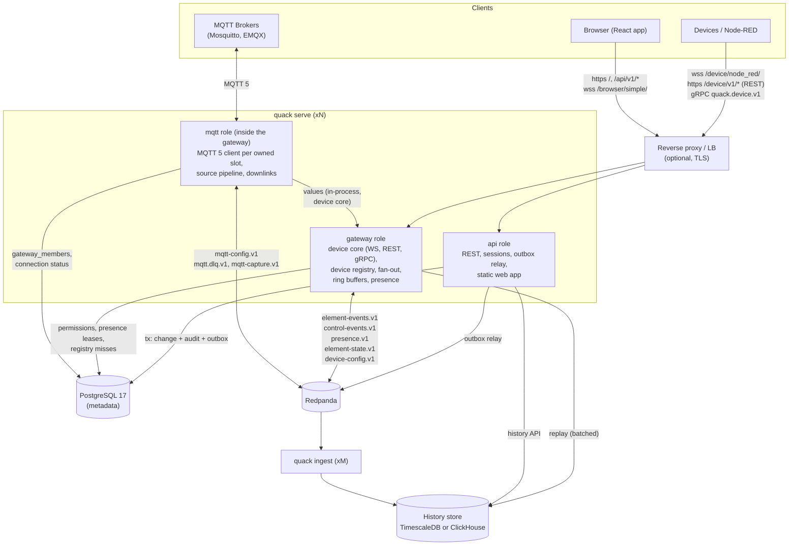
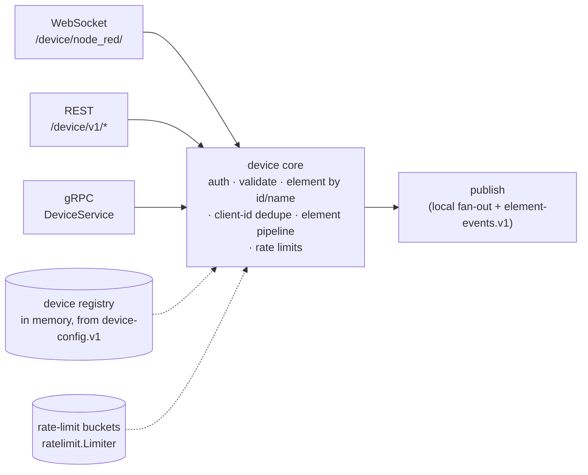
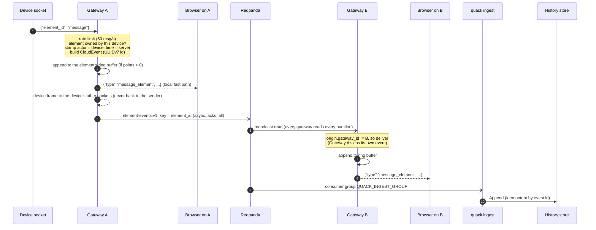
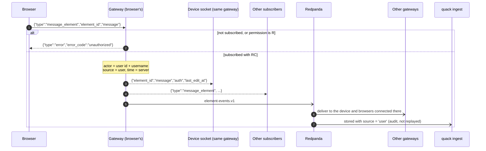
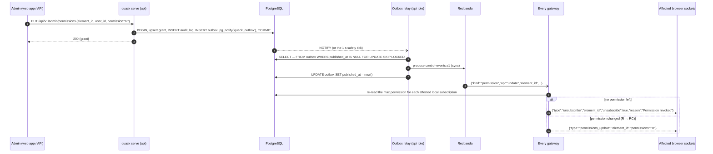
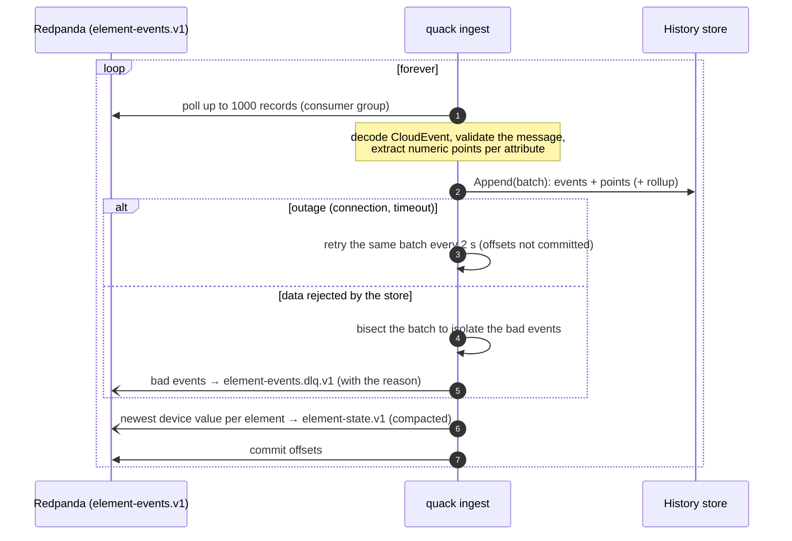
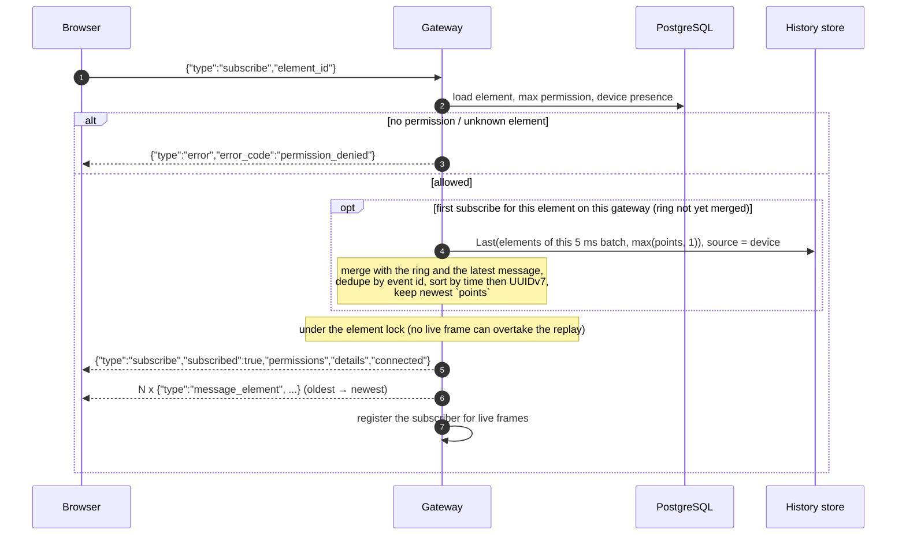
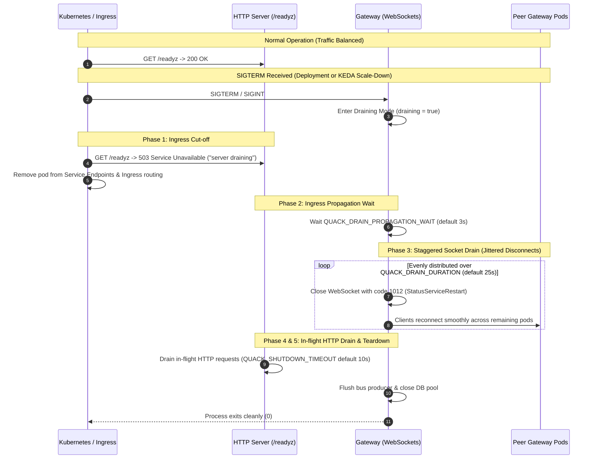

# 2. Architecture

## Components



Everything server-side is one Go binary, `quack`:

| Command | What it runs |
|---|---|
| `quack serve` | The HTTP server. The roles come from `QUACK_ROLES` (default `api,gateway`). |
| &nbsp;&nbsp;role `api` | The REST API under `/api/v1/*`, the OpenAPI spec and docs (`/api/openapi.json`, `/api/docs`), session handling, the **outbox relay** (Postgres → `control-events.v1`, `device-config.v1`, `mqtt-config.v1`), an hourly purge of expired sessions, and the built web app from `QUACK_WEB_DIR` with SPA fallback. |
| &nbsp;&nbsp;role `gateway` | The device transports (WebSocket `/device/node_red/`, [REST](./04_api_reference/device_rest_api.md) `/device/v1/*`, [gRPC](./04_api_reference/device_grpc_api.md) `quack.device.v1.DeviceService`) on one **device core**, the browser socket `/browser/simple/`, the in-memory **device registry**, in-memory fan-out, per-element history ring buffers, presence leases and the sweeper, and the bus consumers. |
| &nbsp;&nbsp;role `mqtt` | Needs `gateway`. Connects as an MQTT 5 **client** (a subscriber, never a broker) to the brokers configured in the admin. Each connection has `replicas` slots; every live `mqtt` gateway computes the same **weighted rendezvous hash (HRW)** over the members in `gateway_members` and opens the slots it owns. Messages go through the source pipeline (an optional JavaScript decoder plus a field map) and then the same **device core** as the other transports, so grants, limits and CloudEvents are identical (`quackvia=mqtt/<connection>`). See [MQTT connections](./10_mqtt.md). |
| `quack ingest` | The history writer. It consumes `element-events.v1` in a consumer group and appends to the [history store](./05_core_concepts/history.md) (events, numeric points and rollups). It publishes each element's newest value to `element-state.v1`, and dead-letters unstorable events to `element-events.dlq.v1`. It serves `/healthz` and `/metrics` on `QUACK_HTTP_ADDR`. |
| `quack migrate` | Applies the core Postgres migrations and the history store's schema and retention, all embedded in the binary, creates the Redpanda topics if they are missing, and republishes every device to `device-config.v1`. Safe to run repeatedly. |
| `quack registry sync` | Republishes every device's snapshot to `device-config.v1` (after restoring a database, say). |
| `quack history copy` | Copies stored history into another backend, to move between [history drivers](./05_core_concepts/history.md#switching-backends). |
| `quack admin ...` | `create-user [--admin]`, `set-password`, `import-key`: bootstrap and emergency tasks that run straight against the database. |
| `quack import-django` | One-off import from the legacy Django database. |
| `quack dev ...` | Development helpers: `demo`, `simulate [--transport websocket\|rest\|grpc\|mixed]`, `token` (a JWT for a demo device), plus `seed` and `hook` for the contract suite. |

Every `serve` instance exposes `/livez` and `/healthz` (liveness probe), `/startupz` (startup probe: database pingable and gateway initialized), `/readyz` (readiness probe: database pingable, registry loaded, and returns 503 while draining) and `/metrics` (Prometheus: `quack_ws_connections`, `quack_ws_rejected_total`, `quack_messages_in_total`, `quack_frames_out_total`, `quack_dropped_total`, `quack_bus_produce_errors_total`, `quack_outbox_published_total`). The ingester adds `quack_ingest_rows_total`, `quack_ingest_lag_seconds` and `quack_ingest_dead_letters_total`.

**Infrastructure:**

| Service | Role |
|---|---|
| **PostgreSQL** | Identity, devices, permissions, dashboards, presence, outbox and audit. See [Database schema](./06_database/schema.md). |
| **History store** | Element history, through a pluggable driver: **TimescaleDB** (the default, which can share the Postgres above) or **ClickHouse**. See [History storage](./05_core_concepts/history.md). |
| **Redpanda** | A Kafka-compatible durable log with a fixed set of topics, never one per device or element. See [Realtime events](./05_core_concepts/realtime_events.md). |
| **Web app** (`web/`) | React single-page app. In production it is built into the image and served by the `api` role. In development Vite serves it on :5173 and proxies `/api/`, `/browser/` and `/device/` to :8080. |

## Data flows

### One device core, three transports



Every transport authenticates with the same device JWT and calls the same core, so rules can't drift between them: validation (JSON, 64 KiB, storable text), the element (by id, or by name on REST and gRPC), retries with a client id, the [element pipeline](./05_core_concepts/element_pipeline.md) (in-memory Go closures / Goja script before the bus), the per-device guard and the per-element [rate limit](./05_core_concepts/rate_limits.md), then the same publish path as below. The core reads devices, keys, pipelines and limits from the **device registry**, a copy of the compacted `device-config.v1` topic that every gateway keeps in memory ([details](./05_core_concepts/realtime_events.md#device-config-v1)). The message path therefore never reads Postgres.

Only delivery differs. WebSocket and gRPC streams are connections in the hub, and get messages pushed. REST devices long-poll `GET /device/v1/sync`, which answers from the newest command per element that every gateway keeps in memory.

### Device → browser (local fast path + bus)

The gateway that receives a message delivers it to its own sockets **first**, then publishes it. Other gateways deliver it from the bus. The receiving gateway recognizes its own events by `origin.gateway_id` and skips them.



Each frame is serialized **once** per audience (device shape and browser shape), and the same bytes go to every recipient.

### Browser → device



User commands go to the device's sockets on **every** gateway, so the device can be connected anywhere. They are not added to the replay ring.

### Admin change → outbox → control event → live re-evaluation

Every mutation in the REST API or the `quack admin` CLI runs in one transaction. That transaction writes the change, an `audit_log` row and one or more `outbox` rows. The relay publishes outbox rows to `control-events.v1` after commit, so a change is never lost and never published if it was rolled back.



Control events carry **ids only**. Gateways treat them as invalidation hints and re-read Postgres. What each `kind` triggers is listed in [Realtime events](./05_core_concepts/realtime_events.md#control-events).

### Ingest → history store



Delivery is **at least once**. `Append` skips events it already has (by event id) and never double-counts them in rollups. This makes replaying the topic from offset 0 safe. Details: [History storage → Guarantees](./05_core_concepts/history.md#guarantees).

### History replay (ring buffer + history store merge)

A new subscriber receives the element's last `points` **device** messages, oldest first, right after the subscribe confirmation. The gateway serves them from its in-memory ring buffer. The first time an element is subscribed on a gateway, the gateway also merges in the newest stored events. That way a freshly restarted gateway still replays full history. Stored reads arriving within 5 ms are **batched into one query** for all the elements involved, so opening a large dashboard, or a reconnect storm, costs a handful of queries.

Every gateway also remembers the **latest device message of every element**, from the bus. On start it warms this memory from the compacted topic `element-state.v1`. The latest message is merged into the replay, which covers events not yet written by the ingester. It is also sent to subscribers of elements with `points = 0`, so value widgets open with a value.



If the history read fails, the replay continues from memory, and the next subscriber retries the read. User commands (`source = 'user'`) are stored but never replayed. Elements with `points = 0` keep no ring and replay only their latest value. A gateway frees an element's state once no device or browser on it uses the element.

For longer ranges, clients use the REST endpoint `GET /api/v1/elements/{id}/history` ([REST API](./04_api_reference/rest_api.md#history)).

## Scaling

### N gateways

- Run as many `quack serve` instances as you need behind a load balancer that supports WebSockets. **No sticky sessions are needed.** Every gateway reads **every partition** of the three topics, without a consumer group and starting at the end. A message published on gateway A therefore reaches subscribers on gateway B.
- Each instance needs a unique `QUACK_GATEWAY_ID`. If it is unset, one is generated from the hostname plus random bytes, which is fine for most deployments. The ID is used in presence leases and to skip the gateway's own events.
- You can split roles: `QUACK_ROLES=gateway` on socket nodes and `QUACK_ROLES=api` on REST nodes. Several `api` instances can run the outbox relay; an advisory lock lets one drain at a time, so each topic key keeps its order (needed by `device-config.v1`).
- **Device REST requests** may hit any gateway. That is fine for correctness, but rate-limit buckets and retry ids are per instance. Hash on the `X-Quack-Device` header at the load balancer to keep them exact ([REST → Behind a load balancer](./04_api_reference/device_rest_api.md#behind-a-load-balancer)). gRPC needs an HTTP/2-capable load balancer; streams are recycled every `QUACK_STREAM_MAX_AGE` (30 min) so they spread out again after a scale-out.
- **Limit:** every gateway processes all element traffic. This is fine into the tens of thousands of messages per second. Beyond that, you need partition-aware routing, which is not implemented.
- The protocol has no per-socket state that another gateway would need, so a client can simply reconnect to any instance.

### The ingester consumer group

- `quack ingest` instances with the **same** `QUACK_INGEST_GROUP` share the work. Run up to 12 replicas, one per partition of `element-events.v1`.
- **Environments sharing a Redpanda cluster need their own `QUACK_TOPIC_PREFIX`** (see [Sharing a cluster](./05_core_concepts/realtime_events.md#sharing-a-cluster)); with it, their consumer groups don't collide either.
- **`QUACK_INGEST_GROUP` must be different for every environment (every target database) that shares a Redpanda cluster without a topic prefix.** Redpanda tracks committed offsets **per group**. Suppose staging and production, or a test database, ingest from the same cluster with the same group name. They would then split the partitions between them, and each database would silently get only part of the events. The integration tests use their own group (`quack-ingest-it`) for this reason.
- A **new** group starts from the earliest retained offset. Topic retention is 7 days, so a fresh database backfills the last week of events.

### Presence: leases and the sweeper

Presence answers one question: "is this device connected to any gateway?" It must stay correct when a gateway crashes.

- **Lease.** When a device socket connects, the gateway upserts a row `(device_id, gateway_id, conn_id)` in `device_presence`.
  - Every `QUACK_PRESENCE_HEARTBEAT` (10 s), each gateway refreshes `last_seen_at` on all of its rows.
  - The row is deleted when the socket closes.
  - A device counts as **connected** if any row has `last_seen_at > now() - QUACK_PRESENCE_TTL` (30 s).
- **Transitions only.** `connected` is emitted when a device goes from zero to one live lease, and `disconnected` when its last live lease goes away. A second socket of the same device does not produce a new event. The gateway updates its local subscribers directly, then publishes `io.quack.device.presence.v1` to `presence.v1` so the other gateways can do the same.
- **Sweeper.** On every heartbeat, each gateway tries `pg_try_advisory_xact_lock`, and only one wins. The winner deletes expired leases, which belong to crashed gateways, and emits `disconnected` for devices that have no live lease left. With default settings, a crashed gateway's devices show as offline 30–40 s after its last heartbeat.
- **Audit.** Every connection is also appended to `device_connections` (gateway, client address, user agent, connect and disconnect time). Admins can read it at `GET /api/v1/admin/connections`.

### Back-pressure and limits

| Limit | Value | Behavior |
|---|---|---|
| Outbound queue per socket | 2048 frames | When full, the socket is closed with **1013** (try again later). Fan-out never blocks. |
| Inbound frame size | 64 KiB | A larger frame closes the socket (1009, message too big). |
| Device messages | Per element (default `QUACK_ELEMENT_MSG_RATE` 50/s) plus a per-device guard (`QUACK_DEVICE_MSG_RATE` 500/s), on every transport | Dropped (WebSocket: silently), or the newest held for elements set to `latest`. REST and gRPC report it per message, and answer `429`/`RESOURCE_EXHAUSTED` when everything was over. See [Rate limits](./05_core_concepts/rate_limits.md). |
| Message size | 64 KiB on every transport; REST and gRPC bodies ≤ 1 MiB and 500 messages | A larger WebSocket frame closes the socket (1009); on REST and gRPC the message is `rejected` (`too_large`). |
| Produce buffer | 200,000 records / 64 MiB | Over 75 %, publishing waits up to 2 s for Redpanda to catch up (back-pressure on the device's socket or request) instead of dropping. Only a longer outage fills it and drops (`quack_bus_produce_errors_total`). |
| Browser frames | `QUACK_BROWSER_MSG_RATE` (100/s, burst 100) | Excess frames get an `error` frame with `rate_limited`. |
| Keep-alive | WebSocket ping every 30 s | No pong within 15 s closes the socket with **1001**. |
| Shutdown | SIGINT / SIGTERM | Phased Graceful Drain (F1): `/readyz` immediately signals 503, pauses `QUACK_DRAIN_PROPAGATION_WAIT` (3s) for Ingress/Endpoints propagation, closes WebSockets over `QUACK_DRAIN_DURATION` (25s) with randomized jitter (1012 Service Restart), and drains in-flight HTTP for up to `QUACK_SHUTDOWN_TIMEOUT` (10s). |

### Kubernetes Health Probes and Graceful Drain (F1)

High-density WebSocket gateways (managing tens of thousands of persistent client and browser connections) require an orchestrated lifecycle in Kubernetes to prevent connection drops and thundering herd / reconnect storms during rolling deployments or KEDA autoscaling.

#### 1. Probe Endpoints (`quack serve`)

| Probe | Endpoint | Purpose | Checks | Behavior |
|---|---|---|---|---|
| **Liveness** | `/livez`, `/healthz` | Checks if process is deadlocked or corrupted. | Internal heartbeat / scheduler viability. | Returns `200 OK` (independent of database latency to avoid cascade restarts). Remains 200 during drain. |
| **Startup** | `/startupz` | Delays liveness/readiness evaluation during bootstrap. | Database pingable, device registry replay complete, and MQTT slots assigned. | Returns `200 OK` once ready; `503` while replaying compacted Kafka topics. |
| **Readiness** | `/readyz` | Controls whether Kubernetes sends traffic to this pod. | Database pingable, gateway ready, producer healthy, and **not draining**. | Returns `200 OK` when ready. **Immediately returns `503` upon SIGTERM / Drain**, removing the pod from endpoints before sockets disconnect. |

#### 2. Phased Graceful Drain Lifecycle



#### 3. Kubernetes Deployment Recommendations

The container termination grace period must be greater than the sum of all drain phases (`QUACK_DRAIN_PROPAGATION_WAIT` + `QUACK_DRAIN_DURATION` + `QUACK_SHUTDOWN_TIMEOUT` = 3s + 25s + 10s = 38s):

```yaml
apiVersion: apps/v1
kind: Deployment
metadata:
  name: quack-serve
spec:
  template:
    spec:
      terminationGracePeriodSeconds: 45
      containers:
        - name: quack
          image: quack:latest
          env:
            - name: QUACK_DRAIN_PROPAGATION_WAIT
              value: "3s"
            - name: QUACK_DRAIN_DURATION
              value: "25s"
            - name: QUACK_SHUTDOWN_TIMEOUT
              value: "10s"
          startupProbe:
            httpGet:
              path: /startupz
              port: 8080
            failureThreshold: 30
            periodSeconds: 2
          livenessProbe:
            httpGet:
              path: /livez
              port: 8080
            periodSeconds: 10
            timeoutSeconds: 3
          readinessProbe:
            httpGet:
              path: /readyz
              port: 8080
            periodSeconds: 3
            timeoutSeconds: 2
```

### Deploying behind a proxy

- Forward WebSocket upgrades for `/device/node_red/` and `/browser/simple/`, and keep the original `Host` header.
- For gRPC, forward HTTP/2 to the server. Without TLS between the proxy and the server, it speaks h2c (HTTP/2 with prior knowledge) on the same port. The browser socket accepts an `Origin` whose host equals `Host`, or one listed in `QUACK_ALLOWED_ORIGINS`.
- Terminate TLS at the proxy and keep `QUACK_COOKIE_SECURE=true` (the default).
- The server does not trust `X-Forwarded-For`. The login rate limiter therefore keys on the proxy's address plus the username.
