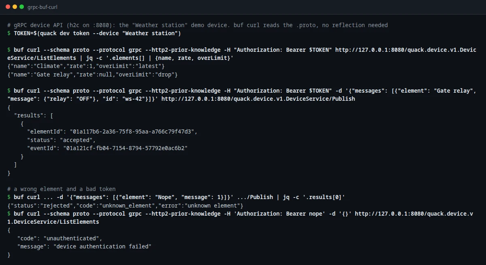

# Device gRPC API

For devices and gateways that already speak gRPC, or want a typed, generated client and long-lived HTTP/2 streams. It uses the same device JWT, elements, permissions and [rate limits](../05_core_concepts/rate_limits.md) as the [WebSocket](./device_api.md) and [REST](./device_rest_api.md) transports.

The service is served by [connect-go](https://connectrpc.com/) on the main HTTP port, so one endpoint speaks **gRPC**, **gRPC-Web** and the **Connect** protocol (plain HTTP + JSON for the unary calls).



## At a glance

| | |
|---|---|
| Schema | [`server/proto/quack/device/v1/device.proto`](https://github.com/taha2samy-3/qauk-qauk/blob/main/server/proto/quack/device/v1/device.proto) |
| Service | `quack.device.v1.DeviceService` at `http://<host>:8080/quack.device.v1.DeviceService/<Method>` |
| Transport | HTTP/2. Without TLS the server accepts h2c ("prior knowledge"); in production terminate TLS at your proxy and forward HTTP/2. |
| Auth | Metadata `authorization: Bearer <jwt>`, the [same token](./device_api.md#the-token) as the WebSocket |
| Routing hint | `x-quack-device: <device id>` (optional, as for [REST](./device_rest_api.md#behind-a-load-balancer)) |
| Limits | 1–500 messages per `Publish`, 1 MiB per request, 64 KiB per message |

| Method | Kind | Purpose |
|---|---|---|
| `Publish(PublishRequest) → PublishResponse` | unary | Send a batch of messages |
| `Watch(WatchRequest) → stream WatchResponse` | server stream | Receive commands from dashboards as they happen |
| `Session(stream SessionRequest) → stream SessionResponse` | bidi stream | The WebSocket equivalent: publish and receive on one stream |
| `ListElements(ListElementsRequest) → ListElementsResponse` | unary | The device, its elements and their limits |

## Messages

```proto
message DeviceMessage {
  string element = 1;                    // element id or name
  google.protobuf.Value message = 2;     // any JSON value, e.g. {"value": 21.5}
  string id = 3;                         // optional client id: retries aren't stored twice
  google.protobuf.Timestamp ts = 4;      // optional device timestamp
}

message ElementMessage {                 // a command for one of this device's elements
  string element_id = 1;
  string element = 2;
  google.protobuf.Value message = 3;
  Actor actor = 4;                       // the user (id, name) who sent it
  google.protobuf.Timestamp time = 5;
}
```

`message` is a `google.protobuf.Value`, so devices send the same JSON as on the other transports and dashboards bind to its attributes the same way. `PublishResult.status` is `accepted`, `filtered`, `duplicate`, `coalesced`, `pipeline_failed` or `rejected` with a `code`, matching [REST](./device_rest_api.md#send-messages).

## Calls

**Publish** behaves like `POST /device/v1/messages`: one result per message.

```sh
buf curl --schema server/proto --protocol grpc --http2-prior-knowledge \
  -H "Authorization: Bearer $TOKEN" \
  -d '{"messages": [{"element": "Gate relay", "message": {"relay": "OFF"}, "id": "ws-42"}]}' \
  http://127.0.0.1:8080/quack.device.v1.DeviceService/Publish
```

**Watch** streams messages that users write to the device's elements (commands). Commands are automatically inverse-transformed if the element has an [element pipeline](../05_core_concepts/element_pipeline.md) with invertible steps. The device's own messages, sent over another connection, are not streamed back. Nothing is replayed on connect.

**Session** is one bidirectional stream, like a WebSocket: send `SessionRequest{publish}` messages, and receive `SessionResponse{message}` for commands (also inverted). Publishing is fire-and-forget: a `SessionResponse{result}` comes back only for a **rejected** or **pipeline_failed** message, or for a message with an `id`, so you can correlate acknowledgements when you need them. Like the WebSocket, it receives messages from the device's other connections too.

**ListElements** returns `device_id`, `device_name`, and for each element its `id`, `name`, `points`, `rate`, `burst` and `over_limit` (0 = the server default).

The server sends the response headers as soon as a stream is registered, so clients can rely on the stream being live once the call returns.

## Errors

| Code | When |
|---|---|
| `UNAUTHENTICATED` | Missing or invalid token, or the stream was closed because access was revoked (device deleted, key removed or changed) |
| `PERMISSION_DENIED` | `x-quack-device` doesn't match the token |
| `INVALID_ARGUMENT` | `Publish` with 0 or more than 500 messages |
| `RESOURCE_EXHAUSTED` | The batch is over the device's limit, or every message was rate limited. `Retry-After` metadata says when to retry (seconds). |
| `UNAVAILABLE` | The stream reached its maximum age, or the server is shutting down: reconnect |

A message-level problem (unknown element, too large, over the element's limit) is a `rejected` result, not an RPC error.

## Streams and scaling

- A stream counts as a device **connection** for [presence](./device_api.md#presence), like a socket. A unary `Publish` counts like a REST request (connected for `QUACK_PRESENCE_TTL` after it).
- Streams live on one gateway instance. To spread load after scaling out, the server closes each stream after `QUACK_STREAM_MAX_AGE` (30 min) plus up to 10 % jitter, with `UNAVAILABLE`. Clients reconnect, and the load balancer places them again.
- Keep-alive is HTTP/2 PING; the stream is closed with the connection.

## Clients

Generate a client from the `.proto` with your usual toolchain (`buf generate`, `protoc`). Two ready examples in this repository:

- **Go:** the demo simulator speaks every transport; [`server/internal/devtools/transports.go`](https://github.com/taha2samy-3/qauk-qauk/blob/main/server/internal/devtools/transports.go) has a complete `Session` client (`task simulate TRANSPORT=grpc`).
- **Command line:** [`buf curl`](https://buf.build/docs/reference/cli/buf/curl/) needs no server reflection, it reads the schema: `--schema server/proto`.

The Go code is generated into `server/internal/gen`. After editing the `.proto`, run `task proto:gen`; CI runs `task proto:check` (buf lint plus "the generated code is up to date").

## Measured

On a laptop (i7-7820HQ, 8 threads), with 20 devices on one instance and a dashboard on another, limits off:

| | Latency p50 / p99 | Messages/s |
|---|---|---|
| `Publish`, 1 message per call | 7.0 / 11.0 ms | 4 638 |
| `Publish`, 100 messages per call | 6.9 / 9.5 ms | 55 000 |
| `Session` stream | 6.6 / 9.8 ms | 60 531 |

Details in [Performance](../refactor/baseline.md#device-transports-2026-10-09).
