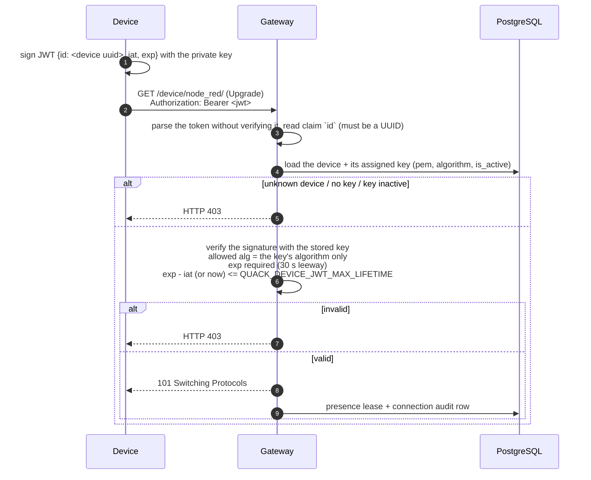

# Authentication

Quack Quack has two kinds of principals, and each authenticates differently:

| Principal | Credential | Where it's checked |
|---|---|---|
| **Device** | A JWT signed with the device's private key (RS256 or ES256) | The WebSocket handshake at `/device/node_red/` |
| **User** | Username + password → an opaque session cookie `quack_session` | Every REST call, and the WebSocket handshake at `/browser/simple/` |

## Devices: asymmetric JWTs

The server stores only **public keys** (`jwt_public_keys`). Each device is assigned one. The private key never leaves the device, so a database leak cannot be used to impersonate devices.



**Key policy.** A key is analyzed when it is uploaded (`POST /api/v1/admin/keys` or `quack admin import-key`):

| Key | Algorithm |
|---|---|
| RSA ≥ 2048 bits (PKIX or PKCS#1 PEM) | `RS256` |
| ECDSA P-256 | `ES256` |
| Anything else | Rejected (422) |

**Rotation and revocation.**

- To **rotate**, upload a new key and assign it to the device (`PATCH /api/v1/admin/devices/{id}` `{"public_key_id": "<new>"}`). Open sockets that use the old key are closed with **4000**, and the device reconnects with a token signed by its new private key.
- To **revoke**, deactivate the key (`PATCH /api/v1/admin/keys/{id}` `{"is_active": false}`) or delete it. Sockets using it are closed with **1000** `key changed`, and new handshakes get **403**.
- **Deleting a device** closes its sockets with **4000**.
- Several devices may share a key, though one key per device is recommended.

**What the token proves, and what it doesn't.** The token authenticates the device as a whole. Each message is then authorized separately: a device can only publish to **its own** elements. Frames for other elements are dropped. The sender shown to viewers (`auth`) is always stamped by the server from the authenticated identity, never taken from the frame.

## Users: passwords and sessions

**Passwords.**

- They are hashed with **argon2id** (m = 19 MiB, t = 2, p = 1; the OWASP minimum) and stored in PHC format.
- The minimum length is 8 characters.
- Hashes imported from Django (`pbkdf2_sha256$...`) are verified as they are, and replaced with argon2id on the first successful login.
- When a username does not exist, a dummy hash is still checked, so response timing does not reveal which usernames exist.

**Sessions.**

- `POST /api/v1/auth/login` creates a random 32-byte token. Only its **SHA-256** is stored in `sessions`, together with the expiry, client IP and user agent.
- The cookie `quack_session` is `HttpOnly`, `SameSite=Lax` and `Path=/`, plus `Secure` unless `QUACK_COOKIE_SECURE=false`.
- It lives for `QUACK_SESSION_TTL` (14 days) from login. Activity updates `last_seen_at` but does not extend the expiry.
- A session counts only while its user is **active**. Expired sessions are purged hourly.

**Revocation.**

| Event | Effect |
|---|---|
| Logout | That session is deleted. Already-open WebSockets stay open until the client closes them. |
| Password change (own or by an admin) | **All** of the user's sessions are deleted, and their WebSockets are closed with **4000** `session revoked` |
| User deactivated (`is_active: false`) or deleted | The same, and login is refused |
| `is_admin` changed | The sessions stay valid; the next request sees the new role |

**Brute-force protection.** Login allows 10 attempts per 5 minutes per (client address, username), then returns 429. The server does not trust `X-Forwarded-For`, so behind a proxy the address is the proxy's.

**CSRF and the WebSocket Origin check.** The cookie is `SameSite=Lax`, and mutating REST calls must not be marked cross-site by the browser (Go's `http.CrossOriginProtection`). The browser WebSocket accepts only a same-host `Origin` or one listed in `QUACK_ALLOWED_ORIGINS`. Together these block CSRF and cross-site WebSocket hijacking. See [REST API → CSRF](../04_api_reference/rest_api.md#csrf).

**Admins** (`is_admin`) can call `/api/v1/admin/*` and see the admin pages. Being an admin does **not** grant access to element data; see [Permissions](./permissions.md).

## Bootstrap and recovery

```sh
task admin:create ADMIN=alice                          # first admin (password prompted)
server/bin/quack admin set-password --username alice  # reset a password (QUACK_DATABASE_URL must be set)
```
