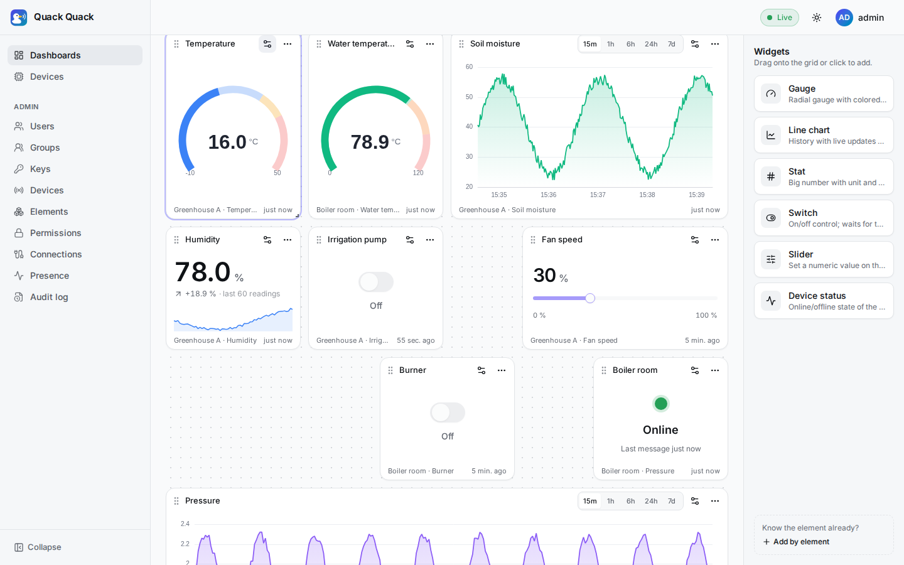

# Dashboards

A dashboard is a user-owned grid of widgets. Each widget is bound to one element. Users build dashboards in the web app by dragging widgets from a palette, resizing them and configuring them. The backend stores each dashboard as an opaque JSON `layout` and never interprets it.

<p align="center">
  
</p>

## Storage and API

| Field | Notes |
|---|---|
| `id` | UUIDv7 |
| `owner_id`, `owner_name` | The creator. Only the owner can change or delete it. |
| `name` | 1–100 characters |
| `shared` | `false` (private) or `true` (visible read-only to every logged-in user) |
| `layout` | A JSON **object**, at most 256 KiB. An empty or missing layout is stored as `{"widgets": []}`. |
| `created_at`, `updated_at` | Timestamps |

Endpoints: `GET/POST /api/v1/dashboards` and `GET/PUT/DELETE /api/v1/dashboards/{id}` ([REST API](../04_api_reference/rest_api.md#dashboards)). `PUT` replaces the name, sharing flag and layout together.

## Sharing

- `GET /api/v1/dashboards` returns your own dashboards first, then every dashboard with `shared: true`. The web app shows them under **Mine** and **Shared with me**.
- Shared dashboards are **read-only** for everyone except the owner. `PUT` and `DELETE` from anyone else return 404. A viewer can **duplicate** a shared dashboard into a private copy and edit that.
- **Sharing never grants data access.** Each widget subscribes with the *viewer's* own session, and the [max-permission rule](./permissions.md) applies per element:
  - Without a grant on an element, its widget shows as unavailable.
  - With `R`, control widgets (switch, slider) show the value but are disabled.
  - Only `RC` lets the viewer send commands.

  So it is safe to share one "plant overview" with operators and viewers who have different grants.

## Layout format (version 1)

The format is owned by the frontend and defined with zod in `web/src/features/dashboards/layout.ts`:

```json
{
  "version": 1,
  "widgets": [
    {
      "id": "a1b2c3d4e5",
      "type": "gauge",
      "element_id": "01a1159f-d2d0-7e02-867d-4dd7fe247f99",
      "title": "Greenhouse temperature",
      "options": { "unit": "°C", "min": -10, "max": 50, "baseColor": "blue",
                   "thresholds": [{ "value": 30, "color": "orange" }, { "value": 40, "color": "red" }] },
      "layouts": { "lg": { "x": 0, "y": 0, "w": 3, "h": 6 } }
    }
  ]
}
```

| Field | Type | Meaning |
|---|---|---|
| `version` | `1` | The layout schema version (`LAYOUT_VERSION`) |
| `widgets[].id` | string | Unique within the dashboard (random, 10 characters) |
| `widgets[].type` | string | A widget type from the registry ([below](#widget-types)) |
| `widgets[].element_id` | UUID or `null` | The bound element. `null` means an unbound placeholder. |
| `widgets[].title` | string, optional | Overrides the element name in the widget header |
| `widgets[].options` | object | Type-specific options (see the table below). Default `{}`. |
| `widgets[].layouts` | object | Grid position per breakpoint: `lg` is required; `md` and `sm` are optional |

**The grid** (react-grid-layout):

| Breakpoint | Viewport width | Columns |
|---|---|---|
| `lg` | ≥ 1100 px | 12 |
| `md` | ≥ 680 px | 8 |
| `sm` | < 680 px | 4 |

Rows are 40 px high, with a 12 px margin. A position is `{x, y, w, h}` in grid units, with integers `x, y ≥ 0` and `w, h ≥ 1`. When `md` or `sm` is missing, it is derived from `lg`: `md` scales `x` and `w` by 8/12, and `sm` stacks every widget at full width.

**Robustness.** When it loads a layout, the app (`migrateLayout`):

- keeps every widget that validates and drops the ones that don't, telling the user how many were dropped;
- treats a document without `version` but with a `widgets` array as version 1;
- replaces any other version with an empty board.

A widget whose `type` is unknown to this version of the app shows "Unknown widget type" instead of crashing. When you make a breaking change, bump `LAYOUT_VERSION` and add a migration in `migrateLayout`.

## Widget types

These come from `web/src/widgets/registry.ts`. Sizes are in `lg` grid units (w × h).

| `type` | Label | What it shows | Default / min size | Options |
|---|---|---|---|---|
| `gauge` | Gauge | A radial gauge with colored thresholds | 3×6 / 2×4 | `unit`, `min`, `max`, `decimals`, `baseColor`, `thresholds` |
| `line` | Line chart | History plus live updates, with a time-range selector (15m, 1h, 6h, 24h, 7d) | 6×7 / 3×4 | `unit`, `range`, `min`, `max`, `decimals`, `color`, `area`, `thresholds` |
| `stat` | Stat | A big number with unit and a trend sparkline | 3×4 / 2×3 | `unit`, `decimals`, `sparkline`, `color`, `thresholds` |
| `switch` | Switch | On/off control that waits for the device to confirm (control) | 3×4 / 2×3 | `onLabel`, `offLabel` |
| `slider` | Slider | Sets a numeric value on the device (control) | 4×4 / 3×3 | `min`, `max`, `step`, `unit` |
| `status` | Device status | Online/offline state of the element's device, and the time of the last message | 2×4 / 2×3 | none |

`thresholds` is a list of `{value, color}`. From each value upwards, the widget uses that color.

**How widgets read values.** A message's number is `message.value`, or `message.y` for `{x, y}` chart points, or the message itself when it is a bare number or boolean. **Control** widgets send `{"value": <number>}` (the switch sends `1`/`0`). They show the command as pending until the device echoes the new value back as telemetry.

**Suggestions from element metadata.** When a widget is added for an element, the editor uses two pieces of metadata:

- **Widget hint.** An element style named `widget` with `{"widget": "sensor" | "chart" | "switch" | "slider"}` picks the suggested widget: gauge, line, switch or slider respectively; `stat` otherwise. It also hides widgets that don't fit (for example, no gauge for a switch).
- **Defaults.** The element's `details` fill in the default options: `unit`, `minValue`/`min`, `maxValue`/`max`, `step` and `title`.

So set these when you create elements (see [Getting started](../03_getting_started.md#register-the-key-device-element-and-grant)).

## Adding a widget type

1. Create `web/src/widgets/<name>/<Name>Widget.tsx` and export a `WidgetDefinition` (`web/src/widgets/types.ts`). It provides:
   - `type`, `label`, `description` and `icon`
   - `defaultSize` and `minSize`
   - `fit(element)`: `suggested`, `ok` or `no`
   - `defaultOptions(element)`
   - `fields` for the configuration sheet (`text`, `number`, `boolean`, `select`, `thresholds`, `color`)
   - `control: true` if the widget sends commands
   - the React `Component`, which receives the live element state (`rt`) and the options
2. Add it to `WIDGETS` in `web/src/widgets/registry.ts`.

Existing dashboards are unaffected, because the layout stores only `type` and `options`.
