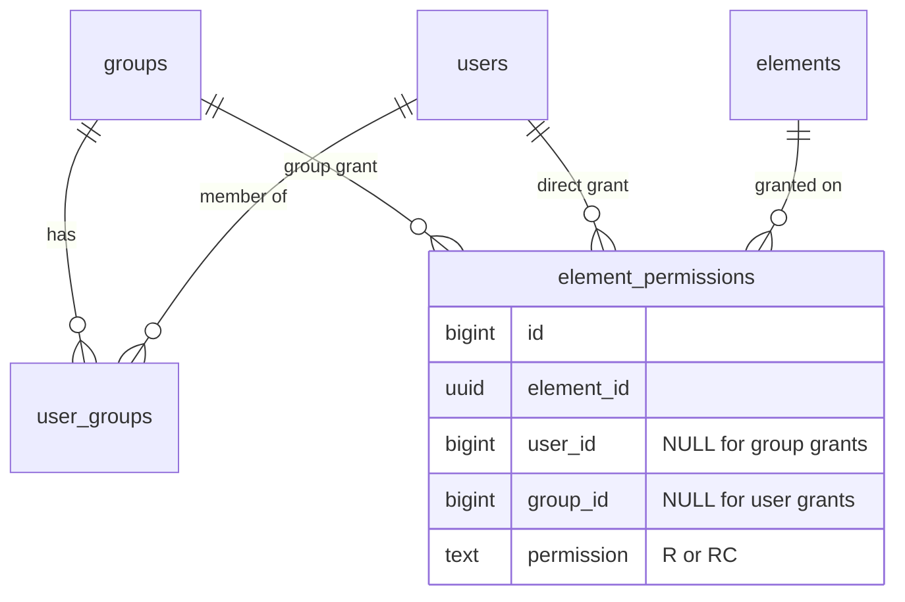
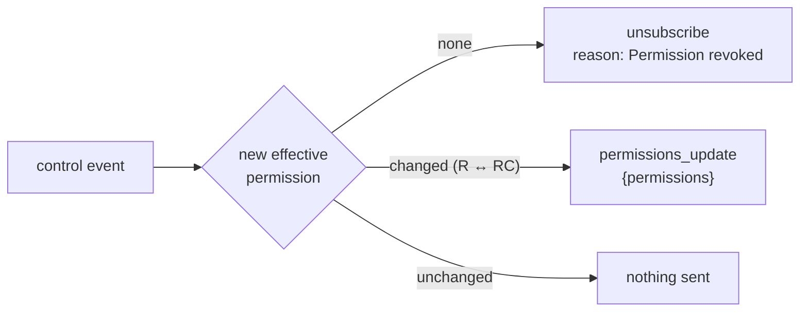

# Permissions

<p align="center">
  
</p>

Access to data is granted **per element**. A dashboard, a device or admin status never grants it implicitly.

## Levels

| Level | Can |
|---|---|
| `R` (read) | Subscribe to the element: live values, history replay, the device's connection status. Read history over REST. See the element in `GET /api/v1/me/elements`. |
| `RC` (read and control) | Everything in `R`, plus send commands (`message_element`) to the device |
| *(none)* | Nothing. Subscribing returns `permission_denied`, history returns 404, and the element does not appear in `/me/elements`. |

## Grants: users and groups

A grant ties an element to **either** a user **or** a group, with a level:



- There is at most one grant per (element, user) and one per (element, group). `PUT /api/v1/admin/permissions` creates or updates it, so calling it twice is safe.
- Grants are deleted automatically with their element, user or group.
- Use groups for roles ("operators", "maintenance") and direct grants for exceptions.

## The max-permission rule

A user's **effective** permission on an element is the **highest** of their direct grant and the grants of every group they belong to. `RC` beats `R`.

| Direct grant | Group grants | Effective |
|---|---|---|
| — | `R` (operators) | `R` |
| `R` | `RC` (maintenance) | `RC` |
| `RC` | `R` | `RC` |
| — | — | none |

There are no deny rules: removing access means removing grants. An **inactive** user has no effective permission at all. The rule is a single SQL query (`MaxPermission` in `server/internal/store/permissions.go`). Subscribe, REST history and `/me/elements` all use the same rule.

## Where it's enforced

| Action | Check |
|---|---|
| WebSocket `subscribe` | Effective permission ≠ none. The level is cached on the subscription. |
| WebSocket `message_element` | The socket is subscribed to the element with `RC` (the cached level, kept up to date as described below) |
| `GET /api/v1/elements/{id}/history` | Effective permission ≠ none, else 404 |
| `GET /api/v1/me/elements` | Lists only elements with an effective permission |
| Dashboards | **Not** a permission boundary. A shared dashboard shows each viewer only what their own grants allow ([Dashboards](./dashboards.md#sharing)). |
| Devices | Not grant-based. A device may publish to its own elements, and receives every command for them. |

## Live re-evaluation

Permission changes apply to **open** subscriptions within about a second, with no reconnect. Every grant, membership or user change commits an outbox row in the same transaction. The relay publishes it as a control event, and every gateway re-checks the affected subscriptions against Postgres:

| Change | Subscriptions re-checked |
|---|---|
| Grant created, updated or deleted for a **user** | That user's subscriptions to that element |
| Grant created, updated or deleted for a **group** | All subscriptions to that element (any user might be a member) |
| User added to or removed from a group | All of that user's subscriptions |
| Group deleted | All subscriptions of each former member |
| User updated (deactivated, password changed, role changed) | The socket is closed with 4000 if the session is no longer valid; otherwise all of the user's subscriptions are re-checked |
| Element deleted (or its device) | Subscribers get a forced `unsubscribe` with `reason: "Element deleted"` |

The result of a re-check is pushed to the socket:



A **new** grant does not subscribe anyone automatically. It takes effect on the client's next `subscribe` or `/me/elements` request.

## Recipes

```sh
# Give the "operators" group read access to an element
curl -b jar.txt -X PUT -H 'Content-Type: application/json' \
  -d '{"element_id":"<uuid>","group_id":3,"permission":"R"}' http://127.0.0.1:8080/api/v1/admin/permissions

# Let one user control it
curl -b jar.txt -X PUT -H 'Content-Type: application/json' \
  -d '{"element_id":"<uuid>","user_id":7,"permission":"RC"}' http://127.0.0.1:8080/api/v1/admin/permissions

# Who has access to an element?
curl -b jar.txt 'http://127.0.0.1:8080/api/v1/admin/permissions?element_id=<uuid>'
```

In the web app, the same operations are under **Admin → Permissions** and **Admin → Groups**.
