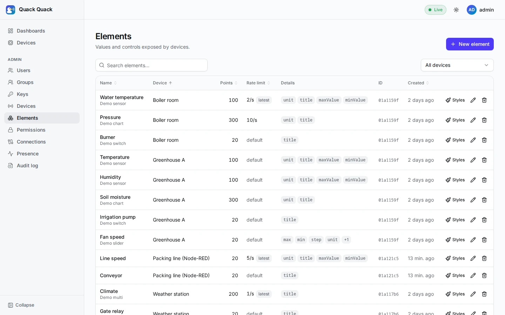
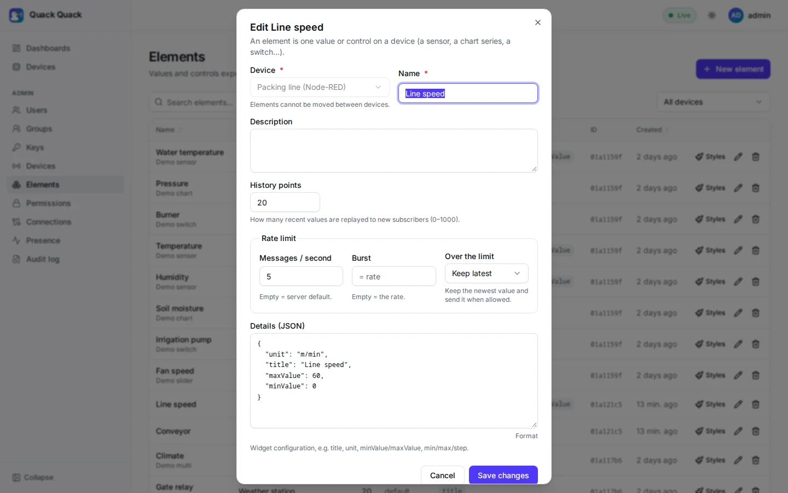

# Rate limits

Every message a device sends is fanned out to dashboards and stored for a year, so one runaway device (a Node-RED flow without a delay, a firmware bug) can cost a lot. Limits protect the platform. They are not billing.

There are two layers, and they apply the same way on every device transport: [WebSocket](../04_api_reference/device_api.md), [REST](../04_api_reference/device_rest_api.md) and [gRPC](../04_api_reference/device_grpc_api.md).

| Layer | Default | Set by | What it covers |
|---|---|---|---|
| **Element limit** | 50 msg/s, burst = rate | Per element, by an admin | Messages for one element (one data stream) |
| **Device guard** | 500 msg/s | Server config (`QUACK_DEVICE_MSG_RATE`) | Everything a device sends, including frames that name no valid element |

Both are token buckets: a bucket holds up to *burst* tokens, refills at *rate* per second, and every message takes one.

## Element limits

An element is one stream of values, and streams differ: a soil sensor might report once a minute, a vibration sensor 100 times a second. So the limit lives on the element.



Set it in **Admin → Elements → Edit → Rate limit**, or through the API:

```sh
curl -X PATCH http://127.0.0.1:8080/api/v1/admin/elements/$ID -b cookies.txt \
  -H 'Content-Type: application/json' -d '{"msg_rate": 5, "msg_burst": 10, "over_limit": "latest"}'
```

| Field | Meaning |
|---|---|
| `msg_rate` | Messages per second (decimals allowed, e.g. `0.2` = one per 5 s). `null`/`0` = `QUACK_ELEMENT_MSG_RATE`. At most `QUACK_ELEMENT_MSG_RATE_MAX` (1000). |
| `msg_burst` | Bucket size. `null`/`0` = the rate (at least 1). |
| `over_limit` | `drop` or `latest`, see below |



Only admins can change limits. A change reaches every gateway within milliseconds through the [device registry](#how-limits-reach-the-gateways), and applies to connected devices at once, with no reconnect.

### Over the limit: drop or keep latest

| `over_limit` | What happens to a message over the limit |
|---|---|
| `drop` (default) | It is discarded. |
| `latest` | It is held. A newer one replaces it, and the held message is published as soon as the bucket has a token. |

`latest` fits readings: the dashboard always ends on the newest value, and the history store gets at most *rate* values per second. Messages keep their order: while one is held, newer ones replace it rather than overtake it.

What the device sees:

| Transport | Dropped | Held (`latest`) |
|---|---|---|
| WebSocket | Nothing: the frame is dropped silently (protocol v1 has no error frames) | Nothing |
| REST | `"status": "rejected", "code": "rate_limited"`; `429` + `Retry-After` if every message was | `"status": "coalesced"` |
| gRPC | `rejected` / `rate_limited`; `RESOURCE_EXHAUSTED` + `Retry-After` if every message was | `coalesced` |

Drops are counted in `quack_dropped_total{reason="element_rate_limit"}` and `{reason="device_rate_limit"}`, and held messages in `{reason="element_rate_coalesced"}`.

## The device guard

`QUACK_DEVICE_MSG_RATE` (500/s) bounds a whole device, whatever its elements' limits add up to, and also counts frames that are invalid or name an element the device doesn't have. On REST and gRPC `Publish`, a batch takes as many tokens as it has messages. If the batch doesn't fit, it is refused as a whole with `429`/`RESOURCE_EXHAUSTED`.

## Several gateway instances

Buckets live in memory, per gateway instance. Whether that is exact depends on the transport:

| Transport | Does one device's traffic spread over instances? | Exact? |
|---|---|---|
| WebSocket | No: one long connection | Yes |
| gRPC streams | No: a stream stays on its instance (until its max age) | Yes |
| REST, gRPC unary | Yes: each request may reach another instance | Up to N× with N instances, unless routed |

To make REST exact without any shared store, **route each device to one instance**: devices send `X-Quack-Device: <device id>`, and the ingress hashes on it (see [REST → Behind a load balancer](../04_api_reference/device_rest_api.md#behind-a-load-balancer)). The gateway rejects a header that doesn't match the token.

The limiter sits behind a `ratelimit.Limiter` interface with one driver today, `QUACK_RATELIMIT_DRIVER=local`. A shared driver (Valkey, GCRA in one Lua script, taking tokens in chunks to save round-trips, falling back to local limits if Valkey is down) can be added for strict quotas, such as billing or multi-tenant limits. It isn't needed for protection: a shared store would put a network round-trip and a new failure mode on every message to fix what routing already fixes. See the [design notes](../refactor/DEVICE_ADAPTERS_PLAN.md#_3-3-rate-limiting-across-instances).

## How limits reach the gateways

Gateways don't read Postgres per message, or even per request. Every change to a device, its key or its elements writes a full **device snapshot** to the compacted topic `device-config.v1`, in the same transaction, through the outbox. Every gateway reads that topic at start and follows it, so device authentication, element lookup by name and limits are all in-memory lookups. See [Realtime events → device-config.v1](./realtime_events.md#device-config-v1).

## Settings

| Variable | Default | Meaning |
|---|---|---|
| `QUACK_ELEMENT_MSG_RATE` | `50` | Rate of elements without their own limit |
| `QUACK_ELEMENT_MSG_RATE_MAX` | `1000` | Highest rate an admin may set |
| `QUACK_DEVICE_MSG_RATE` | `500` | Per-device guard. **Changed:** it used to be a per-socket limit with a default of 50. |
| `QUACK_RATELIMIT_DRIVER` | `local` | Where buckets live |

`0` for a rate means unlimited, which is useful for benchmarks only.
