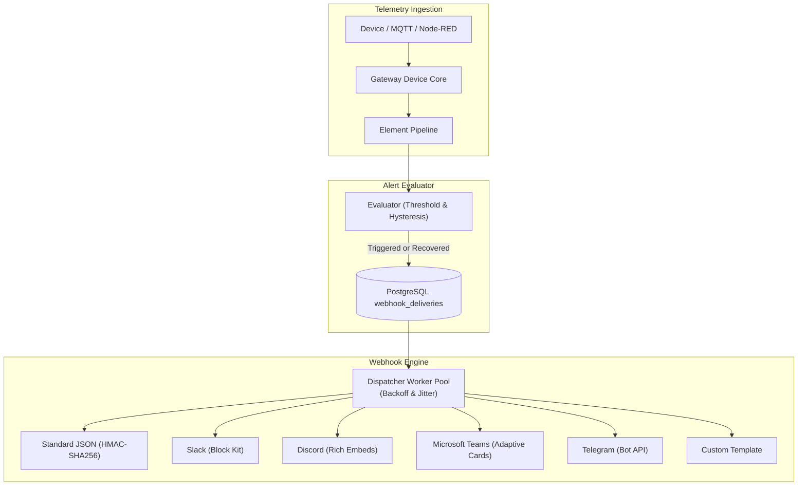

# Alerts and Webhooks

<p align="center">
  
</p>

Quack Quack includes an integrated **Element Alert Rules** engine and **Universal Webhook Notification Dispatcher**. This allows telemetry values to trigger notifications across external services (Slack, Discord, Microsoft Teams, Telegram, and standard webhooks) with hysteresis to prevent alarm flapping and automatic recovery detection.

---

## 1. Architecture



1. **Evaluation**: Incoming element telemetry is evaluated against configured rules.
2. **Hysteresis & Recovery**: If an alarm condition is met, a `NotificationEvent` is created and enqueued. When the value returns within the safe threshold band past the hysteresis window, a recovery event is dispatched.
3. **Queueing**: Events are transactionally recorded in `webhook_deliveries` with delivery status (`pending`, `retrying`, `delivered`, `failed`).
4. **Dispatch**: A background dispatcher delivers the payload with format-specific adapters, retrying failed attempts with exponential backoff and jitter.

---

## 2. Element Alert Rules

Alert rules are defined per element by administrators in **Admin → Elements → Alerts**.

### Supported Conditions

| Condition | Thresholds Required | Description |
|---|---|---|
| `above` | `threshold` | Triggers when telemetry rises strictly above the threshold ($v > T$). |
| `below` | `threshold` | Triggers when telemetry drops strictly below the threshold ($v < T$). |
| `outside_range` | `threshold` (min), `threshold_max` (max) | Triggers when telemetry leaves the allowed band ($v < T_{min}$ or $v > T_{max}$). |
| `equals` | `threshold` | Triggers when telemetry exactly equals a numeric value ($v == T$). |

### Severities

Each rule assigns a severity:

- **`critical`**: High-priority alarm (red badge in UI, red embeds in Discord/Teams).
- **`warning`**: Warning or advisory (amber badge in UI, amber embeds).
- **`info`**: Informational change (blue badge in UI, blue embeds).

Recovery notifications are dispatched with severity `info` and `isRecovery: true`.

### Hysteresis Band (Anti-Flapping)

In industrial IoT, noisy sensors floating near a threshold can trigger dozens of alarms per minute. A configurable **Hysteresis Band** ($H$) stabilizes the alarm state:

- For `above` condition ($T = 35$, $H = 1.0$):
  - Alarm triggers at $v > 35.0$.
  - Alarm **does not clear** until $v \le 34.0$ ($T - H$).
- For `below` condition ($T = 10$, $H = 0.5$):
  - Alarm triggers at $v < 10.0$.
  - Alarm **does not clear** until $v \ge 10.5$ ($T + H$).
- For `outside_range` ($T_{min} = 10$, $T_{max} = 30$, $H = 1.0$):
  - Alarm triggers when $v < 10.0$ or $v > 30.0$.
  - Alarm only clears when $11.0 \le v \le 29.0$.

### Alert Configuration Interface

| Light Theme | Dark Theme |
|---|---|
|  |  |

---

## 3. Webhook Adapters

Webhooks are configured in **Admin → Webhooks** (`/admin/webhooks`). Each endpoint can subscribe to a subset of severities (`info`, `warning`, `critical`).

| Webhooks Administration | Add Webhook Modal |
|---|---|
|  |  |

### Supported Payload Formats

| Format | Target Services | Payload Structure |
|---|---|---|
| `standard` | CloudEvents / Standard Webhooks / Zapier / Make | CloudEvents 1.0 JSON with HMAC-SHA256 signature headers. |
| `slack` | Slack Incoming Webhooks | Slack Block Kit with color-coded attachments, device info, and timestamp. |
| `discord` | Discord Webhooks | Rich Embed with hex color coding (`0xE11D48` critical, `0xD97706` warning, `0x0284C7` info). |
| `teams` | Microsoft Teams Webhooks / Power Automate | Adaptive Card 1.5 schema with alert facts and Markdown body. |
| `telegram` | Telegram Bot API (`/sendMessage`) | HTML formatted alert message with bold headers and code blocks. |
| `custom` | Any custom REST API | Go text/template JSON payload rendered with event fields. |

### Standard Webhook Signatures

Endpoints configured with `standard` format include cryptographic verification headers following the [Standard Webhooks specification](https://standardwebhooks.com/):

| Header | Description |
|---|---|
| `webhook-id` | Unique message UUID (`event_id`). |
| `webhook-timestamp` | Unix epoch timestamp in seconds. |
| `webhook-signature` | `v1,` prefixed base64 HMAC-SHA256 signature calculated over `${webhook-id}.${webhook-timestamp}.${body}`. |

Receivers verify the signature using the endpoint secret (`whsec_...`):

```python
import hmac, hashlib, base64

def verify(secret, webhook_id, timestamp, body, signature):
    key = base64.b64decode(secret.replace("whsec_", ""))
    signed_content = f"{webhook_id}.{timestamp}.{body}".encode("utf-8")
    expected = "v1," + base64.b64encode(hmac.new(key, signed_content, hashlib.sha256).digest()).decode("utf-8")
    return hmac.compare_digest(expected, signature)
```

---

## 4. Delivery & Retry Policy

Deliveries run asynchronously in a background worker pool:

- **Initial Attempt**: Immediately upon event generation.
- **Exponential Backoff**:
  $$\text{Delay} = \min(\text{BaseDelay} \times 2^{\text{attempt}}, \text{MaxDelay}) \times (0.8 \dots 1.2 \text{ Jitter})$$
  - Base delay: 10 seconds.
  - Max delay: 1 hour.
  - Maximum attempts: 5.
- **Non-Retryable Failures**: HTTP 400, 401, 403, and 404 responses are marked as terminal failures immediately without retrying.
- **Delivery Log Inspection**: The Admin UI displays recent delivery logs, HTTP status codes, latency in milliseconds, and the exact response bodies for debugging.
- **Instant Test Ping**: Administrators can click **Send Test** on any endpoint to dispatch a simulated event and receive live round-trip latency feedback.

---

## 5. REST API Reference

### Element Alert Rules

```http
GET    /api/v1/admin/elements/{id}/alerts
POST   /api/v1/admin/elements/{id}/alerts
DELETE /api/v1/admin/elements/{id}/alerts/{ruleId}
```

#### Example: Create an Alert Rule

```bash
curl -X POST http://127.0.0.1:8080/api/v1/admin/elements/$ELEMENT_ID/alerts \
  -b cookies.txt \
  -H 'Content-Type: application/json' \
  -d '{
    "name": "High Motor Temperature",
    "condition": "above",
    "threshold": 75.0,
    "hysteresis": 2.0,
    "severity": "critical",
    "message": "Motor temperature exceeded maximum rated limit",
    "enabled": true
  }'
```

### Webhook Endpoints

```http
GET    /api/v1/admin/webhooks
POST   /api/v1/admin/webhooks
GET    /api/v1/admin/webhooks/{id}
PATCH  /api/v1/admin/webhooks/{id}
DELETE /api/v1/admin/webhooks/{id}
POST   /api/v1/admin/webhooks/{id}/test
GET    /api/v1/admin/webhooks/{id}/deliveries
```

#### Example: Create a Slack Webhook

```bash
curl -X POST http://127.0.0.1:8080/api/v1/admin/webhooks \
  -b cookies.txt \
  -H 'Content-Type: application/json' \
  -d '{
    "name": "Production Alerts Channel",
    "url": "https://hooks.slack.com/services/T000/B000/XXXX",
    "format": "slack",
    "severities": ["warning", "critical"],
    "enabled": true
  }'
```
