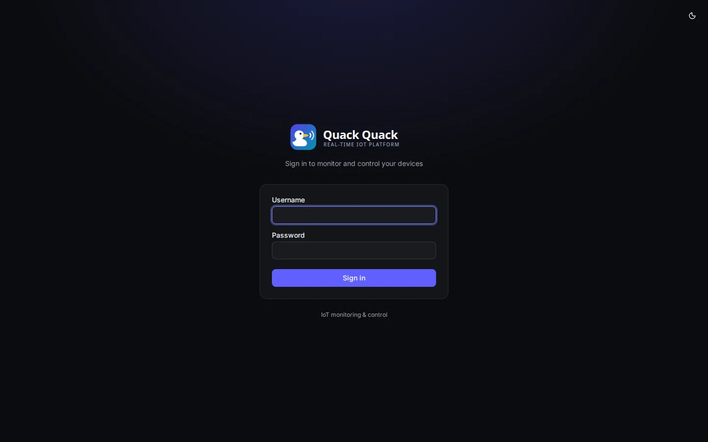
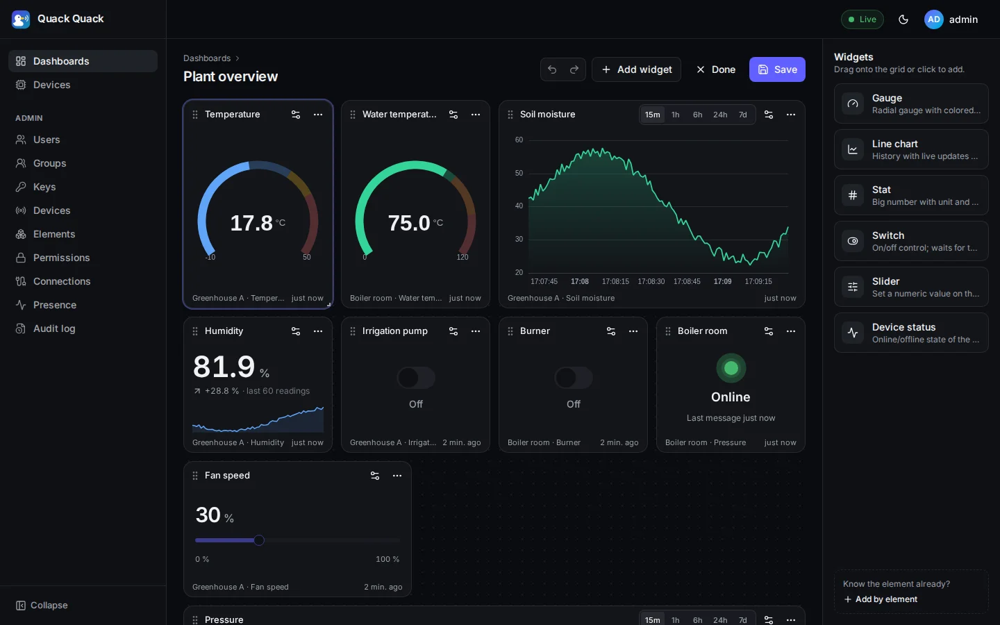
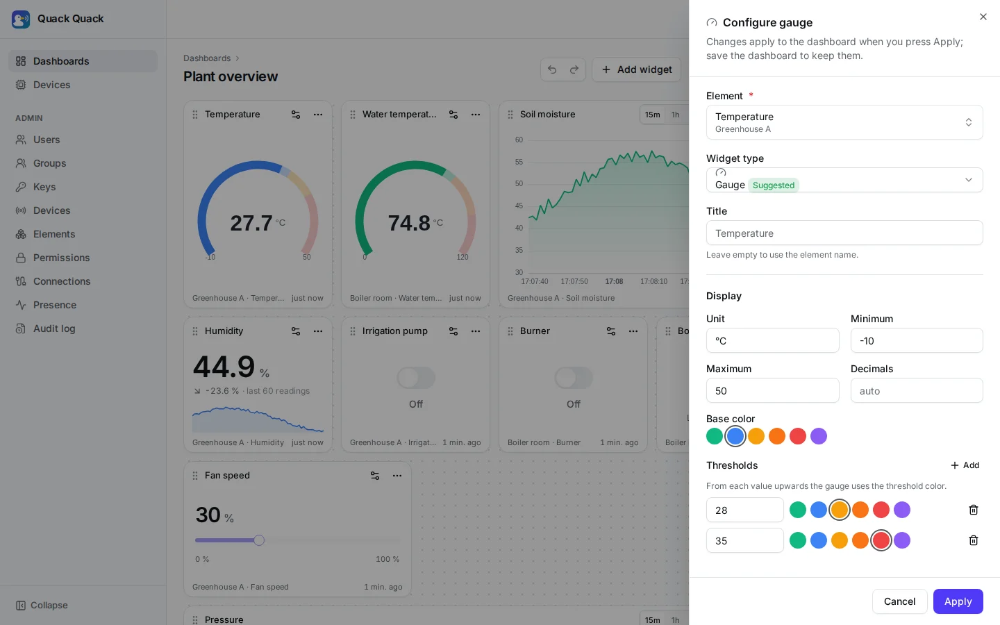
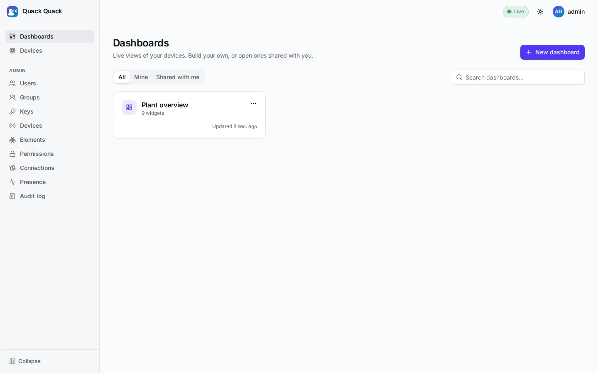
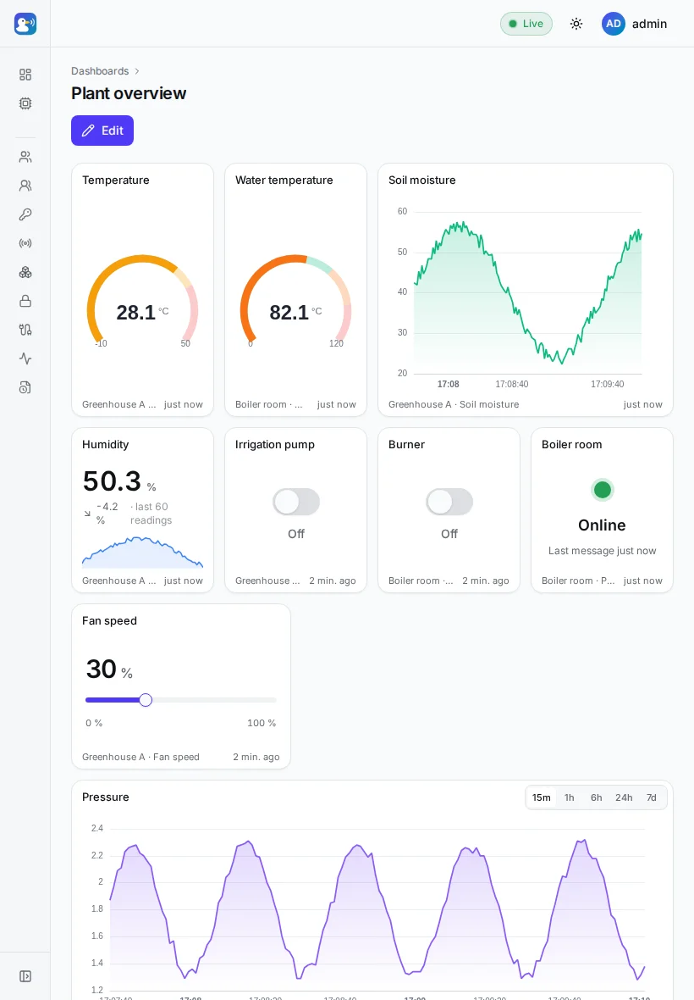
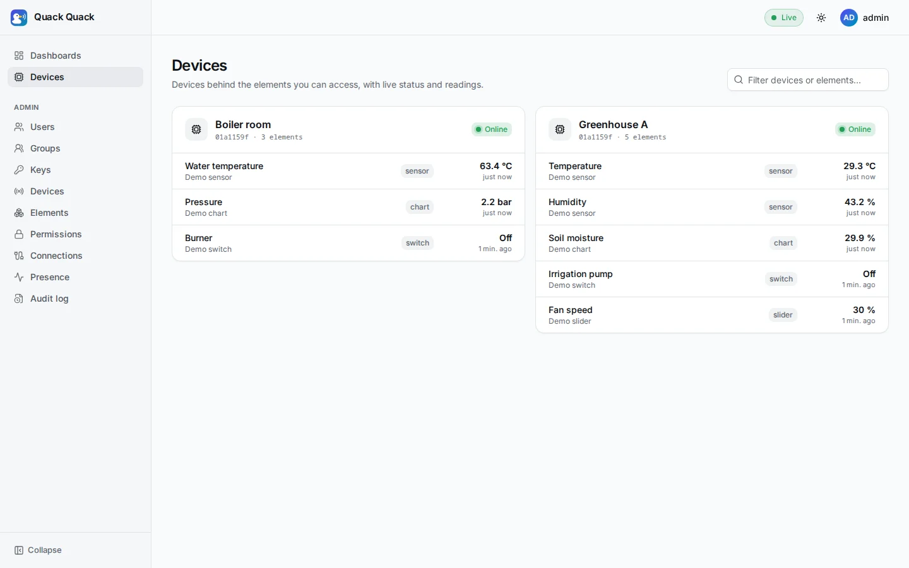
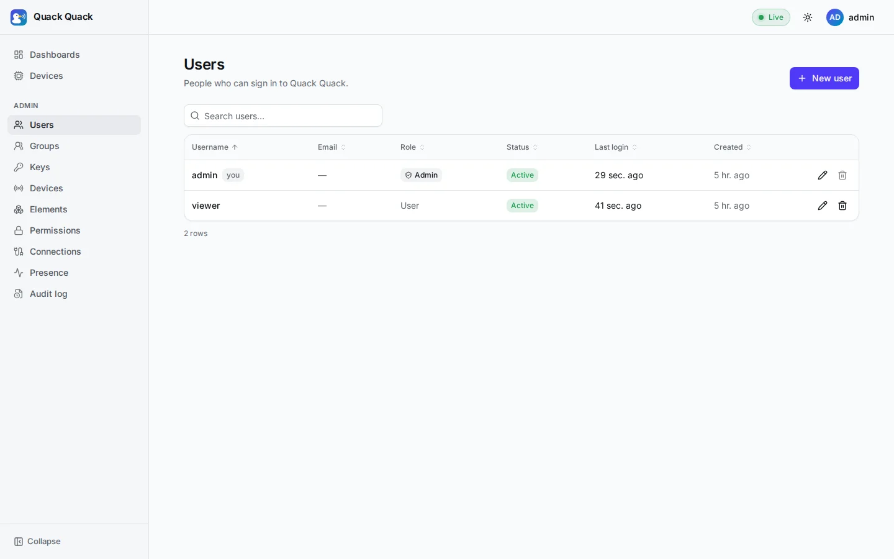
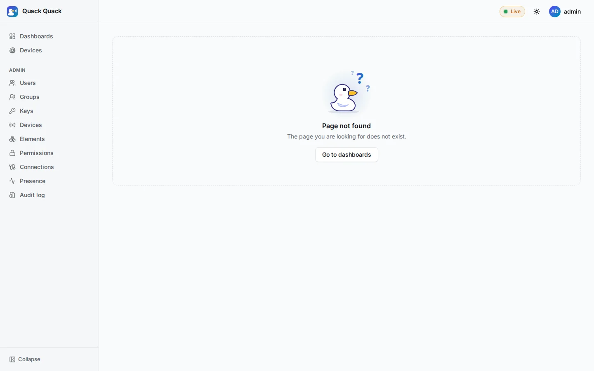

# Screenshots

A tour of the web app, from the demo stack (`task demo` + `task simulate`). The pictures are captured by the
Playwright suite (`web/e2e/screenshots.spec.ts`), so they always show the real UI.

## Sign in

| Light | Dark |
|---|---|
|  |  |

## Live dashboard

Gauges, charts, switches, a slider and a device status widget, all updating in real time. The header shows the live
connection state.

## Building a dashboard

Drag widgets from the palette onto the grid, then move and resize them. Undo/redo, unsaved-changes protection and
responsive layouts are built in.

Every widget has a configuration sheet: title, units, ranges, colored thresholds, decimals and the chart time range.

## Dashboards list and tablets

| Your dashboards | Tablet layout |
|---|---|
|  |  |

## Devices

The devices behind the elements you can see, with live online status:

## Administration

Users, groups, device keys, devices, elements, permissions, connections, live presence and an audit log replace the
old Django admin.

## Friendly empty and error states

Empty and error states show a duck that fits the situation. Here is the lost duck on the "page not found" screen:

