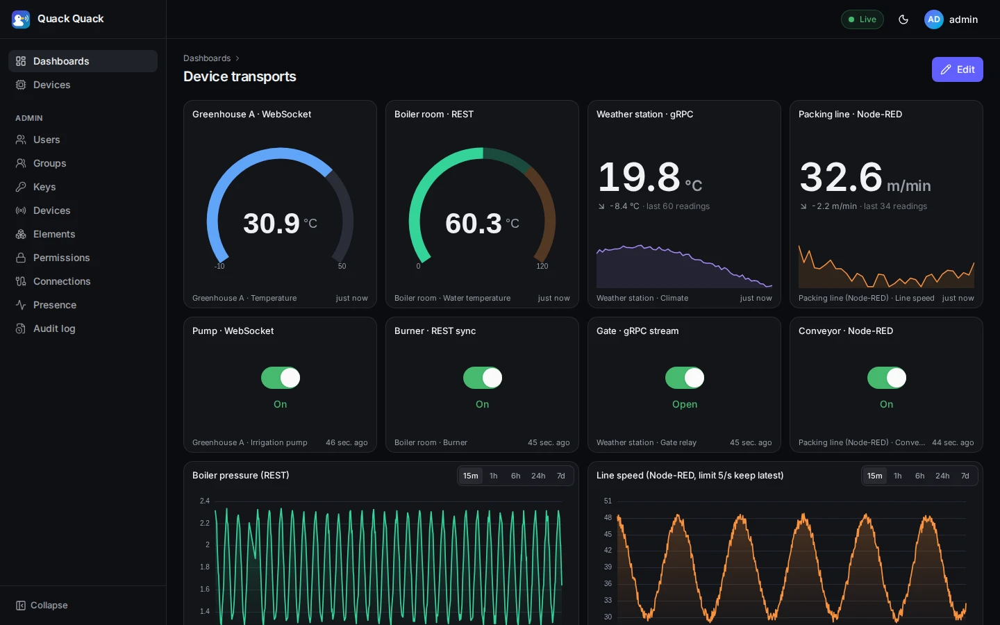
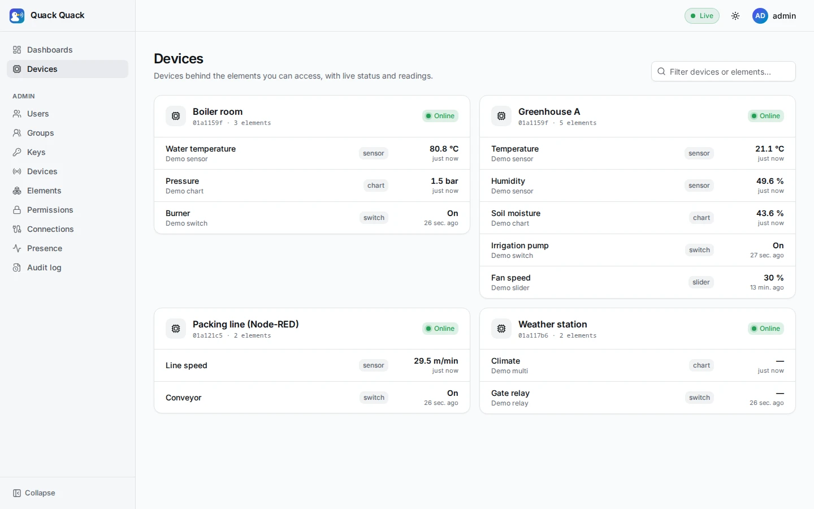
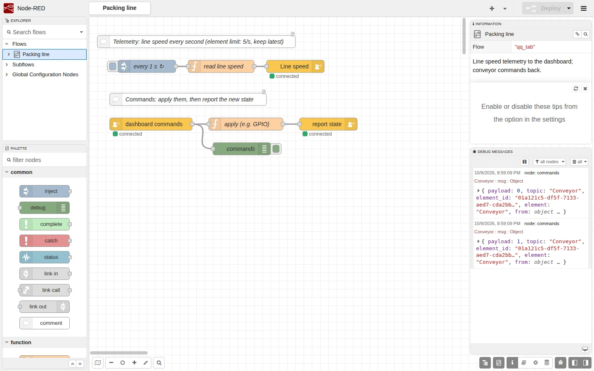
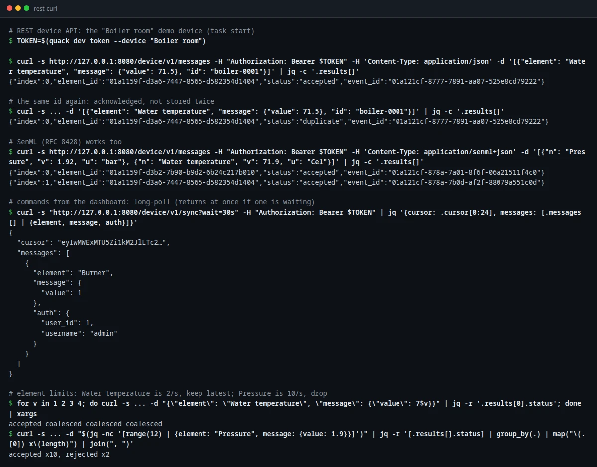
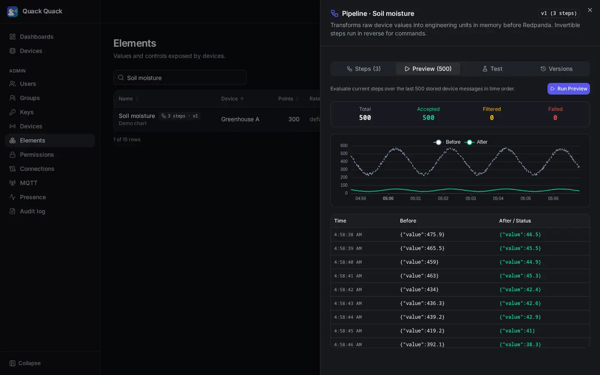
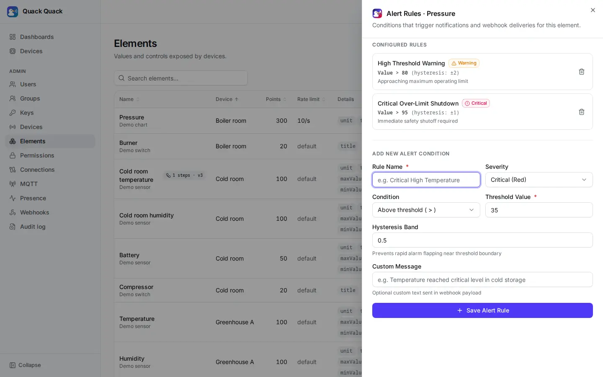
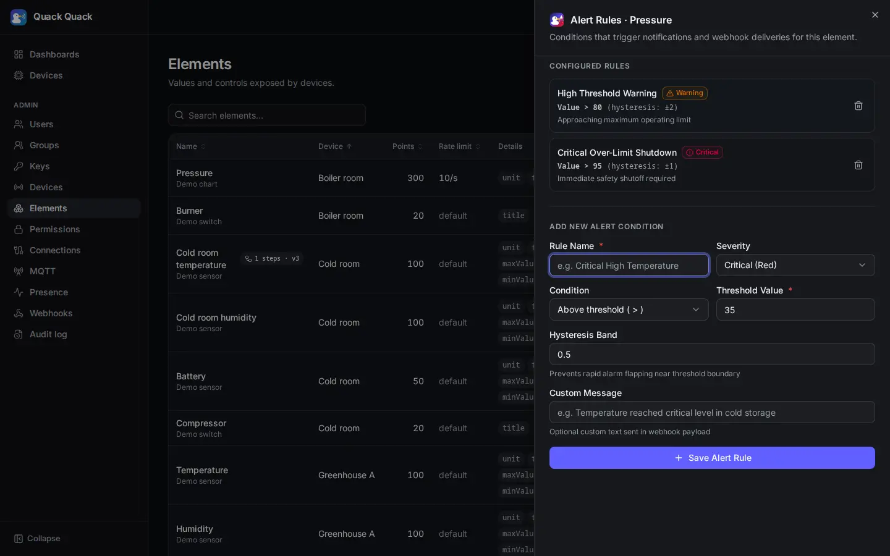
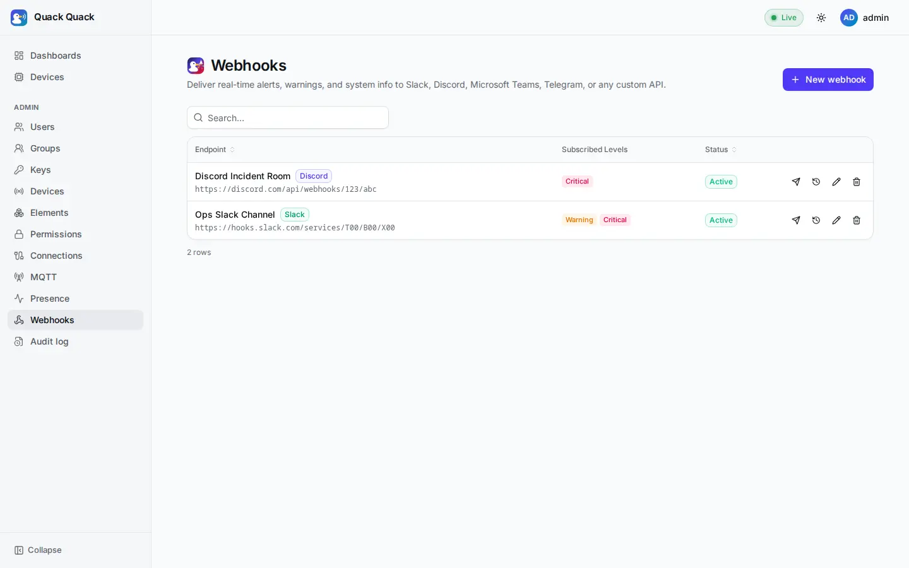
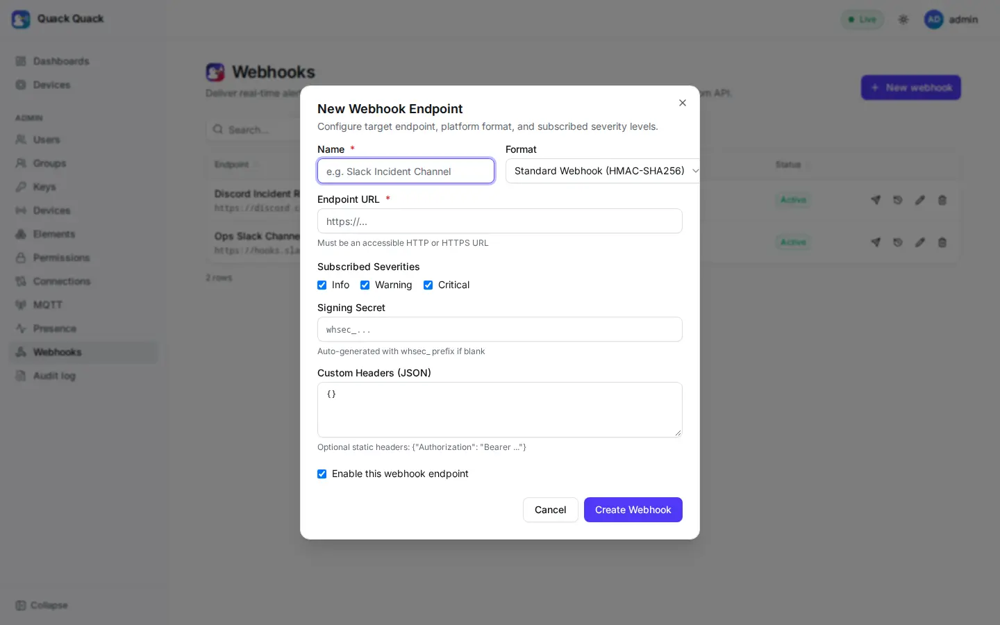
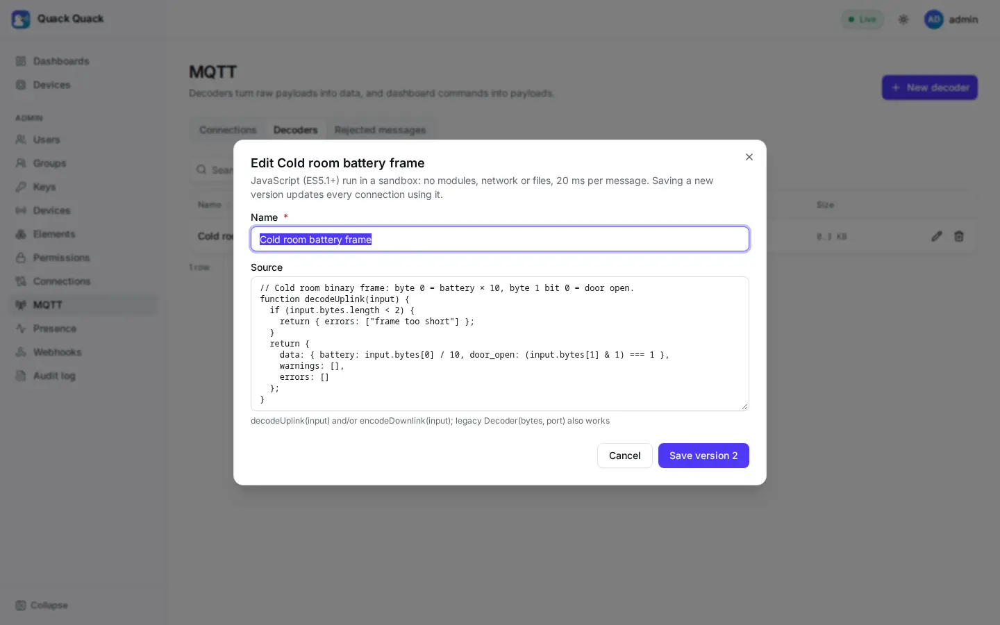

# Screenshots

A tour of the web app, from the demo stack (`task demo` + `task simulate`). The pictures are captured by the
Playwright suite (`web/e2e/screenshots.spec.ts`), so they always show the real UI.

## Sign in

| Light | Dark |
|---|---|
|  |  |

## Live dashboard

Gauges, charts, switches, a slider and a device status widget, all updating in real time. The header shows the live
connection state.

## Building a dashboard

Drag widgets from the palette onto the grid, then move and resize them. Undo/redo, unsaved-changes protection and
responsive layouts are built in.

Every widget has a configuration sheet: title, units, ranges, colored thresholds, decimals and the chart time range.

## Device transports

One dashboard fed by all three device transports plus Node-RED: *Greenhouse A* over the WebSocket, *Boiler room* over
REST, *Weather station* over gRPC, and the *Packing line* flow in Node-RED. Every switch was flipped in the browser,
reached its device over that device's transport, and was confirmed back. Captured by `web/e2e/protocols.spec.ts`.

| All four devices online | The Node-RED flow behind *Packing line* |
|---|---|
|  |  |

| REST with curl | gRPC with buf curl |
|---|---|
|  |  |

## Rate limits per element

| Element list | Element form |
|---|---|
|  |  |

## Element pipelines

In **Admin → Elements**, each element has an in-memory transformation pipeline (Station 2) with steps like `scale`, `round`, `clamp`, `deadband`, `map`, and `script`. The pipeline sheet includes an interactive step editor with invertible badges, a live before-and-after preview table and chart over the last 500 history points, a test console with command inversion verification, and version rollback.

| Light | Dark |
|---|---|
|  |  |

## Element alert rules

In **Admin → Elements**, each element row provides a dedicated **Alerts** button. The Alert Rules sheet allows administrators to configure threshold conditions (`above`, `below`, `outside_range`, `equals`), severity levels (`info`, `warning`, `critical`), and anti-flapping hysteresis bands.

| Light | Dark |
|---|---|
|  |  |

## Webhooks

Manage outbound notification destinations across Slack, Discord, Microsoft Teams, Telegram, and standard HMAC-SHA256 webhooks in **Admin → Webhooks**. Deliveries track status, HTTP latency, retries with backoff and jitter, and manual test pings.

| Webhook destinations | Endpoint configuration modal |
|---|---|
|  |  |

## Dashboards list and tablets

| Your dashboards | Tablet layout |
|---|---|
|  |  |

## Devices

The devices behind the elements you can see, with live online status:

## Administration

Users, groups, device keys, devices, elements, permissions, connections, live presence and an audit log replace the
old Django admin.

## MQTT

Devices that publish to an MQTT broker feed dashboards through [MQTT connections](./10_mqtt.md). The *Cold room* demo device speaks only MQTT: temperature and humidity in one JSON message, its battery in a binary frame decoded by JavaScript, and a compressor switch sent back as a downlink.

| Light | Dark |
|---|---|
|  |  |

Connections show which gateway owns each slot; a connection's page lists its granted devices, uplink rules and downlinks:

*Test & capture* runs a sample through a rule's decoder and field map, and shows the raw messages arriving:

| Decoders | Rejected messages |
|---|---|
|  |  |

## Friendly empty and error states

Empty and error states show a duck that fits the situation. Here is the lost duck on the "page not found" screen:

## Node-RED integration

The [Node-RED nodes](./09_node_red.md) feeding a dashboard. The switch was flipped in the browser, applied in Node-RED, and confirmed back.

| Device settings with a connection test | Elements loaded from the server |
|---|---|
|  |  |
