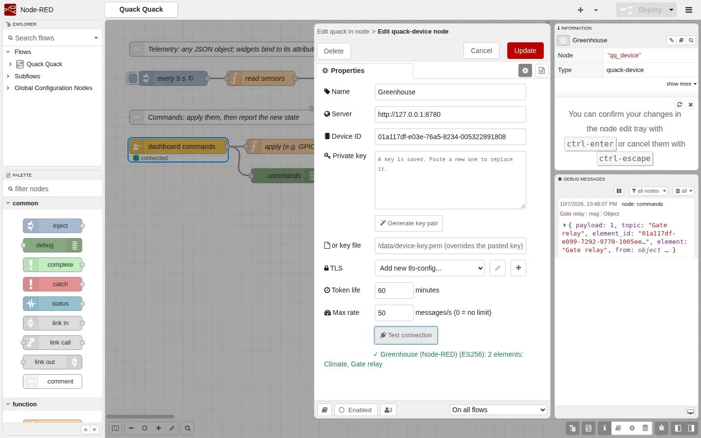
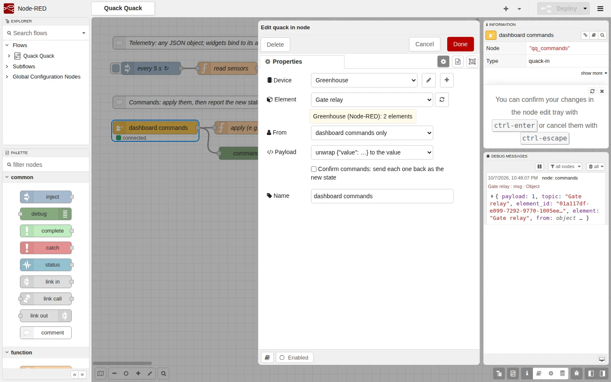
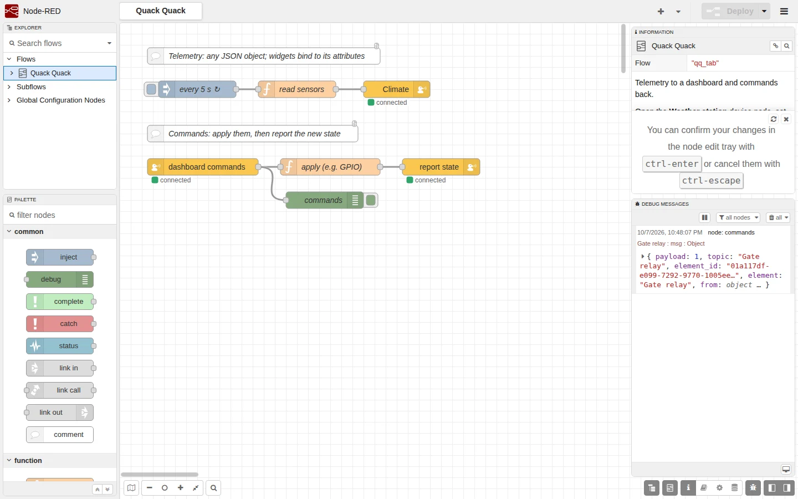
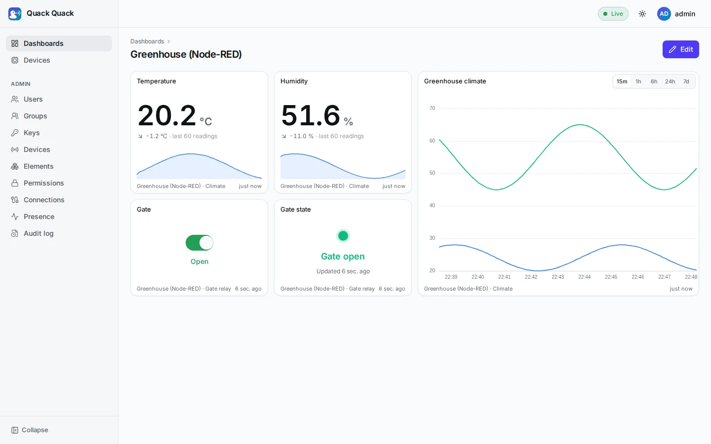

# Node-RED integration

`node-red-contrib-quackquack` is a Node-RED package for Quack Quack. Install it from its GitHub release, point it at your server, and a flow can:

- send readings to dashboards (*quack out*),
- receive the commands people send from them (*quack in*).

You don't have to write WebSocket frames, sign JWTs or handle reconnects yourself. The source is in [`integrations/node-red/`](https://github.com/taha2samy-3/qauk-qauk/tree/main/integrations/node-red).


*Left: the example flow, with every node connected and a dashboard command in the debug panel. Right: the dashboard it feeds. The switch was flipped in the browser, applied in Node-RED and confirmed back.*

## The nodes

| Node | Role |
|---|---|
| **quack-device** (config) | One device: server address, device ID and private key. Every node that uses it shares **one** WebSocket. |
| **quack out** | Sends `msg.payload` as the `message` of one of the device's elements. |
| **quack in** | Emits the commands that dashboards send to the device's elements. |

The nodes use the [device protocol](./04_api_reference/device_api.md) and add the following on top of it:

| Concern | What the nodes do |
|---|---|
| Token lifetime | A fresh JWT is signed with the device key for **every** connection, so the 24 h cap never bites. ES256 or RS256 is picked from the key. |
| Reconnects | Exponential backoff with jitter (1 s → 30 s). After a 403 or a revocation (close code 4000), retries wait at least 60 s, since an admin has to act first. A key rotation (1000 `key changed`) reconnects at once. |
| Dead links | The server pings every 30 s. Silence for 75 s replaces the socket. |
| Element names | The device's element list is loaded from [`GET /device/elements`](./04_api_reference/device_api.md#listing-elements) on connect. An unknown name triggers one reload, so new elements work without a redeploy. |
| Server limits | Frames over 64 KiB, or over the rate (default 50/s, matching the server), are **rejected in Node-RED with an error** instead of being dropped silently by the server. Catch them with a *catch* node. |
| Echo loops | The server never sends a socket its own frames. *quack in* passes on only user commands by default, ignoring telemetry from the device's other connections. |

## Install

The package is released on GitHub (not on the npm registry). Each [release](https://github.com/taha2samy-3/qauk-qauk/releases) tagged `node-red-v…` has the tarball attached. Install it in the Node-RED user directory (usually `~/.node-red`), then restart Node-RED:

```sh
cd ~/.node-red
npm install https://github.com/taha2samy-3/qauk-qauk/releases/download/node-red-v0.1.0-alpha.1/node-red-contrib-quackquack-0.1.0-alpha.1.tgz
```

Or download the `.tgz` from the release and upload it in Node-RED: **Menu → Manage palette → Install → upload** (the icon next to the search box).

Requirements: Node-RED 3.0 or later on Node.js 18 or later. The package's only dependency is `ws`. It is tested against Node-RED 5.

For a development checkout, use one of these:

- `task nodered:dev` runs a local Node-RED on `:1880` with the nodes loaded from source.
- `task nodered:pack` builds the tarball, which you can then install with `npm install ./node-red-contrib-quackquack-<version>.tgz`.

## Connect a device

### 1. On the platform (as an admin)

1. **A key pair.** The server stores only the public key. To get a pair, open any *quack-device* node in Node-RED and press **Generate key pair**: the private key fills the form and the public key is shown, ready to copy. Or use OpenSSL:
   ```sh
   openssl ecparam -name prime256v1 -genkey -noout | openssl pkcs8 -topk8 -nocrypt -out device-key.pem
   openssl pkey -in device-key.pem -pubout -out device-key.pub.pem
   ```
2. **Admin → Keys**: add the public key.
3. **Admin → Devices**: create the device, assign the key, and copy the device ID.
4. **Admin → Elements**: add the device's elements, for example `Climate` (a chart) and `Gate relay` (a switch).
5. **Admin → Permissions**: grant `R` (view) or `RC` (view and control) on those elements to the users or groups who should see them. **Admins need a grant too.** Without one, dashboard widgets show *Element unavailable*.

### 2. In Node-RED

Add a *quack out* or *quack in* node, and create its device:

| Field | Value |
|---|---|
| Server | `http://127.0.0.1:8080`, `https://iot.example.com`, or a path prefix behind a proxy (`https://example.com/quack`). The full device URL works too. |
| Device ID | The UUID from step 3 |
| Private key | Pasted or generated. Or set a **key file** (e.g. a mounted Docker or Kubernetes secret), which overrides the pasted key. |
| TLS | Optional `tls-config` for a private CA or client certificates |
| Token life | Minutes per signed token (default 60). Each connection signs a new one. |
| Max rate | Messages per second before Node-RED refuses them (default 50, the server's default; `0` = off) |

Press **Test connection**. It signs a token with the key in the dialog (or the deployed one) and lists the device's elements, without deploying.



The private key is a Node-RED **credential**: it is stored encrypted in `flows_cred.json` and never sent back to the editor.

## Send telemetry: quack out

| `msg.payload` | `message` sent |
|---|---|
| `21.5`, `true`, `"ON"` | `{"value": 21.5}`, `{"value": true}`, `{"value": "ON"}` |
| `{"temperature": 21.5, "gps": {"lat": 30.04}}` | unchanged |

The `{"value": …}` shape is what dashboards and the per-minute history aggregates read by default. Objects are sent unchanged. Dashboard widgets can [bind to any attribute](./05_core_concepts/dashboards.md) of them (`temperature`, `gps.lat`), and a chart can plot several attributes. Choose **send msg.payload unchanged** to never wrap.

**Which element:** the one picked in the node. If none is picked, the element comes from `msg.element_id`, then from `msg.topic`. Each can be an element ID or a name (case-insensitive). One *quack out* node can therefore serve every element:

```js
// function node
msg.topic = 'Climate'
msg.payload = { temperature: 21.5, humidity: 48, ts: Date.now() }
return msg
```

**Errors** are raised as node errors, so a *catch* node can handle them:

- offline
- unknown element
- two elements with the same name
- payload empty or binary
- frame over 64 KiB
- rate exceeded

Nothing is queued while offline. Buffer in the flow if you need that.

## Receive commands: quack in

When someone flips a switch or moves a slider on a dashboard, the device gets the command and *quack in* emits:

```js
{
  payload: 1,                 // {"value": 1}, unwrapped; "the message unchanged" keeps the object
  topic: "Gate relay",        // element name (its ID if unknown)
  element_id: "01a117df-e099-…",
  element: "Gate relay",
  from: { kind: "user", user_id: 1, username: "admin" },
  last_edit_at: "2026-10-07T19:48:07.120Z"   // server receive time
}
```

| Option | Meaning |
|---|---|
| Element | One element, or every element of the device |
| From | *dashboard commands only* (default), or also frames from this device's **other** connections (`from.kind: "device"`) |
| Payload | Unwrap `{"value": x}` to `x`, or keep the message unchanged |
| Confirm commands | Echo each user command back right away as the new state |



### Confirming commands

A dashboard switch shows the new state only after the device **reports** it, which is the same actuator pattern as any device. There are two ways to report it:

- **Confirm after applying (recommended).** Wire *quack in* → your logic (GPIO, Modbus, an HTTP call…) → *quack out* with **no element picked**. It replies to `msg.element_id`, so the dashboard shows what really happened. This is how the example flow works.
- **Confirm commands** ticked: the command is echoed as soon as it arrives. That is fine for virtual devices, but it can show "on" even if the hardware failed.

## The example flow

**Menu → Import → Examples → node-red-contrib-quackquack → send-and-receive** imports a flow with two parts:

- **Telemetry:** every 5 s, a *function* node builds `{temperature, humidity, battery, ts}`. *quack out* sends it to the element named in `msg.topic` (`Climate`).
- **Commands:** *quack in* → *apply (e.g. GPIO)* → *quack out* (no element). A debug node shows each command.



Set the device (server, ID, key), adapt the element names, and deploy. On a dashboard, bind a line chart to `temperature` with X = `ts`, and add `humidity` as a second series. A switch on `Gate relay` then works end to end.



## Status badges

| Badge | Meaning | Fix |
|---|---|---|
| 🟢 connected | Ready | |
| 🟡 connecting | Handshake in progress | |
| 🔴 disconnected, retry in N s | Network or server gone, or no ping for 75 s | Check the URL and that the server is up |
| 🔴 auth failed | HTTP 403 | Device ID, private key, key active, key assigned to the device, server clock (`exp`) |
| 🔴 device deleted / device key removed / device key changed | Revoked by an admin (close code 4000) | Re-create the device or reassign a key |
| 🔴 an error message | Config error, e.g. a bad key or URL | Shown in the debug sidebar as well |

The Node-RED log has one line per connection change, e.g. `[quack-device:Greenhouse] ws://…/device/node_red/ connected`.

## How it was tested

- **Unit and runtime tests (`task nodered:test`, 22 tests).** A fake gateway verifies JWT signatures the way the real one does. The tests cover token signing (ES256/RS256, PEM formats, bad keys), reconnects, 403 and 4000 handling, liveness, the stop/start race on partial redeploys, the limits, and old servers without `/device/elements`. The nodes themselves run inside a real Node-RED 5 runtime: routing by name, *catch*, filtering, confirm, an in → out round trip, and the editor endpoints.
- **End to end.** The packed tarball was installed into a fresh Node-RED 5 and pointed at a running platform. The checks:
  - its telemetry landed in TimescaleDB;
  - a dashboard switch reached Node-RED and was confirmed back;
  - the Status widget's value mapping followed the confirmed state;
  - the editor's element picker and connection test worked.

  The screenshots on this page come from that run.

## Releases

The package is versioned and released **separately** from the server image:

| What | Tag | Workflow | Goes to |
|---|---|---|---|
| Server image | `v1.2.0` | `release-image.yaml` | GitHub Container Registry `ghcr.io/taha2samy-3/quack_quack`, after tests and a Trivy scan, plus a GitHub release |
| Node-RED nodes | `node-red-v0.2.0` (must match `integrations/node-red/package.json`) | `release-node-red.yaml` | A GitHub release with the npm tarball and its SHA-256 |

Both are published on GitHub only: nothing goes to the npm registry or Docker Hub, and no secrets are needed. Pre-releases (`-alpha.1`, `-rc.1`) are marked as such and don't move `latest`. A new GHCR package starts private: make it public under the repository's **Packages → Package settings**.
