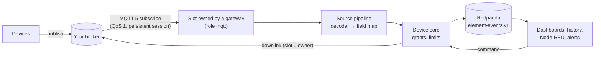
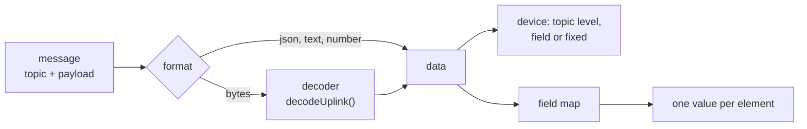

# 10. MQTT connections

Devices that already talk to an MQTT broker (Mosquitto, EMQX, HiveMQ, AWS IoT, The Things Stack, ChirpStack…) can feed dashboards without changing their firmware. Quack Quack connects to the broker as an **MQTT 5 client**: it subscribes to your topics, turns messages into element values, and publishes dashboard commands back.

**We are a subscriber, not a broker.** Quack Quack doesn't run or embed a broker, and devices never connect to it over MQTT. The broker and its security (who may publish on which topic) stay yours.


## How it works



- MQTT runs **inside the gateway**, as the `mqtt` role (`QUACK_ROLES=api,gateway,mqtt`). There is no separate service to deploy.
- Every value goes through the same **device core** as the WebSocket, REST and gRPC transports, so element limits, the device rate limit, history and CloudEvents work the same. Each CloudEvent from MQTT carries the extension `quackvia=mqtt/<connection id>`.
- A connection may only write to devices it was **granted**, by an *external id*: the name the device has in your topics or payloads.
- A device counts as **online** while its messages keep arriving (within `QUACK_PRESENCE_TTL`), like a REST device.
- The configuration lives in Postgres and is published to the compacted topic `mqtt-config.v1`. Gateways follow that topic, so a change in the admin applies within a second, without restarts.

## Many gateways: slots and rendezvous hashing

A connection has `replicas` **slots** (1 by default). Each slot is one MQTT client with a fixed client id, `<client_id_prefix>-<slot>`.

Every gateway with the `mqtt` role writes itself into `gateway_members` on its presence heartbeat (every `QUACK_PRESENCE_HEARTBEAT`, with its `QUACK_MQTT_WEIGHT`). On each heartbeat, every gateway reads the live members and computes, on its own, who owns what with **weighted rendezvous hashing** (highest random weight, top-K):

```
score(connection, member) = -weight / ln(u),   u = xxhash(connection id, member id) mapped to (0, 1)
owners(connection)        = members sorted by score, best first
slot n                    = owners[n]           (n < replicas)
```

All gateways see the same members and get the same answer, so there is no leader, no lock and no coordination traffic. When a gateway leaves, only the connections it owned move; when one joins, it takes an even share from the others and nothing else moves. A gateway with weight 2 owns about twice as many connections.

The slots of one connection always land on **different gateways**. With fewer `mqtt` gateways than `replicas`, the extra slots stay idle (the connection page shows them as not connected) until more gateways join.

**Handover is safe without coordination.** For a moment two gateways may both believe they own a slot (one has seen the new member list, the other hasn't). They use the same client id, and an MQTT broker allows one session per client id: the newer connection takes the session over and the broker disconnects the older one. That is the fence.

**No message is lost on handover.** Slots connect with `clean_start=false` and a session expiry (`session_expiry`, 1 hour by default), and subscribe with QoS 1. A message is acknowledged to the broker only after every value it produced is durable on Redpanda. Messages the old owner never acknowledged stay in the broker's session and are delivered again to the new owner. Duplicates are possible on handover (QoS 1 is at least once); losses are not.

When a gateway dies without leaving, its member row expires after `QUACK_PRESENCE_TTL` (30 s), and the others take its slots over on their next heartbeat.

### More than one slot

With `replicas > 1`, each slot subscribes to `$share/<client_id_prefix>/<filter>`, an MQTT 5 **shared subscription**. The broker spreads the messages over the slots, which usually sit on different gateways. Use it for throughput, or so that losing one gateway pauses only part of the traffic. Messages of one device may then be handled by different gateways, so their order across slots isn't guaranteed.

**Downlinks** are published by the owner of slot 0 only, so each command reaches the broker once.

## Set up a connection

In **Admin → MQTT**:

1. **New connection**: the broker URL (`mqtts://`, `mqtt://`, `wss://` or `ws://`), the authentication, and the number of replicas.
2. **Grant devices**: pick a device and give it its external id, e.g. `cold-room-1`.
3. **Uplink rules**: a topic filter, the payload format, an optional decoder, where the external id is, and a field map.
4. Optionally, **downlinks** for elements that dashboards control, and **decoders** for binary payloads.


The same is available in the [REST API](./04_api_reference/rest_api.md) under `/api/v1/admin/mqtt/*` (admins only).

### Authentication and secrets

| Method | `auth` | Notes |
|---|---|---|
| None | `{"method": "none"}` | For brokers on a private network. |
| Username and password | `{"method": "password", "username": "quack", "password": "env:MQTT_PASSWORD"}` | Needs TLS (`mqtts://` or `wss://`). |
| Client certificate (mTLS) | `{"method": "mtls"}` with `tls.cert` and `tls.key` | Recommended. |

`tls` can also hold `ca` (a CA bundle for private brokers), `server_name` and `insecure_skip_verify`.

**Secrets are references, never values.** A password, key or certificate is written as `env:NAME` (an environment variable of the gateway) or `file:/path` (a mounted file, e.g. a Kubernetes secret). The API refuses plain values, never returns secrets, and they appear neither in logs nor on the bus. Each gateway resolves references when it connects, so the secret must exist on every `mqtt` gateway.

`QUACK_ALLOW_INSECURE_TLS=true` allows passwords without TLS and `insecure_skip_verify`. It is meant for development brokers only.

> **Broker ACLs matter.** Anyone who can publish on a topic you subscribe to can write values for the devices that topic maps to. Give each device its own broker credentials, restrict them to their own topics (`devices/<id>/#`), and grant the platform's user read on those topics and write on the command topics only.

## Uplink rules

A rule matches a topic filter (`+` and `#` allowed) and turns each message into zero or more element values:



| Field | Meaning |
|---|---|
| `topic_filter` | e.g. `sensors/+/up`. `$share/` is added for you when `replicas > 1`. |
| `qos` | 0 or 1. Use 1: QoS 0 messages can be lost on handover. |
| `format` | `json` (parsed), `text` (a string), `number`, or `bytes` (needs a decoder). |
| `decoder_id` | Optional: runs before the field map, for any format. |
| `device` | Where the external id comes from: `{"segment": 1}` (topic level, 0-based), `{"field": "dev.id"}` (a path in the data) or `{"fixed": "boiler-1"}`. |
| `field_map` | A list of `{"element", "value", "wrap", "when"}`: `value` is a path in the data (`t`, `sensors[0].v`, `["odd key"]`); `wrap: "value"` (the default) stores `{"value": v}`, `wrap: "raw"` stores `v` as it is (an object for attribute bindings); `when: "exists"` skips the element when the path is missing instead of rejecting the message. An empty `value` means the whole data. |
| `time` | Optional path to the device's timestamp (RFC 3339, or epoch seconds or milliseconds). Without it, the receive time is used. |

One message can feed many elements: `{"t": 21.5, "h": 48}` with the field map `[{"element": "Temperature", "value": "t"}, {"element": "Humidity", "value": "h"}]` updates both.

A message is rejected, and copied to `mqtt.dlq.v1` with the reasons, when no rule matches, the decoder fails, the device isn't granted, a path is missing (without `when: exists`), or a limit refuses the value. **Admin → MQTT → Rejected messages** shows them:


### Test and capture

Each rule has a **Test & capture** panel. *Run the pipeline* runs a sample topic and payload (text, JSON, or `hex:…` / `base64:…` for binary) through the rule and shows the values it would produce, without publishing anything. *Capture* copies the rule's next raw messages, for 5 minutes, to `mqtt-capture.v1`, and the panel shows them as they arrive.


## Decoders

A decoder is JavaScript that turns raw payloads into data. It uses the **TTN / ChirpStack codec contract**, so most codecs from the [TTN Device Repository](https://github.com/TheThingsNetwork/lorawan-devices) work unchanged:

```js
function decodeUplink(input) {
  // input.bytes (array of numbers), input.fPort, input.payload (parsed JSON, if any),
  // input.topic, input.segments, input.userProperties
  return {
    data: { battery: input.bytes[0] / 10, door_open: (input.bytes[1] & 1) === 1 },
    warnings: [],
    errors: [], // a non-empty list rejects the message
  }
}

// optional: a dashboard command → a payload
function encodeDownlink(input) {
  // input.data (the command message), input.device, input.element
  return { bytes: [input.data.value ? 1 : 0] } // or { payload: {...} } for JSON
}
```

The legacy `Decoder(bytes, port)` form is accepted too. `fPort` comes from the MQTT 5 user property `fPort` when the broker sets it (LoRaWAN network servers do).

**The sandbox:** each message runs in a fresh JavaScript runtime (goja) with no modules, network, timers or file access. A run is stopped after **20 ms**. Sources are limited to 40 KB, payloads to 64 KiB, and a decoder's output to 100 values; `NaN` and `Infinity` are refused. Saving a decoder creates a new version and updates every connection that uses it.


## Downlinks

A downlink sends dashboard commands for one element of one granted device to the broker:

| Field | Meaning |
|---|---|
| `device_external_id`, `element` | Which commands. |
| `topic_template` | e.g. `devices/{device}/cmd/{element}`. `{device}` is the external id, `{element}` the element name, `{user}` the user who sent the command. Values containing `+`, `#`, `/` or control characters are refused, so a name can't change the topic. |
| `encoder` | `{"template": {"compressor": "{{value}}"}}` replaces `"{{value}}"` (the command's `value`, or the whole message) and `"{{message}}"` anywhere in the template; `{"decoder_id": "…"}` uses the decoder's `encodeDownlink`; without an encoder the command message is sent as it is. |
| `qos`, `retain`, `content_type`, `message_expiry`, `response_topic`, `user_properties` | MQTT 5 publish options. The user property `quack-user` is always set. |

The device should confirm by publishing its new state, which an uplink rule maps back to the same element: the dashboard switch then shows the confirmed state, as with the other transports.

## Try it

```sh
task start MQTT=1
```

This also starts a Mosquitto container (`1883` anonymous, `1884` user `quack` / password `quack`, `8883` mTLS with the certificates `task mqtt:certs` writes to `docker/mqtt/certs`) and enables the `mqtt` role. The demo creates:

- the **Cold room** device (`Cold room temperature`, `Cold room humidity`, `Battery`, `Compressor`), granted to the connection **Demo broker** as `cold-room-1`;
- three uplink rules: `quack/demo/+/up` (JSON `{"t", "h"}` → two elements), `quack/demo/+/bin` (a 2-byte frame decoded by the *Cold room battery frame* decoder) and `quack/demo/+/state` (the compressor's confirmed state);
- a downlink for `Compressor` to `quack/demo/{device}/cmd/{element}`.

The simulator plays the device: telemetry every second, a binary frame every 5 seconds, and it applies compressor commands and reports the new state. Publish your own messages with any client:

```sh
docker exec quack-mosquitto-1 mosquitto_pub -V mqttv5 -q 1 -t quack/demo/cold-room-1/up -m '{"t": -18.2, "h": 80}'
docker exec quack-mosquitto-1 mosquitto_sub -V mqttv5 -t 'quack/demo/#' -v   # watch the traffic
```

`task infra:up MQTT=1` starts only the infrastructure, with the broker.

## Operations

| Metric | Meaning |
|---|---|
| `quack_mqtt_connected{connection}` | 1 while a slot is connected on this gateway |
| `quack_mqtt_owned_slots` | Slots this gateway owns |
| `quack_mqtt_messages_received_total`, `quack_mqtt_values_published_total` | Messages in, values out |
| `quack_mqtt_rejected_total{reason}` | Rejections: `no_rule`, `pipeline`, `not_granted`, `core`… |
| `quack_mqtt_decoder_seconds` | Decoder run time |
| `quack_mqtt_unacked` | Messages waiting for their values to be durable before the acknowledgement |
| `quack_mqtt_downlinks_total{result}` | Commands published or failed |

Each slot's state is also in `mqtt_connection_status` and on the connection's page: the owning gateway, whether it is connected, the last MQTT reason code and counters.

| Symptom | Look at |
|---|---|
| `broker refused the connection: bad user name or password (0x86)` or `not authorized (0x87)` | The credentials, and that the `env:`/`file:` reference exists on every `mqtt` gateway. |
| Slot keeps reconnecting, *session taken over* | Another client (perhaps an old deployment) uses the same `client_id_prefix`. |
| Connected but no values | *Rejected messages*; *Test & capture* on the rule; the device must be granted with the external id the topic or payload carries. |
| Values arrive late or the broker drops messages | `quack_mqtt_unacked` near `receive_maximum`: add replicas or gateways, or raise `QUACK_MQTT_CONNECTION_MSG_RATE`. |
| Nothing connects | At least one gateway needs `QUACK_ROLES` with `mqtt`, and the connection must be enabled. |

**Limits:** per connection, `QUACK_MQTT_CONNECTION_MSG_RATE` (5000/s by default) on each gateway; then the device rate limit (`QUACK_DEVICE_MSG_RATE`) and each element's own limit, as for every transport. Values a limit refuses are rejected and dead-lettered, not retried.
