# 10. MQTT connections

<p align="center">
  
</p>

Devices that already talk to an MQTT broker (Mosquitto, EMQX, HiveMQ, AWS IoT, The Things Stack, ChirpStack…) can feed dashboards without changing their firmware. Quack Quack connects to the broker as an **MQTT 5 client**: it subscribes to your topics, turns messages into element values, and publishes dashboard commands back.

**We are a subscriber, not a broker.** Quack Quack doesn't run or embed a broker, and devices never connect to it over MQTT. The broker and its security (who may publish on which topic) stay yours.

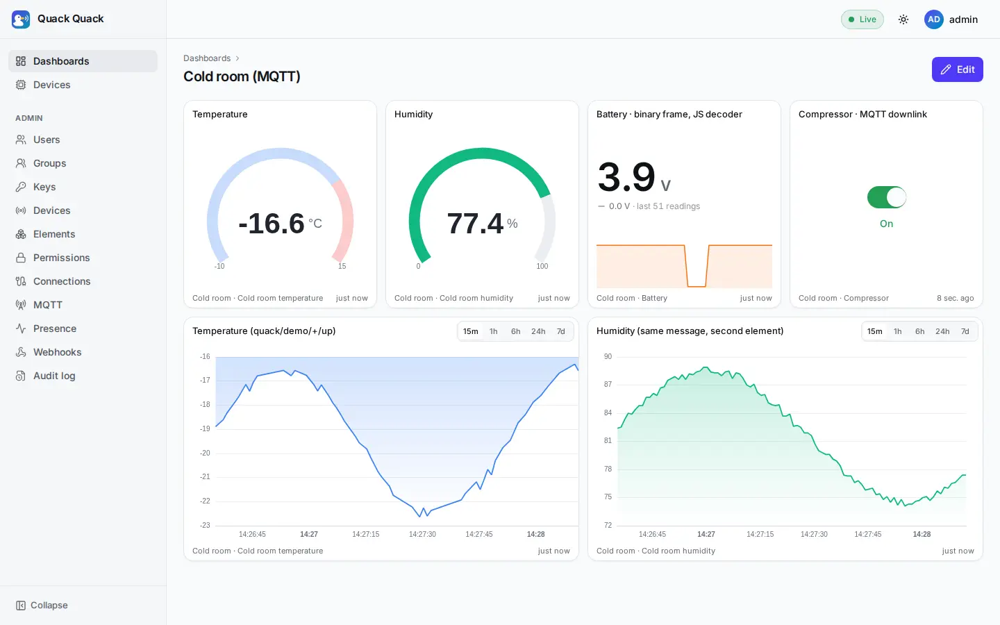

## How it works

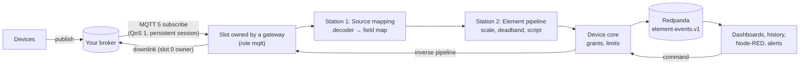
```mermaid
flowchart LR
  DEV["Devices"] -- "publish" --> BR[("Your broker")]
  BR -- "MQTT 5 subscribe<br/>(QoS 1, persistent session)" --> S["Slot owned by a gateway<br/>(role mqtt)"]
  S --> P["Station 1: Source mapping<br/>decoder → field map"]
  P --> EP["Station 2: Element pipeline<br/>scale, deadband, script"]
  EP --> CORE["Device core<br/>grants, limits"]
  CORE --> RP[("Redpanda<br/>element-events.v1")]
  RP --> UI["Dashboards, history,<br/>Node-RED, alerts"]
  UI -- "command" --> CORE
  CORE -- "inverse pipeline" --> S
  S -- "downlink (slot 0 owner)" --> BR
```

- MQTT runs **inside the gateway**, as the `mqtt` role (`QUACK_ROLES=api,gateway,mqtt`). There is no separate service to deploy.
- Every value produced by an uplink rule passes through the element's **[element pipeline](./05_core_concepts/element_pipeline.md)** (Station 2) inside the gateway before rate limiting and publishing to Redpanda. Downlink commands pass through the pipeline's **inverse** before encoder formatting and transmission to the broker.
- Every value goes through the same **device core** as the WebSocket, REST and gRPC transports, so element limits, the device rate limit, history and CloudEvents work the same. Each CloudEvent from MQTT carries the extension `quackvia=mqtt/<connection id>`.
- A connection may only write to devices it was **granted**, by an *external id*: the name the device has in your topics or payloads.
- A device counts as **online** while its messages keep arriving (within `QUACK_PRESENCE_TTL`), like a REST device.
- The configuration lives in Postgres and is published to the compacted topic `mqtt-config.v1`. Gateways follow that topic, so a change in the admin applies within a second, without restarts.

## Many gateways: slots and rendezvous hashing

A connection has `replicas` **slots** (1 by default). Each slot is one MQTT client with a fixed client id, `<client_id_prefix>-<slot>`.

Every gateway with the `mqtt` role writes itself into `gateway_members` on its presence heartbeat (every `QUACK_PRESENCE_HEARTBEAT`, with its `QUACK_MQTT_WEIGHT`). On each heartbeat, every gateway reads the live members and computes, on its own, who owns what with **weighted rendezvous hashing** (highest random weight, top-K):

```
score(connection, member) = -weight / ln(u),   u = xxhash(connection id, member id) mapped to (0, 1)
owners(connection)        = members sorted by score, best first
slot n                    = owners[n]           (n < replicas)
```

All gateways see the same members and get the same answer, so there is no leader, no lock and no coordination traffic. When a gateway leaves, only the connections it owned move; when one joins, it takes an even share from the others and nothing else moves. A gateway with weight 2 owns about twice as many connections.

The slots of one connection always land on **different gateways**. With fewer `mqtt` gateways than `replicas`, the extra slots stay idle (the connection page shows them as not connected) until more gateways join.

**Handover is safe without coordination.** For a moment two gateways may both believe they own a slot (one has seen the new member list, the other hasn't). They use the same client id, and an MQTT broker allows one session per client id: the newer connection takes the session over and the broker disconnects the older one. That is the fence.

**No message is lost on handover.** Slots connect with `clean_start=false` and a session expiry (`session_expiry`, 1 hour by default), and subscribe with QoS 1. A message is acknowledged to the broker only after every value it produced is durable on Redpanda. Messages the old owner never acknowledged stay in the broker's session and are delivered again to the new owner. Duplicates are possible on handover (QoS 1 is at least once); losses are not.

When a gateway dies without leaving, its member row expires after `QUACK_PRESENCE_TTL` (30 s), and the others take its slots over on their next heartbeat.

### More than one slot

With `replicas > 1`, each slot subscribes to `$share/<client_id_prefix>/<filter>`, an MQTT 5 **shared subscription**. The broker spreads the messages over the slots, which usually sit on different gateways. Use it for throughput, or so that losing one gateway pauses only part of the traffic. Messages of one device may then be handled by different gateways, so their order across slots isn't guaranteed.

**Downlinks** are published by the owner of slot 0 only, so each command reaches the broker once.

## Set up a connection

In **Admin → MQTT**:

1. **New connection**: the broker URL (`mqtts://`, `mqtt://`, `wss://` or `ws://`), the authentication, and the number of replicas.
2. **Grant devices**: pick a device and give it its external id, e.g. `cold-room-1`.
3. **Uplink rules**: a topic filter, the payload format, an optional decoder, where the external id is, and a field map.
4. Optionally, **downlinks** for elements that dashboards control, and **decoders** for binary payloads.

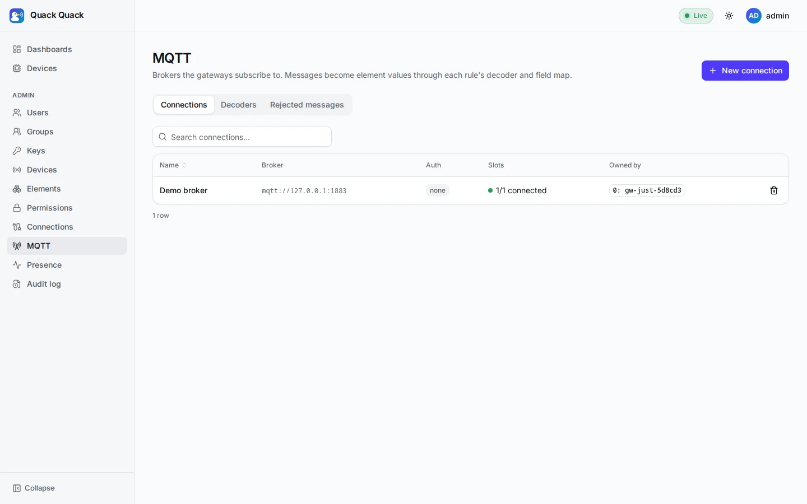

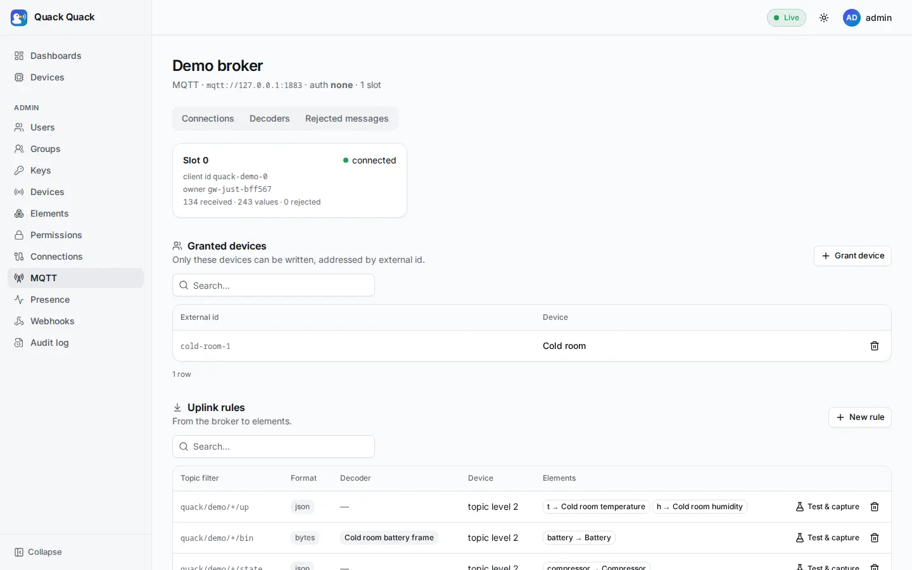

The same is available in the [REST API](./04_api_reference/rest_api.md) under `/api/v1/admin/mqtt/*` (admins only).

### Authentication and secrets

| Method | `auth` | Notes |
|---|---|---|
| None | `{"method": "none"}` | For brokers on a private network. |
| Username and password | `{"method": "password", "username": "quack", "password": "env:MQTT_PASSWORD"}` | Needs TLS (`mqtts://` or `wss://`). |
| Client certificate (mTLS) | `{"method": "mtls"}` with `tls.cert` and `tls.key` | Recommended. |

`tls` can also hold `ca` (a CA bundle for private brokers), `server_name` and `insecure_skip_verify`.

**Secrets are references, never values.** A password, key or certificate is written as `env:NAME` (an environment variable of the gateway) or `file:/path` (a mounted file, e.g. a Kubernetes secret). The API refuses plain values, never returns secrets, and they appear neither in logs nor on the bus. Each gateway resolves references when it connects, so the secret must exist on every `mqtt` gateway.

`QUACK_ALLOW_INSECURE_TLS=true` allows passwords without TLS and `insecure_skip_verify`. It is meant for development brokers only.

> **Broker ACLs matter.** Anyone who can publish on a topic you subscribe to can write values for the devices that topic maps to. Give each device its own broker credentials, restrict them to their own topics (`devices/<id>/#`), and grant the platform's user read on those topics and write on the command topics only.

## Uplink rules

A rule matches a topic filter (`+` and `#` allowed) and turns each message into zero or more element values:

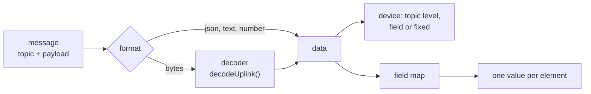
```mermaid
flowchart LR
  M["message<br/>topic + payload"] --> F{"format"}
  F -- "json, text, number" --> D["data"]
  F -- "bytes" --> J["decoder<br/>decodeUplink()"] --> D
  D --> X["device: topic level,<br/>field or fixed"]
  D --> FM["field map"] --> V["one value per element"]
```

| Field | Meaning |
|---|---|
| `topic_filter` | e.g. `sensors/+/up`. `$share/` is added for you when `replicas > 1`. |
| `qos` | 0 or 1. Use 1: QoS 0 messages can be lost on handover. |
| `format` | `json` (parsed), `text` (a string), `number`, or `bytes` (needs a decoder). |
| `decoder_id` | Optional: runs before the field map, for any format. |
| `device` | Where the external id comes from: `{"segment": 1}` (topic level, 0-based), `{"field": "dev.id"}` (a path in the data) or `{"fixed": "boiler-1"}`. |
| `field_map` | A list of `{"element", "value", "wrap", "when"}`: `value` is a path in the data (`t`, `sensors[0].v`, `["odd key"]`); `wrap: "value"` (the default) stores `{"value": v}`, `wrap: "raw"` stores `v` as it is (an object for attribute bindings); `when: "exists"` skips the element when the path is missing instead of rejecting the message. An empty `value` means the whole data. |
| `time` | Optional path to the device's timestamp (RFC 3339, or epoch seconds or milliseconds). Without it, the receive time is used. |

One message can feed many elements: `{"t": 21.5, "h": 48}` with the field map `[{"element": "Temperature", "value": "t"}, {"element": "Humidity", "value": "h"}]` updates both.

A message is rejected, and copied to `mqtt.dlq.v1` with the reasons, when no rule matches, the decoder fails, the device isn't granted, a path is missing (without `when: exists`), or a limit refuses the value. **Admin → MQTT → Rejected messages** shows them:

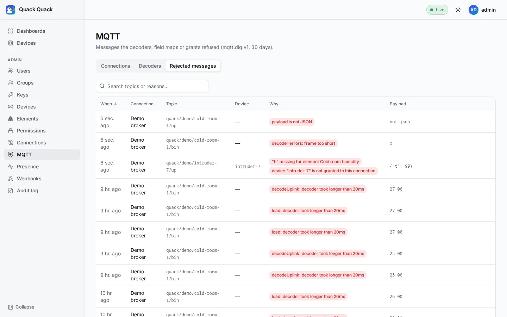

### Test and capture

Each rule has a **Test & capture** panel. *Run the pipeline* runs a sample topic and payload (text, JSON, or `hex:…` / `base64:…` for binary) through the rule and shows the values it would produce, without publishing anything. *Capture* copies the rule's next raw messages, for 5 minutes, to `mqtt-capture.v1`, and the panel shows them as they arrive.

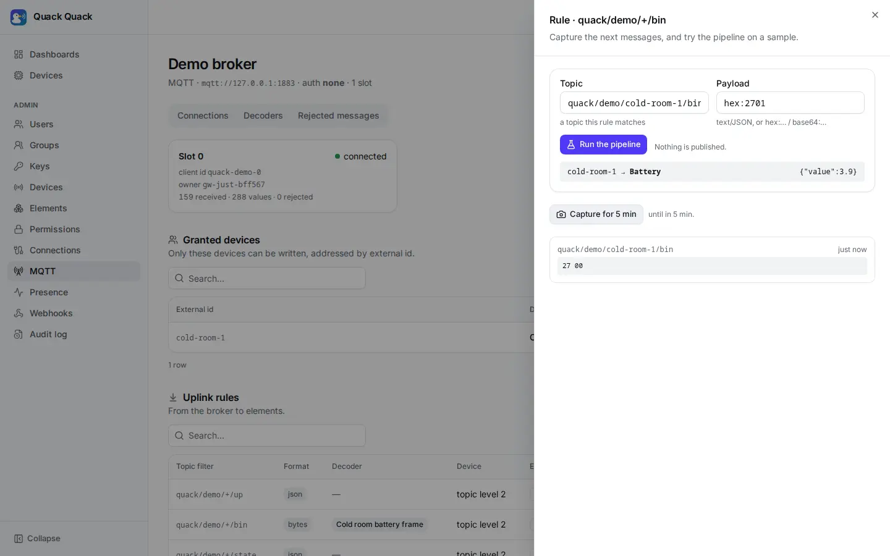

## Decoders

A decoder is JavaScript that turns raw payloads into data. It uses the **TTN / ChirpStack codec contract**, so most codecs from the [TTN Device Repository](https://github.com/TheThingsNetwork/lorawan-devices) work unchanged:

```js
function decodeUplink(input) {
  // input.bytes (array of numbers), input.fPort, input.payload (parsed JSON, if any),
  // input.topic, input.segments, input.userProperties
  return {
    data: { battery: input.bytes[0] / 10, door_open: (input.bytes[1] & 1) === 1 },
    warnings: [],
    errors: [], // a non-empty list rejects the message
  }
}

// optional: a dashboard command → a payload
function encodeDownlink(input) {
  // input.data (the command message), input.device, input.element
  return { bytes: [input.data.value ? 1 : 0] } // or { payload: {...} } for JSON
}
```

The legacy `Decoder(bytes, port)` form is accepted too. `fPort` comes from the MQTT 5 user property `fPort` when the broker sets it (LoRaWAN network servers do).

**The sandbox:** each message runs in a fresh JavaScript runtime (goja) with no modules, network, timers or file access. A run is stopped after **20 ms**. Sources are limited to 40 KB, payloads to 64 KiB, and a decoder's output to 100 values; `NaN` and `Infinity` are refused. Saving a decoder creates a new version and updates every connection that uses it.

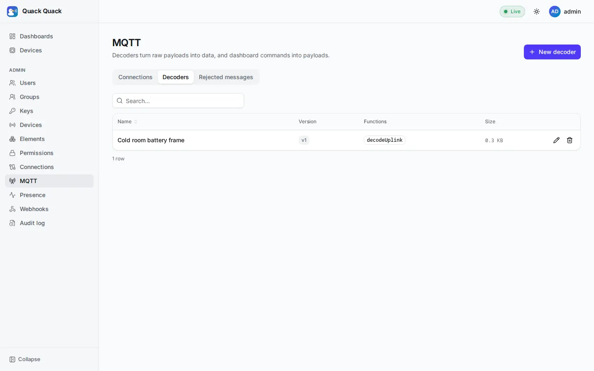

## Downlinks

A downlink sends dashboard commands for one element of one granted device to the broker:

| Field | Meaning |
|---|---|
| `device_external_id`, `element` | Which commands. |
| `topic_template` | e.g. `devices/{device}/cmd/{element}`. `{device}` is the external id, `{element}` the element name, `{user}` the user who sent the command. Values containing `+`, `#`, `/` or control characters are refused, so a name can't change the topic. |
| `encoder` | `{"template": {"compressor": "{{value}}"}}` replaces `"{{value}}"` (the command's `value`, or the whole message) and `"{{message}}"` anywhere in the template; `{"decoder_id": "…"}` uses the decoder's `encodeDownlink`; without an encoder the command message is sent as it is. |
| `qos`, `retain`, `content_type`, `message_expiry`, `response_topic`, `user_properties` | MQTT 5 publish options. The user property `quack-user` is always set. |

The device should confirm by publishing its new state, which an uplink rule maps back to the same element: the dashboard switch then shows the confirmed state, as with the other transports.

| Configured Downlinks Table | New Downlink Configuration Dialog |
|---|---|
| 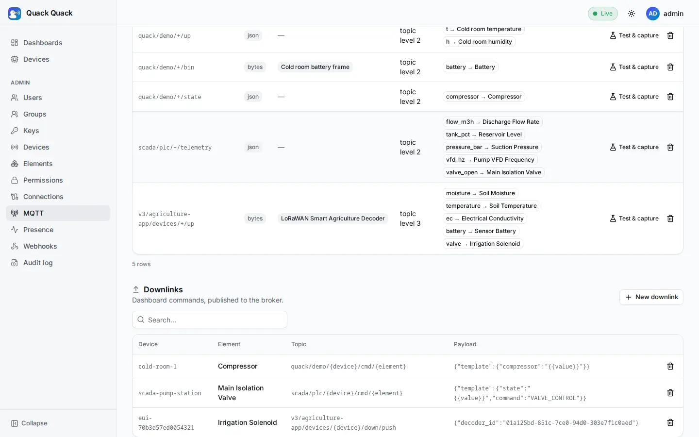 | 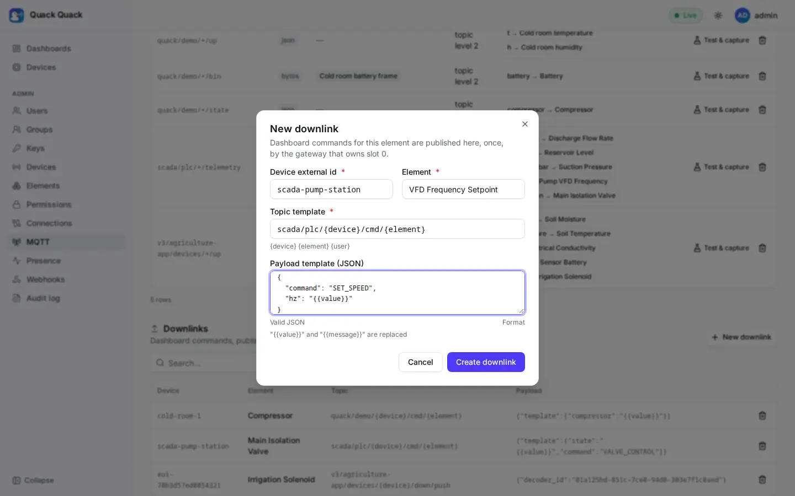 |

**Command inversion:** If an element has an [element pipeline](./05_core_concepts/element_pipeline.md) with invertible steps (such as `scale`, `round`, `clamp`, or `map`), dashboard commands pass through the pipeline's **inverse** before reaching the downlink encoder. The device on the broker receives actuator units, while dashboards and history maintain engineering units.

---

## Complete Guide: Listening to Every Element from an MQTT Broker

This section explains how to configure an MQTT broker so that incoming messages automatically update every element defined in your devices, power real-time dashboards, and trigger threshold alert webhooks.

### 1. Conceptual Architecture: How MQTT Telemetry Reaches Elements

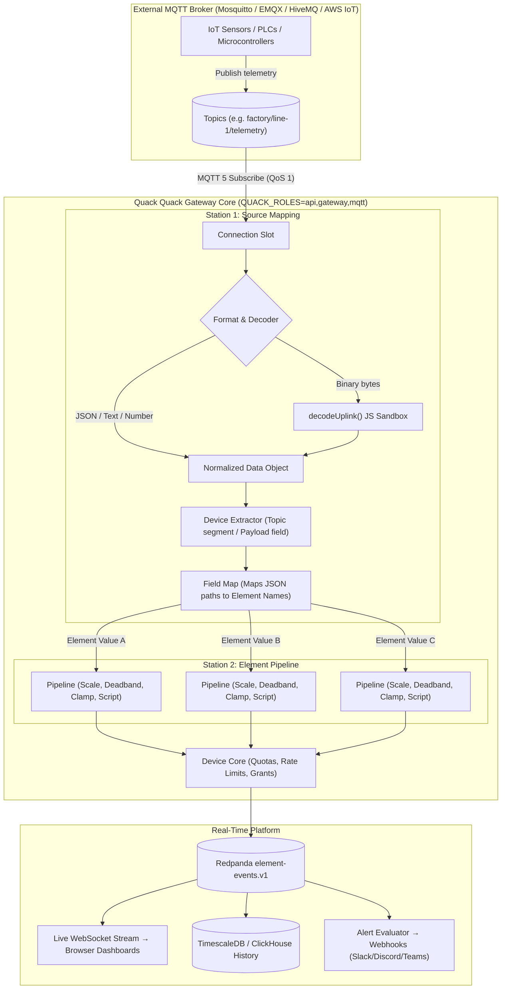
```mermaid
flowchart TD
    subgraph Broker ["External MQTT Broker (Mosquitto / EMQX / HiveMQ / AWS IoT)"]
        PUB["IoT Sensors / PLCs / Microcontrollers"] -- "Publish telemetry" --> TOPIC[("Topics (e.g. factory/line-1/telemetry)")]
    end

    subgraph Gateway ["Quack Quack Gateway Core (QUACK_ROLES=api,gateway,mqtt)"]
        TOPIC -- "MQTT 5 Subscribe (QoS 1)" --> SLOT["Connection Slot"]
        
        subgraph Station1 ["Station 1: Source Mapping"]
            SLOT --> DEC{"Format & Decoder"}
            DEC -- "Binary bytes" --> JS["decodeUplink() JS Sandbox"]
            DEC -- "JSON / Text / Number" --> PARSED["Normalized Data Object"]
            JS --> PARSED
            PARSED --> EXT["Device Extractor (Topic segment / Payload field)"]
            EXT --> FM["Field Map (Maps JSON paths to Element Names)"]
        end

        subgraph Station2 ["Station 2: Element Pipeline"]
            FM -- "Element Value A" --> EP1["Pipeline (Scale, Deadband, Clamp, Script)"]
            FM -- "Element Value B" --> EP2["Pipeline (Scale, Deadband, Clamp, Script)"]
            FM -- "Element Value C" --> EP3["Pipeline (Scale, Deadband, Clamp, Script)"]
        end

        EP1 & EP2 & EP3 --> CORE["Device Core (Quotas, Rate Limits, Grants)"]
    end

    subgraph Platform ["Real-Time Platform"]
        CORE --> RP[("Redpanda element-events.v1")]
        RP --> WS["Live WebSocket Stream &rarr; Browser Dashboards"]
        RP --> TS[("TimescaleDB / ClickHouse History")]
        RP --> ALERTS["Alert Evaluator &rarr; Webhooks (Slack/Discord/Teams)"]
    end
```

Incoming telemetry passes through two stations before reaching your elements:
1. **Station 1 (Source Mapping)**: Dissects the raw MQTT message, identifies which granted device sent it, and evaluates a **Field Map** to route fields into specific element names.
2. **Station 2 (Element Pipeline)**: Runs transformations, calibration scales, anti-jitter deadbands, and unit conversions on each element individually before persisting to TimescaleDB/ClickHouse and streaming to dashboards.

---

### 2. Common Ingestion Patterns

#### Pattern A: Multi-Metric JSON Payload (One Message Updates Multiple Elements)

In typical industrial IoT and smart building systems, a single device broadcasts multiple sensor readings inside a single JSON packet to minimize network overhead and broker connections.

**Incoming MQTT Packet:**
- **Topic:** `factory/cell-01/telemetry`
- **Payload:**
  ```json
  {
    "temperature": 24.8,
    "humidity": 58.2,
    "pressure": 101.4,
    "motor_speed": 1420,
    "compressor_active": true
  }
  ```

**Uplink Rule Configuration:**
- **Topic Filter:** `factory/+/telemetry`
- **Device Extractor:** Topic Segment `1` (which extracts `cell-01`).
- **Format:** `json`
- **Field Map:**

| Element Name in Quack | Field Value Path | Wrap Mode | When | Purpose |
|---|---|---|---|---|
| `Temperature` | `temperature` | `value` | `exists` | Updates element with `{"value": 24.8}` |
| `Humidity` | `humidity` | `value` | `exists` | Updates element with `{"value": 58.2}` |
| `Pressure` | `pressure` | `value` | `exists` | Updates element with `{"value": 101.4}` |
| `Motor Speed` | `motor_speed` | `value` | `exists` | Updates element with `{"value": 1420}` |
| `Compressor` | `compressor_active` | `value` | `exists` | Updates switch with `{"value": true}` |

> **Tip:** Setting `when: "exists"` guarantees that if the device sends a partial message (e.g. only battery and temperature), the missing fields are cleanly skipped rather than causing the message to be dead-lettered.

---

#### Pattern B: Topic-Per-Metric Hierarchy (Wildcards `+` and `#`)

Some systems use a topic tree where each sensor reading is published to its own unique topic.

**Incoming MQTT Packets:**
- `devices/boiler-42/temperature/state` &rarr; Payload: `88.5`
- `devices/boiler-42/pressure/state` &rarr; Payload: `14.2`
- `devices/boiler-42/burner/state` &rarr; Payload: `true`

**Uplink Rule Configuration:**
- **Topic Filter:** `devices/+/temperature/state`
- **Device Extractor:** Topic Segment `1` (extracts `boiler-42`).
- **Format:** `number`
- **Field Map:**
  - `element`: `"Temperature"`, `value`: `""` (empty value path uses the entire payload), `wrap`: `"value"`.

Create parallel rules for `devices/+/pressure/state` and `devices/+/burner/state` to route each topic directly to the corresponding element.

---

#### Pattern C: Binary / Hex Frames with JavaScript Decoders

For constrained devices (LoRaWAN, Zigbee, BLE gateways, or Modbus RTU over MQTT), payloads are transmitted as compact binary byte buffers.

**Incoming MQTT Packet:**
- **Topic:** `lora/node-08/up`
- **Payload:** `0x19 0x3E 0x01` (3 raw bytes)

**Decoder Script (`decodeUplink`):**
```javascript
function decodeUplink(input) {
  // input.bytes is an array of raw uint8 integers
  var temp = input.bytes[0];          // 0x19 = 25 °C
  var humidity = input.bytes[1];      // 0x3E = 62 %
  var status = (input.bytes[2] & 1);  // 0x01 = Active

  return {
    data: {
      temperature: temp,
      humidity: humidity,
      active: status === 1
    },
    warnings: [],
    errors: []
  };
}
```

**Field Map:**
- `{"element": "Temperature", "value": "temperature"}`
- `{"element": "Humidity", "value": "humidity"}`
- `{"element": "Status", "value": "active"}`

The JavaScript decoder unpacks the binary buffer into structured JSON, and the field map distributes each property to its respective element.

---

### 3. Step-by-Step Walkthrough in the Admin Console

#### Step 1: Define Device and Elements
1. Navigate to **Admin → Devices** and create your device (e.g., `Boiler room`).
2. Navigate to **Admin → Elements** and add the elements you want to monitor (e.g., `Temperature`, `Pressure`, `Burner`).
3. *(Optional)* Click **Pipeline** on any element to add transformation steps (such as `scale` $\times 0.1$, `clamp` $[0, 100]$, or `deadband` $0.5$ to eliminate noise).

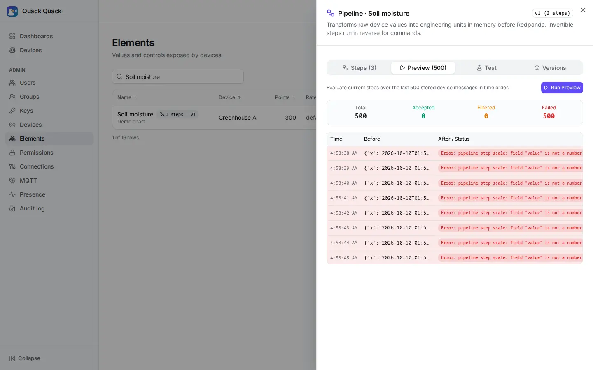

#### Step 2: Create the MQTT Connection
1. Navigate to **Admin → MQTT** and click **New connection**.
2. Fill in your broker details:
   - **Broker URL:** `mqtt://127.0.0.1:1883` (or `mqtts://your-cluster.emqx.io:8883` for cloud brokers).
   - **Client ID Prefix:** `quack-gw` (unique per gateway cluster).
   - **Authentication:** Choose `none`, `password` (using `env:MQTT_PASSWORD`), or `mtls`.
   - **Replicas:** Set to `1` (or more for shared subscription load-balancing).
3. Click **Create Connection**. The dashboard shows your connection slots and active gateway owner.


#### Step 3: Grant the Device
1. Open the newly created connection and scroll to **Granted Devices**.
2. Click **Grant device**:
   - Select your platform device (`Boiler room`).
   - Enter the **External ID** used by your broker/topic (e.g., `boiler-room-1`).
3. Click **Grant**. The gateway will now accept messages that resolve to this external ID.

#### Step 4: Add Uplink Rules & Field Map
1. Under **Uplink Rules**, click **Add rule**.
2. Enter the **Topic filter** (e.g., `quack/demo/+/up`).
3. Set the **Device extraction**:
   - Choose `Topic segment` and enter the 0-indexed segment number (e.g., segment `2` in `quack/demo/{device}/up`).
4. Select the **Payload format** (`json`, `text`, `number`, or `bytes`).
5. Add your **Field Map** entries mapping JSON paths to your platform elements.
6. Click **Save Rule**. Within 1 second, the gateway updates its subscriptions on the live topic bus without restarting.


#### Step 5: Test & Validate Ingestion
1. In the rule editor, expand the **Test & capture** drawer.
2. Enter a simulated topic and sample JSON payload, then click **Run pipeline**.
3. Verify that every element produces the expected numeric or boolean value.
4. Click **Capture live messages** to inspect raw packets arriving from real hardware.
5. If any message fails validation, open **Admin → MQTT → Rejected messages** to see the exact reason (e.g., ungranted device, schema mismatch, or rate limit quota exceeded).


---

### 4. Closing the Loop: Controlling Actuators via Downlinks

To send commands from dashboard switches, sliders, or automations back to devices on the MQTT broker:

1. Open the connection and scroll to **Downlinks**.
2. Click **Add downlink**:
   - Select the target device external ID (`boiler-room-1`) and the actuator element (`Burner`).
   - Define the **Topic template**: `quack/demo/{device}/cmd/{element}`.
   - Choose the encoder:
     ```json
     {"template": {"state": "{{value}}"}}
     ```
3. When an operator flips the switch on a dashboard:
   - The command is validated by permissions.
   - It runs through the element's **inverse pipeline** (Station 2).
   - Slot 0 publishes the encoded payload to the broker with MQTT 5 QoS 1.
   - The device receives the command, applies it, and publishes its new state on the uplink topic to confirm the switch position.

| Light Theme Live Dashboard | Dark Theme Live Dashboard |
|---|---|
|  | 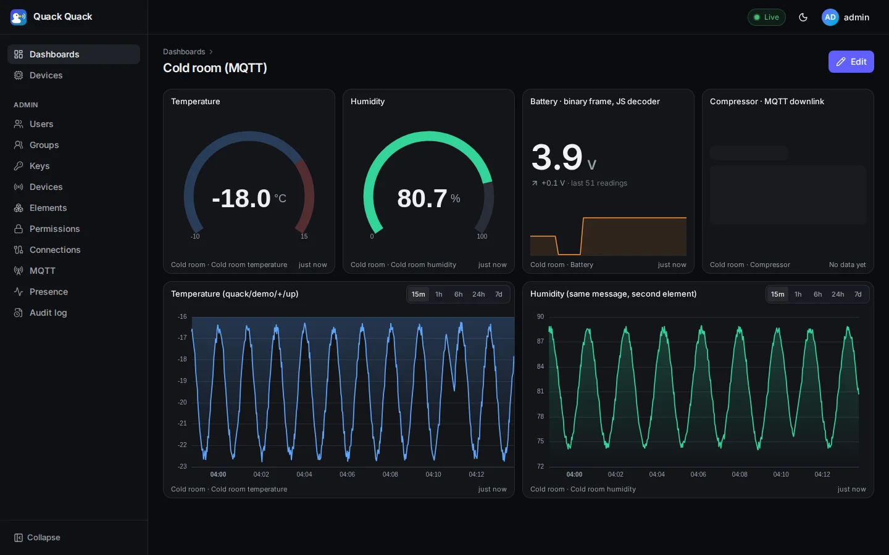 |

---

## Real-World Case Studies: SCADA & LoRaWAN

To see how Quack Quack handles real-world deployments beyond basic telemetry, consider these two end-to-end architectures: an **Industrial Water Treatment SCADA Pumping Station** and an **Agricultural LoRaWAN IoT Node**.

---

### Case Study 1: Industrial SCADA Pumping Station (JSON Telemetry & Actuator Downlink)

Industrial automation systems, PLCs (Siemens S7, Schneider Modicon, Allen-Bradley), and RTUs often connect to edge gateways (such as Ignition Edge, Node-RED, or Kepware) that publish aggregated PLC register blocks over MQTT.

#### 1. Network & Payload Architecture
The pumping station publishes multi-tag telemetry every 2 seconds to topic:
`scada/plc/scada-pump-station/telemetry`

```json
{
  "flow_m3h": 367.0,
  "tank_pct": 87.0,
  "pressure_bar": 5.95,
  "vfd_hz": 49.5,
  "valve_open": true
}
```

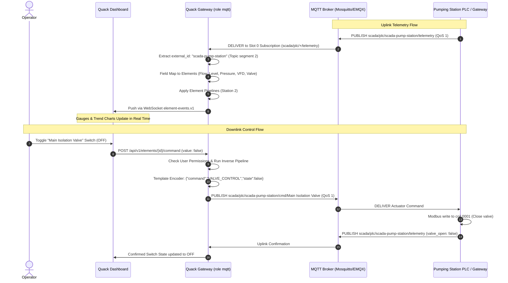
```mermaid
sequenceDiagram
    autonumber
    actor Operator
    participant Dashboard as Quack Dashboard
    participant Gateway as Quack Gateway (role mqtt)
    participant Broker as MQTT Broker (Mosquitto/EMQX)
    participant PLC as Pumping Station PLC / Gateway

    Note over PLC,Broker: Uplink Telemetry Flow
    PLC->>Broker: PUBLISH scada/plc/scada-pump-station/telemetry (QoS 1)
    Broker->>Gateway: DELIVER to Slot 0 Subscription (scada/plc/+/telemetry)
    Gateway->>Gateway: Extract external_id: "scada-pump-station" (Topic segment 2)
    Gateway->>Gateway: Field Map to Elements (Flow, Level, Pressure, VFD, Valve)
    Gateway->>Gateway: Apply Element Pipelines (Station 2)
    Gateway->>Dashboard: Push via WebSocket element-events.v1
    Note over Dashboard: Gauges & Trend Charts Update in Real Time

    Note over Operator,PLC: Downlink Control Flow
    Operator->>Dashboard: Toggle "Main Isolation Valve" Switch (OFF)
    Dashboard->>Gateway: POST /api/v1/elements/{id}/command (value: false)
    Gateway->>Gateway: Check User Permissions & Run Inverse Pipeline
    Gateway->>Gateway: Template Encoder: {"command":"VALVE_CONTROL","state":false}
    Gateway->>Broker: PUBLISH scada/plc/scada-pump-station/cmd/Main Isolation Valve (QoS 1)
    Broker->>PLC: DELIVER Actuator Command
    PLC->>PLC: Modbus write to coil 0001 (Close valve)
    PLC->>Broker: PUBLISH scada/plc/scada-pump-station/telemetry (valve_open: false)
    Broker->>Gateway: Uplink Confirmation
    Gateway->>Dashboard: Confirmed Switch State updated to OFF
```

#### 2. Uplink Rule & Device Grant
1. **Grant Device:**
   - Platform Device: `Water Treatment SCADA`
   - External ID: `scada-pump-station`
2. **Uplink Rule:**
   - **Topic Filter:** `scada/plc/+/telemetry`
   - **Format:** `json`
   - **Device Extractor:** Topic Segment `2` (`scada-pump-station`).
   - **Field Map:**
     - `flow_m3h` &rarr; `Discharge Flow Rate`
     - `tank_pct` &rarr; `Reservoir Level`
     - `pressure_bar` &rarr; `Suction Pressure`
     - `vfd_hz` &rarr; `Pump VFD Frequency`
     - `valve_open` &rarr; `Main Isolation Valve`

#### 3. Interactive Pipeline Validation
Before deploying to production, the rule is tested in the **Test & capture** panel using a simulated SCADA frame:

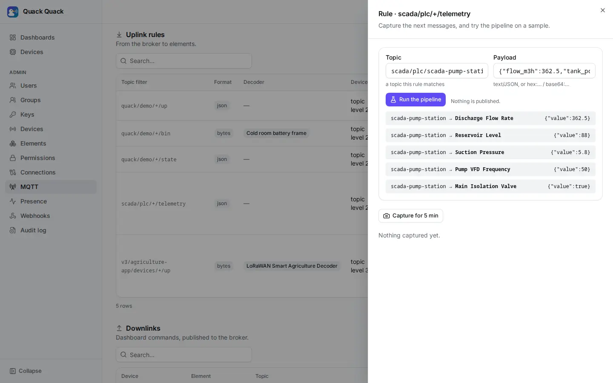

Notice how the pipeline immediately parses the JSON keys and maps them directly to each monitored element with zero runtime errors.

#### 4. Downlink Actuator Configuration
To allow operators to remotely open or isolate the main discharge valve:
- **Device External ID:** `scada-pump-station`
- **Element:** `Main Isolation Valve`
- **Topic Template:** `scada/plc/{device}/cmd/{element}`
- **Payload Encoder:**
  ```json
  {
    "template": {
      "command": "VALVE_CONTROL",
      "state": "{{value}}"
    }
  }
  ```
- **QoS:** `1` (guarantees delivery to the PLC gateway)

#### 5. Live SCADA Monitoring Dashboard & Downlink Control
Telemetry streams into real-time gauge widgets, trend line charts, and active downlink toggles:

| Confirmed State (Valve Open) | Live Downlink Actuation in Progress (`Turning off...`) |
|---|---|
| 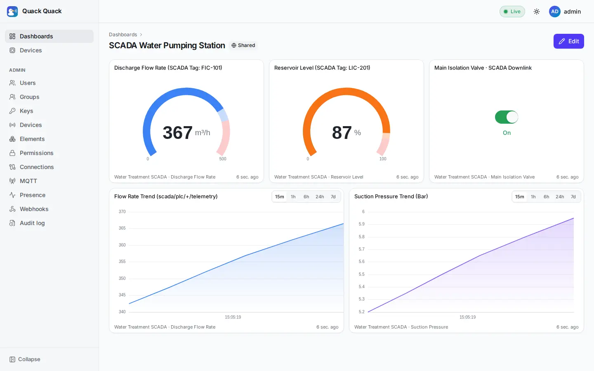 | 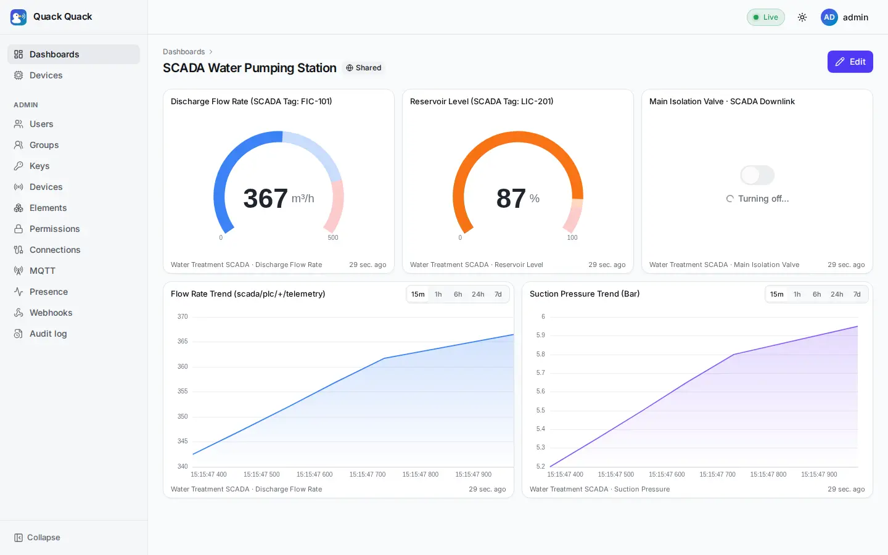 |

Notice how clicking the switch immediately enters the pending feedback state (`Turning off...`) while slot 0 dispatches the downlink command over MQTT, transitioning to confirmed state once the PLC reports back.

---

### Case Study 2: Smart Agriculture LoRaWAN Node (Binary Payloads & TTN/ChirpStack Codec)

Battery-powered IoT devices operating over LoRaWAN (via The Things Network, ChirpStack, or AWS IoT Core for LoRaWAN) transmit compact binary frames to minimize radio airtime and maximize battery longevity.

#### 1. Binary Frame Structure
A long-range soil probe broadcasts a 5-byte unencoded binary frame every 15 minutes to topic:
`v3/agriculture-app/devices/eui-70b3d57ed0054321/up`

Sample hex payload: `hex:2cbe028023`

| Byte Offset | Field | Raw Value | Conversion Formula | Engineering Value |
|---|---|---|---|---|
| Byte 0 | Soil Moisture | `0x2C` (44) | $M = \text{byte}$ | `44 %` |
| Byte 1 | Soil Temperature | `0xBE` (190) | $T = (\text{byte} - 100) / 10$ | `9.0 °C` |
| Bytes 2–3 | Electrical Conductivity (EC) | `0x02 0x80` | $\text{EC} = (\text{b}_2 \ll 8) \mid \text{b}_3$ | `640 µS/cm` |
| Byte 4 (bits 7..1) | Battery Voltage | `0x11` (17) | $V = 3.0 + (\text{bits} \times 0.1)$ | `4.7 V` |
| Byte 4 (bit 0) | Solenoid Valve State | `0x01` | $\text{bit } 0 == 1$ | `true` (Active) |

#### 2. JavaScript Codec (`decodeUplink` & `encodeDownlink`)
Quack Quack adheres directly to the open **The Things Network (TTN) Device Repository** codec specification. Decoders execute inside an isolated JavaScript sandbox (Goja runtime, 20 ms strict execution ceiling, no network, no disk access):

```javascript
// The Things Network / ChirpStack Standard Codec
function decodeUplink(input) {
  var bytes = input.bytes;
  if (!bytes || bytes.length < 5) {
    return { errors: ["Frame too short for agriculture sensor"] };
  }

  var moisture = bytes[0];
  var temp = (bytes[1] - 100) / 10.0;
  var ec = (bytes[2] << 8) | bytes[3];
  var batt = 3.0 + ((bytes[4] >> 1) * 0.1);
  var valve = (bytes[4] & 1) === 1;

  return {
    data: {
      moisture: moisture,
      temperature: temp,
      ec: ec,
      battery: Number(batt.toFixed(2)),
      valve: valve
    },
    warnings: [],
    errors: []
  };
}

// Downlink encoder: converts dashboard boolean toggle to LoRaWAN push command
function encodeDownlink(input) {
  var open = Boolean(input.data.value);
  // Returns raw byte array: command byte 0x01, value 0xFF (open) or 0x00 (close)
  return { bytes: [0x01, open ? 0xFF : 0x00] };
}
```

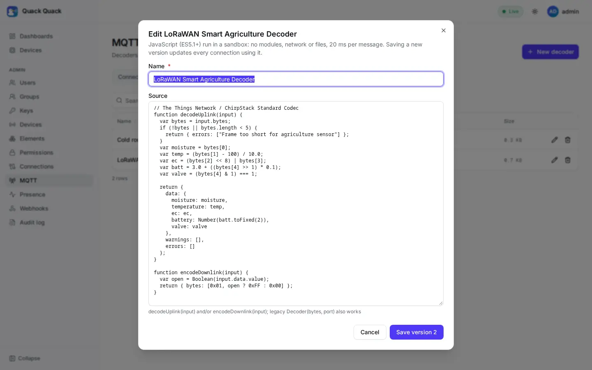

#### 3. Uplink Rule & Downlink Configuration
1. **Grant Device:**
   - Platform Device: `LoRaWAN Soil Node`
   - External ID: `eui-70b3d57ed0054321` (LoRaWAN DevEUI)
2. **Uplink Rule:**
   - **Topic Filter:** `v3/agriculture-app/devices/+/up`
   - **Format:** `bytes`
   - **Decoder:** `LoRaWAN Smart Agriculture Decoder`
   - **Device Extractor:** Topic Segment `3` (`eui-70b3d57ed0054321`)
   - **Field Map:**
     - `moisture` &rarr; `Soil Moisture`
     - `temperature` &rarr; `Soil Temperature`
     - `ec` &rarr; `Electrical Conductivity`
     - `battery` &rarr; `Sensor Battery`
     - `valve` &rarr; `Irrigation Solenoid`
3. **Downlink Actuator (Drip Irrigation Valve):**
   - **Topic Template:** `v3/agriculture-app/devices/{device}/down/push`
   - **Encoder:** Decoder ID of `LoRaWAN Smart Agriculture Decoder` (calls `encodeDownlink`)

#### 4. Real-Time Soil & Irrigation Dashboard
The binary payload is automatically converted into live metric cards, sparklines, soil saturation gauges, and remote solenoid valve controls:

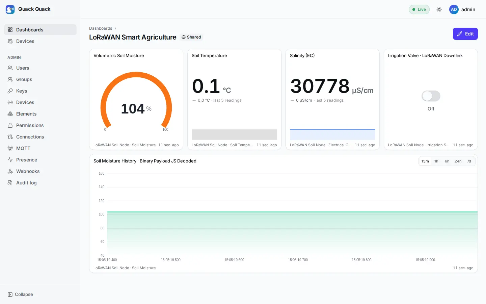

---

---

## Try it

```sh
task start MQTT=1
```

This also starts a Mosquitto container (`1883` anonymous, `1884` user `quack` / password `quack`, `8883` mTLS with the certificates `task mqtt:certs` writes to `docker/mqtt/certs`) and enables the `mqtt` role. The demo creates:

- the **Cold room** device (`Cold room temperature`, `Cold room humidity`, `Battery`, `Compressor`), granted to the connection **Demo broker** as `cold-room-1`;
- three uplink rules: `quack/demo/+/up` (JSON `{"t", "h"}` → two elements), `quack/demo/+/bin` (a 2-byte frame decoded by the *Cold room battery frame* decoder) and `quack/demo/+/state` (the compressor's confirmed state);
- a downlink for `Compressor` to `quack/demo/{device}/cmd/{element}`.

The simulator plays the device: telemetry every second, a binary frame every 5 seconds, and it applies compressor commands and reports the new state. Publish your own messages with any client:

```sh
docker exec quack-mosquitto-1 mosquitto_pub -V mqttv5 -q 1 -t quack/demo/cold-room-1/up -m '{"t": -18.2, "h": 80}'
docker exec quack-mosquitto-1 mosquitto_sub -V mqttv5 -t 'quack/demo/#' -v   # watch the traffic
```

`task infra:up MQTT=1` starts only the infrastructure, with the broker.

## Operations

| Metric | Meaning |
|---|---|
| `quack_mqtt_connected{connection}` | 1 while a slot is connected on this gateway |
| `quack_mqtt_owned_slots` | Slots this gateway owns |
| `quack_mqtt_messages_received_total`, `quack_mqtt_values_published_total` | Messages in, values out |
| `quack_mqtt_rejected_total{reason}` | Rejections: `no_rule`, `pipeline`, `not_granted`, `core`… |
| `quack_mqtt_decoder_seconds` | Decoder run time |
| `quack_mqtt_unacked` | Messages waiting for their values to be durable before the acknowledgement |
| `quack_mqtt_downlinks_total{result}` | Commands published or failed |

Each slot's state is also in `mqtt_connection_status` and on the connection's page: the owning gateway, whether it is connected, the last MQTT reason code and counters.

| Symptom | Look at |
|---|---|
| `broker refused the connection: bad user name or password (0x86)` or `not authorized (0x87)` | The credentials, and that the `env:`/`file:` reference exists on every `mqtt` gateway. |
| Slot keeps reconnecting, *session taken over* | Another client (perhaps an old deployment) uses the same `client_id_prefix`. |
| Connected but no values | *Rejected messages*; *Test & capture* on the rule; the device must be granted with the external id the topic or payload carries. |
| Values arrive late or the broker drops messages | `quack_mqtt_unacked` near `receive_maximum`: add replicas or gateways, or raise `QUACK_MQTT_CONNECTION_MSG_RATE`. |
| Nothing connects | At least one gateway needs `QUACK_ROLES` with `mqtt`, and the connection must be enabled. |

**Limits:** per connection, `QUACK_MQTT_CONNECTION_MSG_RATE` (5000/s by default) on each gateway; then the device rate limit (`QUACK_DEVICE_MSG_RATE`) and each element's own limit, as for every transport. Values a limit refuses are rejected and dead-lettered, not retried.
