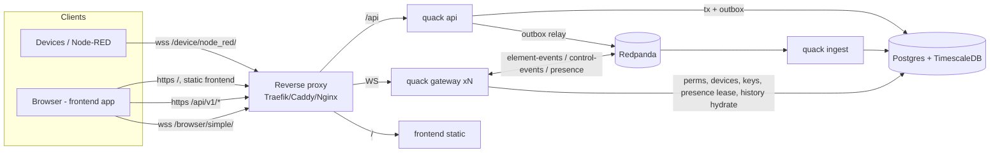

# Refactor Plan: Full Go Backend + Redpanda + Time-Series Storage

> **Audience:** an AI coding agent (and the human reviewing its PRs) that will execute this refactor.
> **Status:** approved direction, evaluated against the code at commit `27d79c5`.
> **Decision (owner):** Django is removed entirely. The whole backend (API, auth, admin, realtime gateway, ingestion) is rewritten in Go. Redis is replaced by Redpanda. History goes to a time-series DB.
> **Rule zero for the agent:** work one phase at a time, one PR per phase, and do not start phase N+1 until phase N's acceptance criteria pass.

## Implementation status (2026-10-07)

| Phase | Status | Evidence |
|---|---|---|
| 0: contract suite + baseline | Done | 53 subtests. On Django, all parity tests passed and all 7 bug tests reproduced. Baseline in [baseline.md](baseline.md). |
| 1: Go foundation + infra | Done | `server/`, goose migrations (Timescale hypertable + continuous aggregate), `docker/compose.yaml`, mise + Taskfile. |
| 2: identity, admin API, importer | Done | huma REST API, argon2id + Django pbkdf2 upgrade, `quack import-django` (verified against a real Django Postgres DB: old passwords log in, old device keys connect). |
| 3: outbox + control events | Done | Transactional outbox + LISTEN/NOTIFY relay → `control-events.v1`. |
| 4: gateway | Done | Contract suite **62/62 pass with no known bugs**, also with the server built with `-race`. Load test: 0 % loss at 20k deliveries/s, p99 22 ms, vs 94 % loss on Django. |
| 5: ingester + history | Done | `quack ingest` (consumer group, idempotent writes), history replay from TSDB after restart, `/api/v1/elements/{id}/history`. |
| 6: frontend | In progress | React + drag-and-drop dashboards (`web/`); `dashboards` table/API added for it. |
| 7: Django removal | Done | All Python removed; CI, devcontainer and VS Code configs moved to Go/mise/task. |

**Deviations from this plan, as built:**
- **sqlc not used.** Queries are hand-written with pgx in `internal/store`, so the toolchain needs no code generator.
- **Device close codes.** Django actually closed sockets with 1000 for device delete and key changes (see the contract README). The Go gateway uses **4000** for device delete, key removal or key change, and session revocation, and **1000** for `jwt_key` touch, matching the legacy rotation behaviour.
- **Device actor (B3 fix).** Device messages now carry `auth = {user_id: <device uuid>, username: <device name>}` instead of `"coming from Device"`.
- **Element deletion.** Subscribers get a forced unsubscribe with reason `"Element deleted"`.
- **Browser frames from users.** `last_edit_at` is now a real server timestamp instead of the string `"None"`.
- **Outbound queue.** It holds 2048 frames, not 256, because a history replay can be up to 1000 frames.
- **CSRF.** Uses Go's `http.CrossOriginProtection` (Sec-Fetch-Site/Origin) instead of a double-submit token, so the Swagger UI keeps working as an interim admin console.
- **Ingester consumer group.** It is configurable (`QUACK_INGEST_GROUP`). Every environment writing to a different database needs its own group.
- **Event ordering.** Event times have millisecond precision, so ordering ties are broken by the UUIDv7 event id.

**Open questions answered:**
- **Q0:** the frontend is our own React app, same-site, with cookie sessions.
- **Q1:** `acks=all` (configurable via `QUACK_KAFKA_ACKS_ALL`).
- **Q2, Q4:** defaults kept.
- **Q3:** user commands are stored in the TSDB (`source='user'`) and kept out of replay.
- **Q5:** the importer is built and verified.

---

## 1. TL;DR

| Decision | Verdict | Notes |
|---|---|---|
| Realtime part (device WS + browser WS) in Go | **Strong fit** | Hot path: long-lived sockets, fan-out, JSON per message. |
| Rest of backend (auth, users, groups, RBAC, devices, keys) in Go | **Accepted. Cost is known and planned for.** | The biggest cost is replacing **Django admin**, plus auth and sessions. §6.7 covers it with a REST admin API (Swagger UI as an interim UI) and admin pages in the new frontend. |
| Redis → Redpanda | **Yes, with the pattern in §4** | Durable event log that feeds the TSDB. It is not a drop-in for Channels groups, the last-N cache, or presence. |
| Old data → time-series DB | **Yes, but write everything (§5)** | Every event goes to TimescaleDB from the log. The in-memory queue is only a hot window. |

**Target shape:** one Go module, one binary (`quack`) with roles: `api`, `gateway`, `ingest`, `migrate`, plus admin CLI commands. Postgres + TimescaleDB is the single database. Redpanda is the event bus. The frontend is a separate app talking to the REST API and the WebSocket.

---

## 2. Current system (as-is), with facts that matter

### 2.1 Components (to be replaced)
- `myproject/asgi.py` — routes WS by path: `/device/node_red/` → `AuthMiddlewareDevice` → `NodeRedConsumer`; `/browser/simple/` → Django session auth → `BrowserConsumer`.
- `node_red/middleware.py` — device auth: decode JWT unverified → read `id` → load `Device` + `JWTPublicKey` → verify signature with the key's algorithm (RS256/ES256) → load the device's elements.
- `node_red/consumers/nodered.py` — device socket. Joins one group per element + one per device. On message: validate element ownership → append to cache `cache:{element_id}` (deque, maxlen = `Element.points`) → broadcast to the element group. Creates/deletes a `Connections` row on connect/disconnect.
- `node_red/consumers/browser.py` — browser socket. `subscribe` → permission check → join element group + `perm_{permission.id}` group → send confirmation → replay cached points. `message_element` → requires `RC` → broadcast.
- `node_red/signals.py` — model changes → realtime notifications (device/element CRUD, permission CRUD, connection status, JWT key change → force disconnect).
- `node_red/models.py` — `Device`, `Connections`, `Element(points ≤ 1000, details JSON)`, `ElementDetailsStyle`, `ElementPermissionsUser`, `ElementPermissionsGroup` (`R` / `RC`), `JWTPublicKey`. Users and groups come from `django.contrib.auth`.
- `node_red/admin.py` — Django admin for all models. **This is the feature most at risk in the rewrite.**
- Frontend: Django templates + vanilla JS widgets (`static/js/{SensorChart,SensorGauge,Slider,SwitchButton,websocket}.js`). `views.py` uses hard-coded element IDs (demo only).

### 2.2 Facts that change the evaluation
1. **Redis is not actually wired in.** `myproject/settings.py:134-144` uses `InMemoryChannelLayer` and `LocMemCache`. `docker/enfile.env` points to a non-existent `myproject.settings_production`. DB is SQLite in settings. Today the system only runs as one process.
2. **The cache is O(points) per message and racy.** `nodered.py:192-200` reads the whole deque, appends, and writes the whole deque on every message. Concurrent writers lose updates.
3. **Fan-out cost.** `channels_redis` group send to N sockets costs O(N) Redis operations per message. Go in-process fan-out is a map lookup plus N channel sends.
4. **No tests.** `node_red/tests.py` is empty. Phase 0 builds a contract suite **before** any Go code replaces Python.
5. **Docs drift.** `docs/04_api_reference/browser_api.md` documents `message_element_history` (batched). The code sends individual `message_element` frames. **The code is the contract.**
6. **Device identity must survive the migration.** Devices authenticate with a JWT whose `id` claim is the device UUID, verified against the stored public key. **Device UUIDs, element UUIDs, and public keys must be imported unchanged**, or every deployed device or Node-RED flow breaks.

### 2.3 Bugs & security issues (fix them in the Go version; do not port them)

| # | Where | Issue | Go behavior |
|---|---|---|---|
| B1 | `middleware.py:70-84` | `JWTPublicKey.is_active` never checked. | Reject inactive keys. |
| B2 | `middleware.py:108-112` | `exp` not required. A token without `exp` is valid forever. | Require `exp`; cap lifetime (config, default 24 h); allow 30 s clock skew. |
| B3 | `nodered.py:62-66` | Device can set arbitrary `auth.user_id/username/last_edit_at` → spoofing. | Server stamps the actor from the authenticated identity; the client timestamp is stored as `client_ts` only. |
| B4 | `browser.py` + `asgi.py` | No Origin check on the cookie-authenticated WS → Cross-Site WebSocket Hijacking. | Strict Origin allow-list. |
| B5 | `browser.py:85` | Traceback sent to client. | Generic error code; details only in logs. |
| B6 | `browser.py:226-237` | Unsubscribing one element drops **all** permission listeners. | Per-element subscription state. |
| B7 | `browser.py:167` + models | `perm_{id}` collides between the user-permission and group-permission tables. | Single `element_permissions` table (§6.2); invalidate by `element_id`. |
| B8 | signals | Group membership changes and new grants are not pushed live. | Emit control events on membership and grant changes; re-evaluate. |
| B9 | `nodered.py:41-47` | A crash leaves the device "connected" forever. | Heartbeat/lease presence (§6.5). |
| B10 | `signals.py:61-68` | Any update to a `Connections` row closes the device socket. | Presence events come only from the gateway. |
| B11 | settings | Hard-coded secret, `DEBUG=True`, empty `ALLOWED_HOSTS`. | All config from env; no secrets in the repo. |

---

## 3. Why Go, and what it costs

**Gains on the hot path:**
- **Connections:** a goroutine per socket costs ~10–40 KB, so one instance realistically holds 50k–100k idle sockets. A single Daphne process is usually comfortable in the low thousands. *These are estimates; Phase 0 and Phase 4 measure them.*
- **CPU and fan-out:** no GIL. Each outbound message is serialized once and the same bytes go to N sockets.
- **Operations:** a single static binary, a small image, built-in pprof.

**Costs, which this plan budgets for:**

| Django gave you for free | Go replacement | Where |
|---|---|---|
| Admin UI for all models | REST admin API + OpenAPI. Swagger UI as the interim UI. Admin pages in the new frontend. | §6.7, Phase 6 |
| Users, password hashing, sessions, CSRF | `users`, `sessions` tables; argon2id; httpOnly session cookie; CSRF protection | §6.4 |
| Groups + permissions | `groups`, `user_groups`, `element_permissions` | §6.2 |
| Migrations | `goose` SQL migrations embedded in the binary | §6.1 |
| Model validation (PEM analysis, `points` 0..1000) | Validation in the service layer, plus DB `CHECK` constraints | §6.2 |
| Admin action history (`LogEntry`) | `audit_log` table written by every admin mutation | §6.2 |
| `createsuperuser` | `quack admin create-user --admin` | §6.1 |

**Honest caveat:** most of today's performance ceiling is the **architecture** (in-memory layer, whole-deque rewrite per message, per-recipient serialization), not Python itself. The redesign is the gain; Go makes it easier to keep.

---

## 4. Redpanda: how to use it correctly

Redpanda is a **Kafka-compatible log**: partitioned, durable, replayable, and ordered per partition. It is **not** pub/sub with thousands of dynamic groups, **not** a KV cache, and **not** a presence store.

| Today's Redis role | Replacement | Notes |
|---|---|---|
| Group per element | **One topic `element-events.v1`**, key = `element_id`. **Every gateway instance reads every partition** (unique consumer group per instance, start at latest) and fans out **in memory** to its local sockets. | Never create a topic per element or device. |
| Last-N cache | **In-memory ring buffer per element in the gateway**, hydrated from TimescaleDB on cold start or first subscribe. | Removes Redis entirely. |
| Control notifications (Django signals) | Topic `control-events.v1`, written through a **transactional outbox** (§6.3). | Gateways treat these as *invalidation hints* and re-read Postgres. A periodic resync covers anything missed. |
| Presence | Postgres lease table + topic `presence.v1` (compacted, key = `device_id`). | §6.5 |

**Costs and mitigations:**
- **Extra hop:** one more network hop, typically single-digit milliseconds with `linger.ms` ≤ 5.
- **Local fast path:** the gateway delivers to its *own* local subscribers immediately, then ignores its own events when they return from the topic (match on `origin.gateway_id`).
- **Scaling limit:** every instance consumes all traffic. That is fine into the tens of thousands of msgs/s; beyond that, partition-affinity routing (out of scope).

**Alternative, for the record:** NATS JetStream fits the fan-out and KV shape more tightly. Redpanda is chosen because the durable pipeline into the TSDB, and future analytics consumers, are explicit goals. Do not run both.

---

## 5. Time-series: TimescaleDB, and write everything

**Do not** write data to the TSDB "when it falls off the queue". That is eviction-triggered, racy, and loses data on crash. Instead:

```
device/browser → gateway → Redpanda (element-events.v1) ─┬→ gateways (live fan-out + ring buffer)
                                                         └→ ingester → TimescaleDB (all events)
```

The ring buffer (`elements.points`) is the hot window for instant replay. The TSDB is the source of truth for history.

**Why TimescaleDB:** it is a Postgres extension. One database for relational data **and** time series: one backup, joins between telemetry and elements, one migration tool.

**Migration (`goose`, SQL):**
```sql
CREATE EXTENSION IF NOT EXISTS timescaledb;

CREATE TABLE element_event (
  time        timestamptz NOT NULL,         -- server receive time (authoritative)
  element_id  uuid        NOT NULL,
  device_id   uuid        NOT NULL,
  source      text        NOT NULL CHECK (source IN ('device','user')),
  actor_id    text        NOT NULL,         -- device id or user id, stamped by server (B3)
  actor_name  text        NOT NULL,
  client_ts   timestamptz NULL,             -- client-claimed last_edit_at, informational only
  payload     jsonb       NOT NULL,         -- original `message`
  value       double precision NULL,        -- payload->'value' if numeric
  kpartition  int         NOT NULL,
  koffset     bigint      NOT NULL,
  UNIQUE (time, kpartition, koffset)        -- idempotent re-ingest (time must be in unique idx)
);
SELECT create_hypertable('element_event', 'time', chunk_time_interval => interval '1 day');
CREATE INDEX ON element_event (element_id, time DESC);

ALTER TABLE element_event SET (timescaledb.compress, timescaledb.compress_segmentby = 'element_id');
SELECT add_compression_policy('element_event', interval '7 days');
SELECT add_retention_policy('element_event', interval '365 days');   -- Q4

CREATE MATERIALIZED VIEW element_value_1m WITH (timescaledb.continuous) AS
SELECT time_bucket('1 minute', time) AS bucket, element_id,
       avg(value) AS avg, min(value) AS min, max(value) AS max, count(*) AS n
FROM element_event WHERE value IS NOT NULL GROUP BY 1, 2;
```

**Ingester (`quack ingest`):** reads in a **shared** consumer group. Batches events (500 rows or 200 ms) into `INSERT ... ON CONFLICT DO NOTHING` (or `COPY` into a staging table and merge). Commits offsets **after** the DB commit, which is at-least-once delivery with idempotent writes.

**Image:** `timescale/timescaledb:latest-pg16` replaces `postgres:15`.

---

## 6. Target architecture (to-be)



`api` and `gateway` are **roles of the same binary**. In dev and small deployments, run `quack serve --roles=api,gateway`. Split them into separate deployments when scale requires it, with no code change.

### 6.1 Stack and repository layout

**Framework choice:** use a **`net/http`-compatible** stack. WebSockets, OpenTelemetry, pprof, and `coder/websocket` all assume `net/http`.
- Router: **`go-chi/chi/v5`**.
- API layer: **`danielgtaylor/huma/v2`** on chi. It generates the OpenAPI 3.1 spec, request validation, and Swagger UI from Go types, so the frontend gets a typed client for free and Swagger is the interim admin UI.
- **Avoid Fiber.** It is built on fasthttp, which is not `net/http`-compatible, and its WebSocket support is weaker.

**Libraries:**

| Concern | Library |
|---|---|
| WebSocket | `github.com/coder/websocket` |
| Redpanda | `github.com/twmb/franz-go` |
| Postgres + queries | `github.com/jackc/pgx/v5`, `sqlc` (generated typed queries) |
| Migrations | `github.com/pressly/goose/v3` (SQL files via `embed`) |
| JWT | `github.com/golang-jwt/jwt/v5` |
| Password hashing | `golang.org/x/crypto/argon2` (argon2id) |
| Config | `github.com/caarlos0/env/v11` |
| Logging | `log/slog` |
| Metrics | `prometheus/client_golang` |
| Integration tests | `testcontainers-go` (Postgres/Timescale + Redpanda) |
| Linting | `golangci-lint` |

**Layout** (Go lives in `server/` during the transition; Django code is deleted in Phase 7):
```
server/
  go.mod                          # module github.com/taha2samy/quackquack/server
  cmd/quack/main.go               # subcommands: serve, ingest, migrate, admin, import-django
  migrations/                     # goose *.sql (embedded)
  queries/                        # sqlc *.sql
  sqlc.yaml
  internal/config/
  internal/db/                    # sqlc output + pgx pool
  internal/domain/                # Device, Element, Permission, User... + validation (PEM analysis, points range)
  internal/authn/                 # password hashing, sessions, CSRF, device JWT verify, Origin check
  internal/authz/                 # max-permission resolution + cache + invalidation
  internal/api/                   # huma operations: auth, users, groups, devices, elements, styles, permissions, keys, history
  internal/outbox/                # write-in-tx + relay to Redpanda
  internal/bus/                   # franz-go producers/consumers, envelope types
  internal/gateway/hub/           # element_id -> set[conn] fan-out
  internal/gateway/wsdevice/
  internal/gateway/wsbrowser/
  internal/gateway/history/       # ring buffers + Timescale hydrate
  internal/gateway/presence/      # lease heartbeat, sweeper, presence events
  internal/ingest/
  internal/importdjango/          # one-off importer from Django tables
  contracttest/                   # black-box WS tests, run against Django (Phase 0) and Go (Phase 4)
  loadgen/                        # load generator
web/                              # new frontend (Q0)
```

### 6.2 Database schema (Go-owned, replaces Django tables)
```sql
-- identity
users(id bigserial PK, username text UNIQUE NOT NULL, email text, password_hash text NOT NULL,
      is_active bool NOT NULL DEFAULT true, is_admin bool NOT NULL DEFAULT false,
      created_at timestamptz NOT NULL DEFAULT now(), last_login_at timestamptz)
groups(id bigserial PK, name text UNIQUE NOT NULL)
user_groups(user_id → users ON DELETE CASCADE, group_id → groups ON DELETE CASCADE, PK(user_id, group_id))
sessions(token_hash bytea PK, user_id → users ON DELETE CASCADE, created_at, expires_at, last_seen_at, ip inet, user_agent text)

-- devices
jwt_public_keys(id uuid PK, name text NOT NULL, pem text NOT NULL,
                algorithm text NOT NULL CHECK (algorithm IN ('RS256','ES256')), key_size int NOT NULL,
                is_active bool NOT NULL DEFAULT true, created_at timestamptz NOT NULL DEFAULT now())
devices(id uuid PK, name text NOT NULL, description text, public_key_id uuid NULL → jwt_public_keys ON DELETE SET NULL)
elements(id uuid PK, device_id uuid → devices ON DELETE CASCADE, name text NOT NULL,
         points int NOT NULL CHECK (points BETWEEN 0 AND 1000), description text, details jsonb,
         created_at timestamptz NOT NULL DEFAULT now())
element_styles(id bigserial PK, element_id uuid → elements ON DELETE CASCADE, name text NOT NULL, details jsonb)

-- authorization (merges ElementPermissionsUser + ElementPermissionsGroup; fixes B7)
element_permissions(id bigserial PK, element_id uuid → elements ON DELETE CASCADE,
                    subject_type text NOT NULL CHECK (subject_type IN ('user','group')),
                    subject_id bigint NOT NULL,
                    permission text NOT NULL CHECK (permission IN ('R','RC')),
                    UNIQUE (element_id, subject_type, subject_id))

-- runtime
device_presence(device_id uuid, gateway_id text, conn_id text, connected_at timestamptz, last_seen_at timestamptz,
                PRIMARY KEY (device_id, gateway_id, conn_id))
device_connections(id uuid PK, device_id uuid, details jsonb, connected_at timestamptz, disconnected_at timestamptz NULL)  -- audit only

-- infra
outbox(id bigserial PK, topic text, key text, payload jsonb, created_at timestamptz DEFAULT now(), published_at timestamptz NULL)
audit_log(id bigserial PK, actor_user_id bigint, action text, entity text, entity_id text, diff jsonb, at timestamptz DEFAULT now())

-- + element_event hypertable and element_value_1m (§5)
```
- **New IDs:** generate UUIDv7. **Imported IDs** are preserved exactly (§2.2 #6).
- **PEM analysis:** port `JWTPublicKey._analyze_and_populate_key_details` using `crypto/x509.ParsePKIXPublicKey`. Accept RSA (≥ 2048 bits) → RS256, and ECDSA P-256 → ES256. Reject everything else.
- **Max permission:** port `PermissionManager.get_max_permission` as one query. Union the direct user grant with group grants through `user_groups`. `RC` beats `R`. A direct grant wins a tie, as today.

### 6.3 Events and the outbox
Every API mutation that affects realtime state writes its row change **and** an `outbox` row in the **same transaction**. The relay (inside the `api` role) polls `outbox WHERE published_at IS NULL ORDER BY id` with `FOR UPDATE SKIP LOCKED`, produces to Redpanda, and marks the rows published. This replaces Django signals with no lost events.

All bus events use **CloudEvents 1.0** (structured JSON mode) with JSON Schema payloads. The full profile, event catalog, and examples are in [MESSAGE_FORMATS.md](MESSAGE_FORMATS.md).
- `io.quack.element.message.v1` → `element-events.v1` (key = `element_id`)
- `io.quack.control.changed.v1` → `control-events.v1` (key = entity id). Carries **ids only**; consumers re-read Postgres.
- `io.quack.device.presence.v1` → `presence.v1` (compacted, key = `device_id`)
- Topics: `element-events.v1` (12 partitions, 7 days), `control-events.v1` (3 partitions, 7 days), `presence.v1` (compacted).

### 6.4 Authentication
- **Devices:** same protocol as today. Header `Authorization: Bearer <jwt>` and claim `id` = device UUID. Algorithm comes from the DB key, **never from the token header**. Plus B1/B2. Public keys are cached 60 s and invalidated on `jwt_key` control events. A `jwt_key` change or a device delete force-closes the affected sockets with code `4000`, as today.
- **Users (default: frontend served on the same site behind the proxy):**
  - **Login:** `POST /api/v1/auth/login` → verify argon2id → create a session with a random 32-byte token. Store only its SHA-256 in `sessions`. Set it as an `HttpOnly; Secure; SameSite=Lax` cookie.
  - **CSRF:** mutating requests require `SameSite` **and** a custom header (`X-CSRF-Token`, double-submit cookie).
  - **WebSocket:** `/browser/simple/` authenticates with the same session cookie, **plus a strict Origin allow-list** (B4).
  - **Revocation:** deactivating a user deletes their sessions and emits a `user` control event, so the gateway closes their sockets.
  - **Alternative:** if the frontend is on a different domain, or there is a mobile app (Q0), use short-lived bearer access tokens plus refresh tokens, and a single-use 60 s **WS ticket** for the socket (cookies would not be sent cross-site).
- **Imported Django users:** Django stores `pbkdf2_sha256$<iter>$<salt>$<b64hash>`. Implement a verifier for that format. On the first successful login, rehash to argon2id. Never store plaintext; never force a reset unless the format is unknown.

### 6.5 Gateway behavior
- **Wire protocol: must stay byte-compatible** with the current consumers.
  - **Paths and close codes:** same paths, same JSON fields, same close code `4000`.
  - **Device → server:** `{element_id, message, auth?, last_edit_at?}` with **no** `type` field. A foreign or unknown `element_id` is dropped and logged.
  - **Server → device:** `{element_id, message, auth:{user_id,username}, last_edit_at}`.
  - **Browser ↔ server:** `subscribe`, `unsubscribe`, `message_element`, `permissions_update`, `element_connection_status`, `error`, with the shapes in `node_red/consumers/browser.py`.
  - **History replay:** N individual `message_element` frames, oldest → newest, right after the `subscribe` confirmation.
  - **No echo:** a message never goes back to the socket that sent it. Every other socket in the element's audience receives it: other sockets of the owning device and all subscribed browsers.
  - **Deviations:** allowed only for B1–B11, and each must be listed in the PR.
- **Permissions:** cached per `(user_id, element_id)`. On `permission`, `group_membership`, or `user` control events, re-evaluate every affected live subscription, then send `permissions_update` or a forced `unsubscribe` (B6/B8).
- **Presence:**
  - **Lease:** upsert `device_presence` on connect, heartbeat every 10 s, delete on disconnect. A device is connected if any row has `last_seen_at > now() - 30s`.
  - **Events:** emit `presence.v1` on each transition.
  - **Sweeper:** any gateway holding a Postgres advisory lock expires stale rows and emits "disconnected" (B9/B10).
  - **Audit:** append to `device_connections`.
- **Back-pressure:** each socket has a bounded outbound queue (256 frames). On overflow, close with code `1013`. Never block fan-out. Read limits: 64 KB per frame and 50 msg/s per device connection (configurable).

### 6.6 Element history API
`GET /api/v1/elements/{id}/history?from&to&step` is permission-checked. It reads raw rows for ranges ≤ 1 h and `element_value_1m` for longer ranges.

### 6.7 Replacing Django admin
- **REST admin API** (`/api/v1/admin/*`, `is_admin` only), CRUD for:
  - users (incl. password reset, activate/deactivate) and groups/membership
  - devices, elements, element styles, permissions, and JWT keys (upload a PEM → analyzed → algorithm/size returned)
  - connections and presence (read-only)
  - the audit log (read-only)
- **Audit trail:** every admin mutation writes `audit_log` **and** `outbox` in the same transaction.
- **Interim UI:** huma's built-in docs/Swagger UI at `/api/docs` (admin-only) is a usable admin console until the frontend admin pages exist.
- **CLI:** `quack admin create-user --admin`, `quack admin set-password`, `quack admin import-key --file key.pem` for bootstrap and emergencies.
- **User-facing API:** `GET /api/v1/me/elements` (elements the user can read, with permission level, details, and styles). It replaces the hard-coded IDs in `views.py`.

---

## 7. Phased migration plan (strangler fig)

Each phase is one PR with green CI. Django keeps serving production until the Phase 7 cutover. Cutover is a proxy route flip and is reversible.

### Phase 0: Safety net and baseline (no Go production code yet)
- Write `server/contracttest/`, black-box WebSocket tests in Go against the **running Django** server. Cover:
  - device auth: success; bad signature; unknown device; no key; inactive key*; missing exp*
  - delivery: device → browser; browser → device with `RC`; denial with `R`; no echo to origin
  - history: replay order and count = `points`
  - element create/update/delete propagation to the device socket
  - permissions: revoke → forced unsubscribe
  - device connect/disconnect status

  (\*Tests marked with an asterisk are expected to fail on Django. Tag them `known-bug`.)
- Write `server/loadgen/`: N devices × M msg/s, K browsers. Record p50/p99 latency and max sockets for the **current** system in `docs/refactor/baseline.md`.
- **Acceptance:** the suite passes against Django (except `known-bug`), and the baseline is committed.

### Phase 1: Go foundation and infra
- `server/` module, config, slog, `/healthz`, `/metrics`, and the `quack` CLI skeleton.
- goose migrations for the full schema (§6.2 + §5). `sqlc` setup.
- Compose: `timescale/timescaledb:latest-pg16`, `redpanda`, `redpanda-console`, and a topic-init job. Keep the Django services running side by side on separate DB schemas or databases.
- CI: `go test -race ./...`, `golangci-lint`, `sqlc vet`, and testcontainers integration tests.
- **Acceptance:** `quack migrate up` works on an empty DB, compose is healthy, and CI is green.

### Phase 2: Identity, admin API, importer
- `authn` (argon2id + Django pbkdf2 verifier, sessions, CSRF), `authz` (max permission), and all admin + `me` endpoints from §6.7, with outbox and audit.
- `quack import-django --from <django-dsn>`: copies users (with hashes), groups, memberships, keys, devices, elements, styles, and both permission tables (merged into `element_permissions`). It **preserves every UUID** and is idempotent (rerunnable).
- **Acceptance:**
  - API integration tests cover every endpoint, including authz denials.
  - After import, row counts match.
  - A migrated user logs in with their old password and gets rehashed.
  - An existing device JWT still verifies against the imported key.
  - The OpenAPI spec is committed.

### Phase 3: Outbox relay and control events
- Relay to `control-events.v1`. Every mutation type emits the right event (tested with a test consumer).
- **Acceptance:** admin edit → event on the topic within 1 s; no lost events across a relay restart.

### Phase 4: Gateway
- Implement §6.4 (device + cookie WS auth) and §6.5 completely.
- **Acceptance:**
  - The full contract suite passes against Go, **including** the `known-bug` tests.
  - Load test: ≥ 5× the Phase 0 socket capacity and better p99 on the same hardware.
  - Killing one gateway marks its devices disconnected within 30 s.

### Phase 5: Ingester and history
- `quack ingest` → `element_event`. Ring buffer hydration. History API (§6.6).
- **Acceptance:**
  - After all gateways restart, a new subscriber still gets the last `points` events.
  - Ingest lag < 2 s at the Phase 4 load.
  - Replaying the topic from offset 0 creates no duplicates.

### Phase 6: Frontend (depends on Q0)
- Port the 4 widgets (gauge, chart, switch, slider) and the dashboard to the new frontend, using `/api/v1/me/elements` and the same WS protocol. Charts load ranges from the history API.
- Admin pages for the §6.7 resources (replacing Swagger as the admin UI).
- **Acceptance:** an end-to-end test (Playwright) for login → dashboard → live value → toggle switch → device receives the command.

### Phase 7: Cutover and Django removal
- Freeze admin writes → final `import-django` run → the proxy routes everything to Go and the new frontend. Canary first if there are real devices.
- Keep the Django DB read-only for 1 week as rollback insurance, then delete: `manage.py`, `myproject/`, `node_red/`, `requirements.txt`, `Pipfile*`, `.python-version`, the Python Dockerfile and CI steps, and Redis from compose. Rewrite `docs/` for the Go system.
- **Acceptance:** 48 h with no error-rate regression; all docs updated.

### Phase 8 (optional): AI and analytics layer
- **Read:** a Postgres role with `SELECT` only on `element_event`, `element_value_1m`, and a devices/elements view (no `users`/`sessions`).
- **Act:** a dedicated service user with explicit `RC` grants. It acts through the normal API/WS path, so RBAC and the audit trail apply (`actor` = the AI user).
- **Expose:** both as tools (e.g. an MCP server: `query_history`, `list_elements`, `send_command`). The AI never gets raw DB write access.

---

## 8. Guardrails for the executing agent
1. **Preserve device compatibility.** Same WS paths, same message shapes, same JWT scheme, same UUIDs. Deployed devices and Node-RED flows must not need changes.
2. **Do not** change the wire protocol except for B1–B11. List every deviation in the PR.
3. **Do not** create topics per element or device. Use the 3 topics in §6.3 only.
4. Every mutation that affects realtime state goes through **tx + outbox**. Never publish to Redpanda directly from a request handler.
5. Serialize each outbound event **once** and reuse the bytes for every recipient.
6. All config comes from env. No secrets in the repo. Every role exposes `/healthz` + `/metrics`.
7. Keep Django running and untouched until Phase 7. The contract suite is the source of truth for "same behavior".
8. Each phase ends with: `go test -race`, `golangci-lint`, the integration tests, the contract suite (Phase 4+), and a load test (Phase 4+). Post the numbers in the PR.
9. If this plan conflicts with what the code actually does, **stop and report the conflict**. Do not guess.

## 9. Open decisions for the human
- **Q0 Frontend:** which framework, and is it served from the **same site** as the API (default assumed: yes → cookie sessions), or from a different domain or a mobile app (→ bearer tokens + WS ticket)?
- **Q1 Delivery guarantee:** `acks=1` or `acks=all` for telemetry? *Recommended: `acks=all`, 5 ms linger.*
- **Q2 Command acknowledgment:** should browser → device commands require a device ack? Today they are fire-and-forget.
- **Q3 Commands in history:** should user commands appear in history replay? *Recommended: store them in the TSDB as audit (`source='user'`); keep them out of replay for parity.*
- **Q4 Retention:** TSDB retention and downsampling tiers (default: raw 365 days, compressed after 7 days).
- **Q5 Existing data:** is there production data in a Django database to import? If not, `import-django` can be dropped and Phase 7 simplifies to a straight switch.
