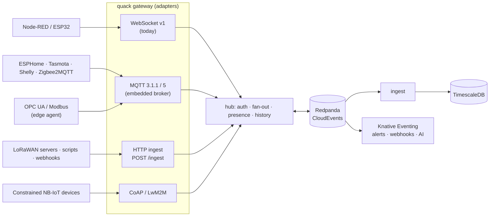

# Platform Review and Roadmap: Knative, KEDA, Fixes, Features, Platforms and Protocols

> **Audience:** the maintainer, and an AI coding agent that will implement the items. Every item has an id, a
> priority and an effort estimate, so it can become an issue or PR.
>
> **Scope:** the system as built on `main` (Go backend, React web app, Redpanda, TimescaleDB).
>
> **Notation:** priority **P0** (do before production) … **P3** (nice to have). Effort **S** (≤ 1 day),
> **M** (≤ 1 week), **L** (> 1 week).

---

## 1. Verdict

**Overall:** the platform is in **good shape for a single-region, small-to-medium deployment** (thousands of devices,
tens of thousands of browser sockets). The data path is sound, and it is measured and tested:
- the WebSocket contract suite passes, including under `-race`
- integration tests cover cross-instance delivery
- the load test showed 0 % loss at 20k deliveries/s with a 22 ms p99

**What it is not yet:** an *operated* product. The main gaps are operational, not architectural:
- graceful drain on shutdown
- auth caching against reconnect storms
- per-device (not per-socket) limits
- no Kubernetes packaging
- no alerting
- devices can connect over WebSockets only

| Area | Today | Rating |
|---|---|---|
| Realtime data path (gateway, fan-out, history) | Correct, fast, contract-tested | ●●●●○ |
| Event backbone (Redpanda, CloudEvents, outbox) | Standards-based, durable, replayable | ●●●●○ |
| Storage (TimescaleDB, aggregates, retention) | Good defaults; policies are hard-coded | ●●●○○ |
| Security | Strong basics (B1–B11 fixed); no SSO/2FA, no mTLS, no API tokens | ●●●○○ |
| Operations (k8s, autoscaling, drain, DR) | Compose only; no Helm, no drain, no backups | ●●○○○ |
| Device reach (protocols, platforms) | WebSocket + JWT only | ●●○○○ |
| Product features (alerts, automation, fleet) | Dashboards + control only | ●●○○○ |

**Knative and KEDA, short answer:**
- **KEDA: yes.** It fits the ingester perfectly (scale on consumer lag). For the gateway it works only together with
  the graceful-drain fix (F1). Never scale the gateway to zero.
- **Knative Eventing: yes, the strongest fit.** The bus already speaks CloudEvents, so alerting, notifications,
  webhooks, AI analysis and automation can be added as serverless functions without touching the core.
- **Knative Serving: only for stateless add-ons.** Not for the gateway (long-lived sockets, scale-to-zero, request
  timeouts), and not for the API while it embeds the outbox relay.

---

## 2. Knative and KEDA in detail

### 2.1 Where each workload belongs

| Workload | Nature | Run it as | Autoscaling |
|---|---|---|---|
| `quack serve` gateway role | Long-lived WebSockets, in-memory fan-out | Kubernetes `Deployment` (≥ 2 replicas) | **KEDA**, Prometheus trigger on sockets per pod, slow scale-down; requires F1 |
| `quack serve` API role | Stateless HTTP + outbox relay loop | `Deployment` (split from the gateway, see F9) | HPA / KEDA on CPU or RPS; the relay is safe with N replicas (`SKIP LOCKED`) |
| `quack ingest` | Kafka consumer group → TimescaleDB | `Deployment` | **KEDA Kafka scaler** on lag; max replicas = partitions (12) |
| Alerts, notifications, webhooks, AI, automation (new) | Event-triggered, bursty, often idle | **Knative Service** + **Knative Eventing** (`KafkaSource` → Broker → Trigger) | Knative autoscaler, **scale-to-zero** |
| Data export, reports (new) | Request-driven, rare | Knative Service | scale-to-zero |

### 2.2 KEDA: the ingester (do this first)

```yaml
apiVersion: keda.sh/v1alpha1
kind: ScaledObject
metadata:
  name: quack-ingest
spec:
  scaleTargetRef:
    name: quack-ingest
  minReplicaCount: 1
  maxReplicaCount: 12            # = partitions of element-events.v1; more replicas would sit idle
  triggers:
    - type: kafka                # Redpanda speaks the Kafka API
      metadata:
        bootstrapServers: redpanda.redpanda.svc:9092
        consumerGroup: quack-ingest   # must equal QUACK_INGEST_GROUP
        topic: element-events.v1
        lagThreshold: "5000"
        offsetResetPolicy: earliest
```

This works today without code changes. The ingester already commits offsets only after writing, and `(time, event_id)`
makes re-delivery idempotent, so rebalances during scaling are safe.

### 2.3 KEDA: the gateway (only after F1 graceful drain)

```yaml
apiVersion: keda.sh/v1alpha1
kind: ScaledObject
metadata:
  name: quack-gateway
spec:
  scaleTargetRef:
    name: quack-gateway
  minReplicaCount: 2             # never zero: devices must always reach a socket
  maxReplicaCount: 20
  advanced:
    horizontalPodAutoscalerConfig:
      behavior:
        scaleDown:               # drain slowly: every removed pod forces its clients to reconnect
          stabilizationWindowSeconds: 900
          policies: [{ type: Pods, value: 1, periodSeconds: 300 }]
  triggers:
    - type: prometheus
      metadata:
        serverAddress: http://prometheus.monitoring:9090
        query: sum(quack_ws_connections)
        threshold: "20000"       # target sockets per pod; tune with the load test (§7)
```

**Why scaling is safe once F1 lands:**
- Presence is lease-based: a removed pod's devices reappear on another pod, and the sweeper clears stale leases.
- History lives in the TSDB.
- Every gateway reads all bus partitions.

**Caveat:** every gateway consumes *all* element events (see F10), so adding pods adds socket capacity but not bus
throughput.

### 2.4 Knative Eventing: event-driven extensions

The bus already carries CloudEvents 1.0 in structured mode, which is Knative's native format, so extensions plug in
without core changes:

```yaml
apiVersion: sources.knative.dev/v1beta1
kind: KafkaSource
metadata:
  name: quack-element-events
spec:
  consumerGroup: knative-extensions      # separate group: never steals from the ingester
  bootstrapServers: [redpanda.redpanda.svc:9092]
  topics: [element-events.v1, presence.v1, control-events.v1]
  sink:
    ref: { apiVersion: eventing.knative.dev/v1, kind: Broker, name: quack }
---
apiVersion: eventing.knative.dev/v1
kind: Trigger
metadata:
  name: alerts
spec:
  broker: quack
  filter:
    attributes: { type: io.quack.element.message.v1 }
  subscriber:
    ref: { apiVersion: serving.knative.dev/v1, kind: Service, name: quack-alerts }
```

> **Spike first (S):** confirm that `KafkaSource` forwards our records as CloudEvents unchanged. Our records are
> structured mode, with a `content-type: application/cloudevents+json` header. Otherwise switch the producer to binary
> mode (`ce_*` headers) for the topics consumed by Knative; the profile in `MESSAGE_FORMATS.md` allows both.

**Extensions that fit this model:**
- the alert rule engine (§4, X1)
- notifications (email, Slack, Telegram, WhatsApp)
- outgoing webhooks
- AI anomaly detection and summaries
- automation / scenes
- data export

Each one is a small service (Go, or any language), scales to zero, and can't take the realtime path down.

**To act on devices, extensions need a way back in.** Use the REST API with a machine token (X3), or a new
`commands.v1` topic that gateways consume (X2). Never write to Postgres directly.

### 2.5 Kubernetes packaging (prerequisite for both)

| Id | Item | P | Effort |
|---|---|---|---|
| K1 | Helm chart: separate `gateway`, `api`, `ingest` Deployments, a `migrate` Job (pre-install/upgrade hook), Services, Ingress with WebSocket timeouts, PodDisruptionBudget (gateway `minAvailable: 1`), probes on `/healthz` and `/readyz`, ServiceMonitor | P1 | M |
| K2 | Postgres via **CloudNativePG** with a TimescaleDB image (backups to object storage, PITR); Redpanda via the **Redpanda Operator** (3 brokers, `acks=all` already set) | P1 | M |
| K3 | `terminationGracePeriodSeconds` ≥ drain time (F1) and a `preStop` hook on the gateway | P0 with K1 | S |
| K4 | Separate metrics port so `/metrics` is not public (F8) | P1 | S |

---

## 3. What needs fixing (audit of the current code)

Verified in the code on `main`. Ordered by priority.

| Id | Finding (where) | Impact | Fix | P | Effort |
|---|---|---|---|---|---|
| **F1** | ~~No graceful drain: `Gateway.shutdown()` closes **all** sockets at once~~<br/>✅ **RESOLVED**: Phased graceful drain implemented in `internal/gateway/drain.go` with `/readyz` 503 cut-off, `DrainPropagationWait`, jittered disconnects (code 1012), `/livez`, `/startupz`, and unit tests. | ~~Every deploy or scale-down triggers a reconnect storm~~<br/>Smoothly drains over `QUACK_DRAIN_DURATION` with zero reconnect storm. | Done: Configurable drain window, propagation pause, and K8s probes. | **P0** | **DONE** |
| **F2** | Device auth hits Postgres on **every** handshake (`DeviceVerifier.Load` → `GetDeviceAuth`). The plan's 60 s key cache was never built | A reconnect storm becomes a DB storm | LRU cache of `(device → key)` with 60 s TTL, invalidated by `jwt_key` / `device` control events (already consumed). Also add a per-IP handshake rate limit | **P0** | S |
| **F3** | Rate limits are **per socket** (`limiter` in `deviceClient`/`browserClient`) | A device opening 10 sockets gets 10× the budget | Per-device (and per-user) buckets in the hub, plus a max sockets per device (config, default 4) | P1 | S |
| **F4** | Login limiter is **in memory per instance** (`internal/api/auth.go`) | With N API pods an attacker gets N× the attempts | Store attempts in Postgres (`login_attempts` with a TTL purge), or put an edge rate-limit at the ingress | P1 | S |
| **F5** | Telemetry produce failures are **logged and dropped** (`bus.Producer.Publish` → `OnError`) | If Redpanda is down, values reach live browsers but are lost from history | A bounded in-memory retry buffer with a metric. Optionally a disk spool, or a back-pressure close of device sockets when the buffer is full | P1 | M |
| **F6** | Browser sessions are checked **only at connect** (and on user control events) | An expired session keeps its socket until disconnect | Periodic re-validation (e.g. every 5 min, batched per gateway) or close at `expires_at` | P2 | S |
| **F7** | Retention (365 d) and compression (7 d) are **hard-coded** in migration `00002` | Every deployment needs a migration to change them | `QUACK_TSDB_RETENTION`, `QUACK_TSDB_COMPRESS_AFTER`, applied by `quack migrate` (idempotent `remove_*_policy` / `add_*_policy`) | P2 | S |
| **F8** | `/metrics` and `/api/docs` are on the public port | Exposes internals | Admin listener (`QUACK_ADMIN_ADDR`, default `:9090`) for `/metrics` and pprof; docs behind admin or a config flag | P1 | S |
| **F9** | API and gateway roles in one Deployment | They scale differently (CPU vs sockets) | Already supported via `QUACK_ROLES`; only the Helm chart needs to split them | P1 | S (in K1) |
| **F10** | Every gateway consumes **all** element events | Bus throughput per pod caps the whole system (fine to ~tens of k msg/s) | Later: partition-affinity routing (a device or browser hashed to a gateway set), or consume only elements with local interest via a per-gateway filter topic | P3 | L |
| **F11** | One key per device; rotation means downtime | Can't roll keys without reconnect failures | Allow 2 active keys per device (overlap window) | P2 | M |
| **F12** | Last commanded state is not replayed (Q3); history replays device data only | A new viewer doesn't see a pending command | The device-twin model (X4) solves this properly | P2 | via X4 |
| **F13** | Event timestamps have ms precision; ordering ties are broken by UUIDv7 | Fine within one gateway; cross-gateway ties are arbitrary | Microsecond `time` in the CloudEvent envelope (wire frames can stay ms) | P3 | S |
| **F14** | No end-to-end test in CI (Playwright runs only locally) | UI regressions can merge | CI job: `docker compose up`, demo, simulator, `task web:e2e` | P1 | M |
| **F15** | Load tested on one gateway only; no soak or memory test | Unknown behavior at 10× and over days | Multi-pod load test in k8s (k6 or our loadgen), 24 h soak, memory/socket profile | P1 | M |
| **F16** | No backup / disaster recovery documented | Data loss risk | CloudNativePG backups + PITR runbook; Redpanda topics are re-creatable, the TSDB is the truth | **P0** for prod | S (with K2) |
| **F17** | Go module path is `github.com/taha2samy/quackquack/server`; the repo is `taha2samy-3/qauk-qauk` | Cosmetic; matters only if the module is imported elsewhere | Rename when convenient | P3 | S |

---

## 4. Features still missing

### 4.1 Core product

| Id | Feature | Why | Design notes | P | Effort |
|---|---|---|---|---|---|
| **X1** | **Alerts and rules** (thresholds, rate of change, offline for N min, and/or) with notifications: email, Slack, Telegram, webhook | The first thing every IoT user asks for | A Knative function on `element-events.v1` + `presence.v1` (§2.4). Rules in Postgres (`alert_rules`, `alert_events`), with hysteresis and debounce. UI: a rule editor and an alert timeline, plus badges on widgets | **P1** | L |
| **X2** | **Command ack + offline queue** (Q2) | Today commands are fire-and-forget, and they're lost if the device is offline | A `commands.v1` topic plus a `commands` table (id, element, payload, status: queued/sent/acked/expired, ttl). Devices ack with `{"ack": "<id>"}` (opt-in, protocol v2). Queued commands are delivered on reconnect | P1 | M |
| **X3** | **API tokens / machine users** | Integrations, scripts and Knative functions need non-browser auth | `api_tokens` (hashed, scoped to element permissions, expiry), sent as `Authorization: Bearer` on REST | P1 | S |
| **X4** | **Device twin** (desired vs reported state per element) | It solves F12; it's the standard model for actuators | `element_state(element_id, reported jsonb, desired jsonb, updated_at)`, updated by gateway and API. Browsers see both and can show "pending" | P2 | M |
| **X5** | **SSO (OIDC)** + optional **TOTP 2FA** | Companies need Keycloak / Entra / Google login | OIDC login → upsert user; map OIDC groups to our groups | P2 | M |
| **X6** | **Multi-tenancy (organizations)** | Required to serve more than one customer | `org_id` on every table, row-level checks in `store`, an org switcher in the UI. Do it **early**: it's hard to add later | P2 (P1 if SaaS) | L |
| **X7** | **Device provisioning** | Today keys are pasted by an admin | Claim codes or bulk CSV import, key generation in the UI (private key shown once), QR for field installs | P2 | M |
| **X8** | **Element typing** (number, boolean, enum, json schema, unit, range) | Validation, better widget choice, cleaner aggregates | `elements.schema jsonb`; the gateway validates (and rejects) device payloads; the frontend picks widgets from the type | P2 | M |
| **X9** | **Data export** (CSV, Parquet) and per-element retention/downsampling tiers | Analysis and compliance | A Knative job or API streaming from Timescale; extra continuous aggregates (1 h, 1 d) | P3 | M |
| **X10** | **AI layer** (plan Phase 8) | Natural-language questions, anomaly summaries, safe actions | MCP server with `query_history`, `list_elements`, `send_command` using an X3 token (RBAC applies), plus anomaly detection as a Knative function | P3 | M |

### 4.2 Web app

| Id | Feature | P | Effort |
|---|---|---|---|
| W1 | Arabic UI with **RTL** support (i18n framework, translations, mirrored layout) | P1 for the local market | M |
| W2 | Dashboard variables / templates (one dashboard for N identical devices) | P2 | M |
| W3 | Kiosk / TV mode and read-only public share links (signed, expiring) | P2 | S |
| W4 | PWA (installable, offline shell) + push notifications for alerts | P2 | M |
| W5 | Map widget (device locations), table widget, image/camera widget | P2 | M |
| W6 | Alert annotations on charts, and "who changed what" on control widgets | P2 | S |
| W7 | Dashboard import/export (JSON) and versions | P3 | S |

---

## 5. Platforms to support besides Node-RED

Connect them through **adapters** (§6.1), not special cases in the core.

| Platform | Why | How to connect | P |
|---|---|---|---|
| **ESP32 / ESP8266 / Arduino firmware** | Most DIY and small-industrial devices | Publish a small client library (Arduino + ESP-IDF) for WebSocket + JWT today, and MQTT (P1) next. Include a JWT signing example on device, or pre-signed long-lived tokens within `QUACK_DEVICE_JWT_MAX_LIFETIME` | P1 |
| **Home Assistant** | Huge smart-home user base | A custom integration (Python, in its own repo) using the browser/REST APIs with an X3 token, or **MQTT discovery** once the MQTT adapter exists | P2 |
| **ESPHome / Tasmota / Shelly** | Popular off-the-shelf firmware, all speak MQTT | The MQTT adapter with topic templates per platform | P1 (with MQTT) |
| **Zigbee2MQTT / Z-Wave JS UI** | Zigbee and Z-Wave devices via MQTT | The MQTT adapter | P2 |
| **ChirpStack / The Things Network (LoRaWAN)** | Long-range, low-power sensors | Their HTTP or MQTT integrations → our HTTP ingest (P1) or MQTT adapter; decoders map payloads to elements | P2 |
| **Telegraf / Fluent Bit / Vector** | Ingest existing metrics pipelines | A Kafka output straight into `element-events.v1` (CloudEvents), or the HTTP ingest | P2 |
| **Grafana** | Advanced analytics for power users | A PostgreSQL datasource on TimescaleDB with a read-only role (plan Phase 8); ship example dashboards | P2 |
| **n8n / Node-RED (as a consumer) / Zapier** | No-code automation | Outgoing webhooks (X1) + API tokens (X3); an n8n community node later | P2 |
| **Raspberry Pi / Linux edge agent** | Gateways for Modbus, BLE, serial and OPC UA in the field | A small Go agent (`quack-edge`) reusing our device protocol, with store-and-forward when offline | P2 |
| **AWS IoT Core / Azure IoT Hub** | Customers already on a cloud IoT service | A bridge via their Kafka or Event Hubs exports into our bus, or via MQTT bridging | P3 |

---

## 6. Protocols

### 6.1 Architecture: protocol adapters

Keep **one** internal model, `io.quack.element.message.v1` on Redpanda, and add adapters at the edge. Each adapter:
1. authenticates the device (JWT, mTLS or username/password mapped to a device key)
2. maps protocol addresses to `element_id`
3. publishes CloudEvents
4. delivers commands back

The gateway's hub already abstracts a socket as a `client` with `Send`. MQTT sessions and CoAP observers become new
client kinds, so fan-out, presence, history and permissions are reused unchanged.



### 6.2 Protocol priorities

| Id | Protocol | Why | Implementation | P | Effort |
|---|---|---|---|---|---|
| **R1** | **MQTT 3.1.1 + 5** | The IoT standard; unlocks ESPHome, Tasmota, Shelly, Zigbee2MQTT, Home Assistant and most firmware | Embed **mochi-mqtt** (Go, MIT) in the gateway as an adapter, configured as below | **P1** | M |
| R2 | **HTTP ingest** (`POST /api/v1/ingest`) | Devices and services that can't keep a socket; LoRaWAN servers; webhooks | Bearer device JWT or an X3 token; accepts our v1 frame or **SenML** (RFC 8428) arrays | P1 | S |
| R3 | **SenML** payloads (format, not transport) | A standard multi-value measurement format (planned v2) | Accepted by R1, R2 and R4; maps `n` to an element name, `v`/`vb`/`vs` to `message.value` | P2 | S |
| R4 | **CoAP (+ DTLS) / LwM2M** | Constrained, battery-powered UDP devices, NB-IoT | `plgd-dev/go-coap`; observe = subscribe; LwM2M object mapping later | P3 | L |
| R5 | **Sparkplug B** over MQTT | Industrial / SCADA interop | An R1 topic namespace `spBv1.0/...`; decode protobuf, map metrics to elements, support birth/death certificates for presence | P3 | M |
| R6 | **OPC UA / Modbus** | PLCs and industrial equipment | Not in the cloud gateway: in the **edge agent** (§5), which polls locally and publishes over MQTT/WS | P3 | L |
| R7 | **gRPC streaming** | High-throughput server-to-server ingest | Only if a customer needs it; Kafka-direct already covers most cases | P3 | M |
| R8 | **AMQP 1.0 / RabbitMQ bridge** | Enterprise integration | Redpanda Connect bridge, configuration only (no code) | P3 | S |

**R1 configuration for the embedded MQTT broker:**
- **Topics:** `quack/{device_id}/{element_id}` for data, and `quack/{device_id}/{element_id}/set` for commands.
- **Auth:** username = device id, password = device JWT; or mTLS later.
- **QoS:** 0/1, with retained messages mapped to X4 desired state.
- **Presence:** last-will maps to presence.
- **Hub:** each MQTT session becomes a hub client, so commands flow back to the device on `/set`.
- **Deployment:** its own port (1883/8883), on the same gateway pods or a separate `mqtt` role.

**Not recommended:** a separate MQTT broker (EMQX/Mosquitto) bridged to Redpanda. It's possible, but you would
duplicate auth, presence and ACLs that the gateway already has. Embed instead, unless you need >1M MQTT sessions.

---

## 7. Roadmap (suggested order)

| Phase | Goal | Items | Exit criteria |
|---|---|---|---|
| **A: production-ready core** (≈ 2 weeks) | Safe to deploy and operate | F1, F2, F3, F8, K1–K4, F16, F14 | Rolling update with 10k sockets: no failed reconnects, and DB CPU < 50 % during the storm. Backups restore |
| **B: elastic** (≈ 1 week) | Autoscale on real signals | KEDA ingester (§2.2), KEDA gateway (§2.3), F15, F4 | Load ramp 1k → 50k sockets scales out and back with zero message loss; 24 h soak flat on memory |
| **C: reach** (≈ 3 weeks) | Many more devices | R1 MQTT, R2 HTTP ingest, R3 SenML, ESP32 library, ESPHome/Tasmota guides | A Shelly/Tasmota device and an ESPHome node appear in a dashboard via MQTT with no code |
| **D: product** (≈ 4 weeks) | What customers ask for | X1 alerts on Knative, X2 command ack/queue, X3 API tokens, W1 Arabic RTL, X4 twin | An alert fires within 2 s to Telegram; a command queued offline is delivered on reconnect |
| **E: scale and enterprise** | Bigger customers | X5 SSO, X6 multi-tenancy (start design in D), X7 provisioning, F10 if needed | Two orgs fully isolated (tested); OIDC login |
| **F: ecosystem** | Plug into everything | Home Assistant, LoRaWAN, Grafana pack, edge agent (R6), X10 AI | Integration guides published in the docs |

---

## 8. Guardrails for whoever implements this
1. **Keep the bus model.** Every new protocol or platform becomes `io.quack.element.message.v1` CloudEvents. No
   adapter writes to Postgres or talks to another adapter directly.
2. **The WebSocket v1 protocol stays byte-compatible.** New behavior (acks, SenML) is opt-in.
3. **Extensions run off the realtime path.** Use Knative/KEDA services with their own consumer groups, never the
   gateway process.
4. **Measure before and after.** Extend `contracttest` for protocol changes, and the load test for anything on the hot
   path. Post the numbers in the PR.
5. **Start multi-tenancy design before adding many tables.** Retrofitting `org_id` is the most expensive change on
   this list.
