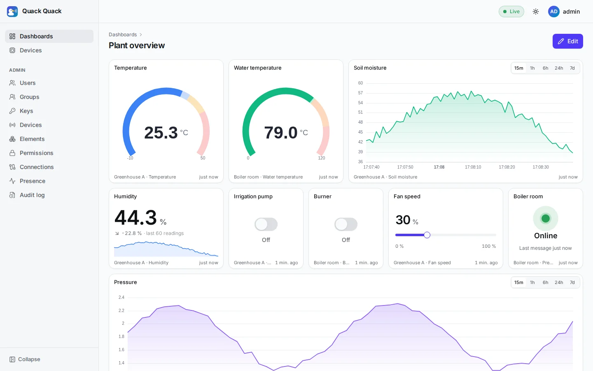
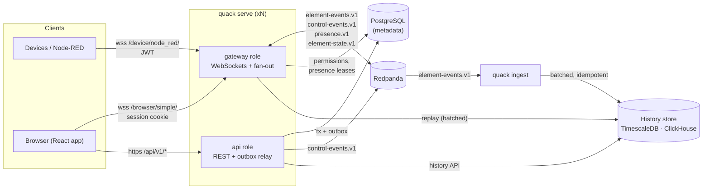
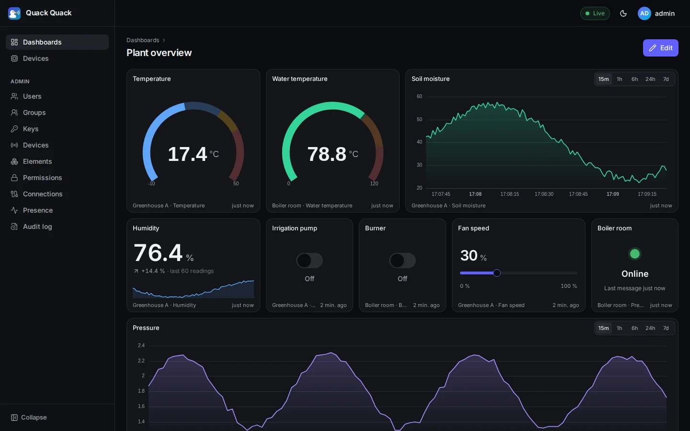
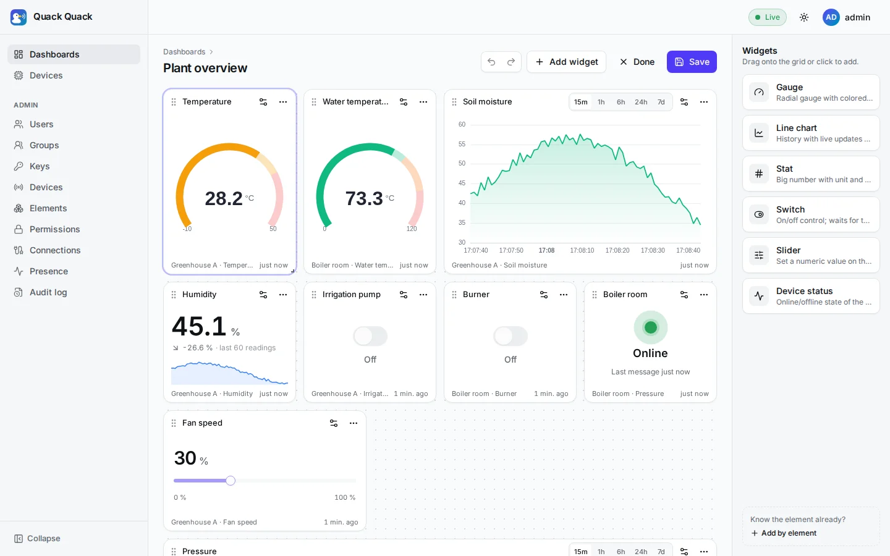
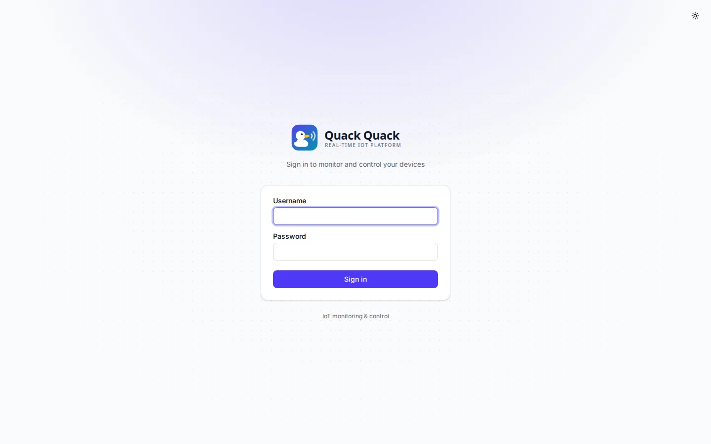
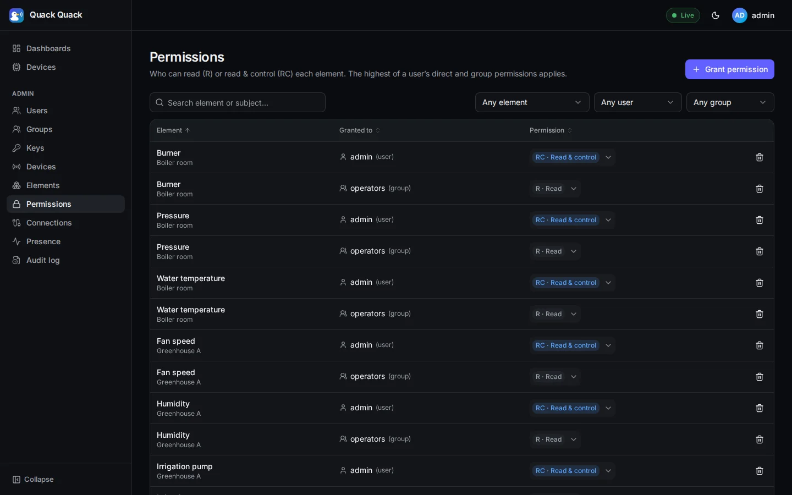
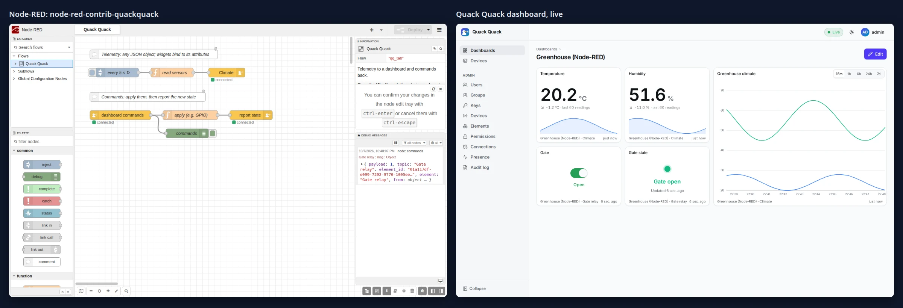
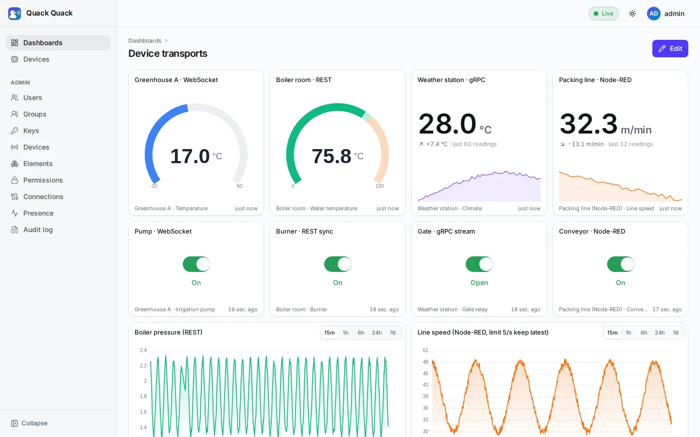

<p align="center">
  <picture>
    <source srcset="docs/public/ducks-3d/duck-3d-hi-still.svg" media="(prefers-reduced-motion: reduce)"/>
    
  </picture>
</p>

<h1 align="center">Quack Quack</h1>

<p align="center">
  Realtime IoT dashboards and device control: a Go WebSocket gateway, drag-and-drop dashboards,<br/>
  per-element RBAC and full telemetry history in TimescaleDB or ClickHouse.
  <br/><br/>
  <a href="https://taha2samy-3.github.io/qauk-qauk/"><strong>Read the docs »</strong></a>
  <br/><br/>
  <a href="#key-features">Features</a> ·
  <a href="#architecture">Architecture</a> ·
  <a href="#quick-start">Quick start</a> ·
  <a href="#documentation">Documentation</a>
</p>

<p align="center">
  
  
  
  
  
  <a href="https://github.com/taha2samy-3/qauk-qauk/actions/workflows/docs.yaml"></a>
  <a href="LICENSE"></a>
  <a href="https://github.com/taha2samy-3/qauk-qauk/network/updates"></a>
</p>

---

**Quack Quack** connects devices (microcontrollers, gateways, Node-RED flows) to people. Devices authenticate with their own key and send telemetry over a WebSocket, REST (with SenML), gRPC, or via **MQTT 5** connections. Users watch it live on dashboards they build themselves and send commands back to switches and sliders. Every element has its own read (`R`) or read-and-control (`RC`) grant, so each user only sees and controls what they are allowed to. Every message is also stored in a pluggable history store (TimescaleDB or ClickHouse), so charts show history and new viewers get the latest values instantly. The backend is a single Go binary; Redpanda carries events between instances.

<p align="center">
  
</p>

## Key features

- **Realtime WebSocket gateway in Go.** One process fans out 20,000 deliveries/s with p99 latency of 22 ms. Each message is serialized once, outbound queues are bounded, and a message never echoes back to its sender.
- **Three device transports, one core.** The [WebSocket](docs/04_api_reference/device_api.md) (legacy v1, unchanged), [REST](docs/04_api_reference/device_rest_api.md) (batches, SenML, long-poll commands, retry-safe message ids) and [gRPC](docs/04_api_reference/device_grpc_api.md) (unary and streams; gRPC-Web and Connect too). Same token, elements and rules on all three, at 6–7 ms median latency across instances ([measured](docs/refactor/baseline.md#device-transports-2026-10-09)).
- **Rate limits per element.** Each element (data stream) has its own limit, and over the limit it either drops or keeps only the latest value. A per-device guard sits on top, and changes apply live. See [Rate limits](docs/05_core_concepts/rate_limits.md).
- **Drag-and-drop dashboards.** A React app with a responsive grid. Widgets: gauge, line chart, stat, switch, slider and device status. Dashboards are private or shared, and sharing never bypasses element permissions.
- **RBAC per element.** `R` / `RC` grants for users and groups, resolved to the highest grant. Permission and group changes reach open sockets live: they upgrade, downgrade or unsubscribe.
- **Device security.** Devices sign a JWT with their own RSA (2048+ bit) or ECDSA P-256 key. Inactive keys and tokens without `exp` are rejected, and token lifetime is capped. The server stamps the sender identity; clients cannot spoof it.
- **Pluggable history store.** Every device message and user command is stored in **TimescaleDB or ClickHouse**: one setting, the same tested behavior. Each numeric attribute (`temperature`, `gps.lat`) gets its own series with 1-minute rollups. Writes are idempotent, a dead-letter topic catches unstorable data, and the API has cost guards. `quack history copy` moves the data between backends. See [History storage](docs/05_core_concepts/history.md).
- **Redpanda event bus.** Gateways scale horizontally. Admin changes flow through a transactional outbox, so no committed change is lost.
- **CloudEvents everywhere.** Bus events are CloudEvents 1.0 with JSON Schema payloads. The REST API is OpenAPI 3.1 with RFC 9457 error bodies.
- **Admin UI, CLI and audit log.** Manage users, groups, keys, devices, elements and permissions in the web app, through the REST API, or with `quack admin`. Every admin change is recorded in an audit log.
- **Drop-in replacement for the legacy Django server.** Device paths, frames and JWTs are unchanged, so existing devices and Node-RED flows keep working. `quack import-django` migrates the old database with UUIDs, keys and passwords intact.
- **Node-RED nodes.** [`node-red-contrib-quackquack`](integrations/node-red) adds *quack out* and *quack in* to the palette. They handle token signing, reconnects, element names and command confirmation. Install it from its [GitHub release](docs/09_node_red.md#install).

## Architecture



The `api` and `gateway` roles run in the same binary (`QUACK_ROLES=api,gateway`) and can be split when you need to scale. The [architecture guide](docs/02_architecture.md) covers the data flows with sequence diagrams.

### Performance

Measured on the same 8-core machine with the same load test: 20 device sockets at 10 msg/s each, fanned out to 100 browsers (20,000 deliveries/s for 20 s). Full numbers are in [baseline.md](docs/refactor/baseline.md).

| | Legacy Django (Channels) | Go (`quack serve`) |
|---|---|---|
| Delivered | 23,465 / 400,000 (94.1 % lost) | **400,000 / 400,000 (0 % lost)** |
| Throughput | 964 deliveries/s | **19,902 deliveries/s** |
| Latency p50 / p99 | 12.2 s / 21.1 s | **2.1 ms / 22.3 ms** |

The Go server also published every message to Redpanda with `acks=all` during that run.

## Quick start

**Prerequisites:** Docker with Compose, [mise](https://mise.jdx.dev/), and Node.js with pnpm for the web app.

```sh
git clone https://github.com/taha2samy-3/qauk-qauk.git
cd qauk-qauk

mise install        # Go, Task, golangci-lint (pinned in mise.toml)
task start          # everything in one command (Ctrl+C stops it); HISTORY=clickhouse for ClickHouse
```

Or step by step, each piece in its own terminal:

```sh
task infra:up       # Postgres/TimescaleDB on :5433, Redpanda on :19092 (+ ClickHouse with HISTORY=clickhouse)
task demo           # migrate, then seed demo devices, users and grants
task dev            # terminal 1: api + gateway on http://127.0.0.1:8080
task simulate       # terminal 2: the demo devices stream live values
task web:install    # terminal 3: install the web app's dependencies
task web:dev        # web app on http://127.0.0.1:5173 (proxies to :8080)
```

Open **http://127.0.0.1:5173** and log in as **admin / admin12345**. The **viewer / viewer12345** account is read-only.

To keep history across restarts and fill the history charts, also run the ingester: `task ingest` (terminal 4).

**All in containers.** This command builds one image (backend and frontend) and starts Postgres/TimescaleDB, Redpanda, migrations, `quack serve` and `quack ingest` (add `HISTORY=clickhouse` to keep history in ClickHouse):

```sh
task up             # http://127.0.0.1:8080
```

The containers stack starts with an empty database. Create your first admin as described in [Getting started](docs/03_getting_started.md#full-stack-in-containers).

**Node-RED.** Install the [Quack Quack nodes](docs/09_node_red.md) from the [GitHub release](https://github.com/taha2samy-3/qauk-qauk/releases/tag/node-red-v0.2.0-alpha.1), then restart Node-RED:

```sh
cd ~/.node-red
npm install https://github.com/taha2samy-3/qauk-qauk/releases/download/node-red-v0.2.0-alpha.1/node-red-contrib-quackquack-0.2.0-alpha.1.tgz
```

**Tests.** Run everything CI runs (lint, unit tests with `-race`, integration tests and the WebSocket contract suite) with infrastructure up:

```sh
task infra:up
task check
```

Run `task --list` to see every task.

## Screenshots

| | |
|---|---|
|  |  |
| **Live dashboard**: gauges, charts, switches and sliders updating in real time | **Drag-and-drop editor**: palette, resize, undo/redo, per-widget settings |
|  |  |
| **Sign in** | **Administration**: users, groups, keys, devices, permissions, audit log |



**Node-RED integration**: a flow sends readings to the dashboard, and the dashboard's switch is applied in Node-RED and confirmed back.

More in the [screenshot tour](https://taha2samy-3.github.io/qauk-qauk/guide/screenshots). Logos and brand files are on the [brand page](https://taha2samy-3.github.io/qauk-qauk/guide/brand).

## Documentation

The documentation is published as a website at **https://taha2samy-3.github.io/qauk-qauk/**. It is built with [VitePress](https://vitepress.dev) from the markdown in [`docs/`](docs/README.md) and deployed by the `Docs` GitHub Actions workflow on every push to `master`. Preview it locally with `task docs:dev` (http://127.0.0.1:5174).

| | |
|---|---|
| [Overview](docs/01_overview.md) | Goals and tech stack |
| [Architecture](docs/02_architecture.md) | Components, data flows, scaling |
| [Getting started](docs/03_getting_started.md) | Local dev, containers, connecting devices and Node-RED, configuration, migrating from Django |
| [Device WebSocket API](docs/04_api_reference/device_api.md) | For firmware and Node-RED authors |
| [Device REST API](docs/04_api_reference/device_rest_api.md) | For devices that wake, send and sleep, and for scripts (curl, SenML) |
| [Device gRPC API](docs/04_api_reference/device_grpc_api.md) | For gRPC clients and gateways |
| [Rate limits](docs/05_core_concepts/rate_limits.md) | Per-element limits, the device guard, several instances |
| [Node-RED integration](docs/09_node_red.md) | The `node-red-contrib-quackquack` nodes: install, connect a device, send telemetry, receive commands |
| [Browser WebSocket API](docs/04_api_reference/browser_api.md) | For frontend developers |
| [REST API](docs/04_api_reference/rest_api.md) | Auth, CSRF, errors, resources (live docs at `/api/docs`) |
| [Core concepts](docs/05_core_concepts/README.md) | Authentication, permissions, realtime events, dashboards |
| [History storage](docs/05_core_concepts/history.md) | Pluggable history store (TimescaleDB, ClickHouse): data model, guarantees, configuration, benchmark, switching backends, adding a driver |
| [Database schema](docs/06_database/schema.md) | ER diagram, and the history store schemas for each driver |

<p align="center">
  
</p>

<p align="center">
  
</p>

## License

Distributed under the MIT License. See [LICENSE](LICENSE).
